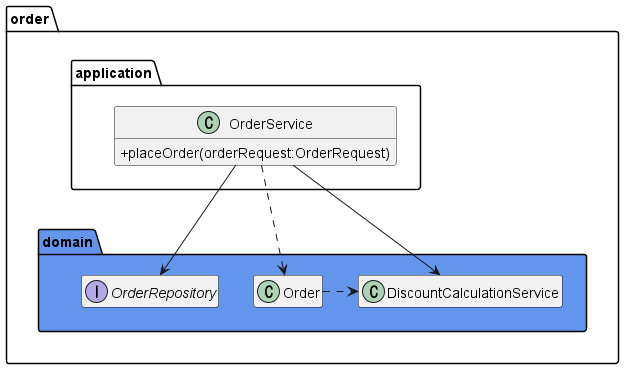
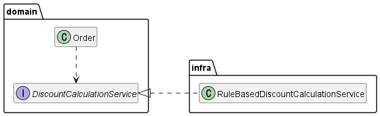

# 7. 도메인 서비스

## 1. 여러 애그리거트가 필요한 기능

- 도메인 영역의 코드를 작성하다 보면, 한 애그리거트로 기능을 구현할 수 없을 때가 있다.
  - 결제 금액 계산로직이 대표적이다.
  - 상품 애그리거트: 구매하는 상품의 가격이 필요하다. 또한 상품에 따라 배송비가 추가되기도 한다.
  - 주문 애그리거트: 상품별로 구매 개수가 필요하다.
  - 할인 쿠폰 애그리거트: 쿠폰별로 지정한 할인 금액이나 비율에 따라 주문 총 금액을 할인한다. 할인 쿠폰을 조건에 따라 중복 사용할 수 있다거나 지정한 카테고리의 상품에만 적용할 수 있다는 제약 조건이 있다면 할인 계산이 복잡해진다.
  - 회원 애그리거트: 회원 등급에 따라 추가 할인이 가능하다.
- 위 상황에서 실제 결제 금액을 계산해야 하는 주체는 어떤 애그리거트일까?
- 총 주문 금액을 계산하는 것은 주문 애그리거트가 할 수 있지만 실제 결제 금액은 이야기가 다르다.
- 총 주문 금액에서 할인 금액을 계산해야 하는데 이 할인 금액을 구하는 것은 누구 책임일까?
  - 할인 쿠폰이 할인 규칙을 갖고 있으니 할인 쿠폰 애그리거트가 계산해야 할까?
  - 그런데 할인 쿠폰을 두 개 이상 적용할 수 있다면 단일 할인 쿠폰 애그리거트로는 총 결제 금액을 계산할 수 없다.
- 생각해 볼 수 있는 방법은 주문 애그리거트가 필요한 데이터를 모두 가지도록 한 뒤 할인 금액 계산 책임을 주문 애그리거트에 할당하는 것이다.

```java
public class Order {
	...
	private Orderer orderer;
	private List<OrderLine> orderLines;
	private List<Coupon> usedCoupons;

	private Money calculatePayAmounts() {
		Money totalAmounts = calculateTotalAmounts();
		// 쿠폰별로 할인 금액을 구한다.
		Money discount = coupons.stream()
												.map(coupon -> calculateDiscount(coupon))
												.reduce(new Money(0), (v1, v2) -> v1.add(v2));
		// 회원에 따른 추가 할인을 구한다.
		Money membershipDiscount = calculateDiscount(orderer.getMember().getGrade());
		// 실제 결제 금액 계산
		return totalAmounts.minus(discount).minus(membershipDiscount);
	}

	private Money calculateDiscount(Coupon coupon) {
		// orderLines의 각 상품에 대해 쿠폰을 적용해서 할인 금액을 계산하는 로직.
		// 쿠폰의 적용 조건 등을 확인하는 코드
		// 정책에 따라 복잡한 분기와 계산 코드
		...
	}

	private Money calculateDiscount(MemberGrade grade) {
		// 등급에 따라 할인 금액 계산
		...
	}
}
```

- 여기서 결제 금액 계산 로직이 주문 애그리거트의 책임이 맞을까?
  - 특별 감사 세일로 전 품목에 대해 한 달간 2% 추가 할인을 하기로 했다고 해보자.
  - 이 할인 정책은 주문애그리거트가 갖고 있는 구성요소와는 관련이 없다.
  - 그럼에도 결제 금액 계산 책임이 주문 애그리거트가 갖고 있다는 이유로 주문 애그리거트의 코드를 수정해야 한다.
- 이렇게 한 애그리거트에 넣기 애매한 도메인 기능을 억지로 특정 애그리거트에 구현하면 안 된다.
  - 애그리거트는 자신의 책임 범위를 넘어서는 기능을 구현하기 때문에 코드가 길어진다.
  - 외부에 대한 의존이 높아지게 되며 코드를 복합하게 만들어 수정을 어렵게 만드는 요인이 된다.
  - 게다가 애그리거트의 범위를 넘어서는 도메인 개념이 애그리거트에 숨어들어 명시적으로 드러나지 않게 된다.
- 이런 문제를 해결하는 가장 쉬운 방법은 도메인 기능을 별도 서비스로 구현하는 것이다.

## 2. 도메인 서비스

- 도메인 서비스는 도메인 영역에 위치한 도메인 로직을 표현할 때 사용한다.
- 주로 다음과 같은 상황에서 도메인 서비스를 사용한다.
  - 계산 로직: 여러 애그리거트가 필요한 계산 로직이나, 한 애그리거트에 넣기에는 다소 복잡한 계산 로직
  - 외부 시스템 연동이 필요한 도메인 로직: 구현하기 위해 타 시스템을 사용해야 하는 도메인 로직

### 2.1. 계산 로직과 도메인 서비스

- 할인 금액 규칙 계산처럼 한 애그리거트에 넣기 애매한 도메인 개념을 구현하려면 애그리거트에 억지로 넣기보다는 도메인 서비스를 이용해서 도메인 개념을 명시적으로 드러내면 된다.
- 응용 영역의 서비스가 응용 로직을 다룬다면 도메인 서비스는 도메인 로직을 다룬다.
- 도메인 영역의 애그리거트나 밸류와 같은 구성요소와 도메인 서비스를 비교할 때 다른 점은 도메인 서비스는 상태 없이 로직만 구현한다는 점이다.
- 도메인 서비스를 구현하는 데 필요한 상태는 다른 방법으로 전달받는다.
- 할인 금액 계산 로직을 위한 도메인 서비스는 다음과 같이 도메인의 의미가 드러나는 용어를 타입과 메서드 이름으로 갖는다.

```java
public class DiscountCalculationService {

	public Money calculateDiscountAmounts(List<OrderLine> orderLines,
																				List<Coupon> coupons,
																				MemberGrade grade) {
		Money couponDiscount = coupons.stream()
												.map(coupon -> calculateDiscount(coupon))
												.reduce(new Money(0), (v1, v2) -> v1.add(v2));

		Money membershipDiscount = calculateDiscount(orderer.getMember().getGrade());

		return couponDiscount.add(membershipDiscount);
	}

	private Money calculateDiscount(Coupon coupon) {
		...
	}

	private Money calculateDiscount(MemberGrade grade) {
		...
	}
}
```

- 할인 계산 서비스를 사용하는 주체는 애그리거트가 될 수도 있고 응용 서비스가 될 수도 있다.
- 다음과 같이 애그리거트의 결제 금액 계산 기능에 DiscountCalculationService를 전달하면 사용 주체는 애그리거트가 된다.

```java
public class Order {

	public void calculateAmounts(DiscountCalculationService disCalSvc,
																MemberGrade grade) {
		Money totalAmounts = getTotalAmount();
		Money discountAmounts =
				disCalSvc.calculateDiscountAmounts(this.orderLines, this.coupons, grade);
		this.paymentAmounts = totalAmounts.minus(discountAmounts);
	}
	...
}
```

- 애그리거트 객체에 도메인 서비스를 전달하는 것은 응용 서비스 책임이다.

```java
public class OrderService {
	private DiscountCalculationService discountCalculationService;

	@Transactional
	public OrderNo placeOrder(OrderRequest orderRequest) {
		OrderNo orderNo = orderRepository.nextId();
		Order order = createOrder(orderNo, orderRequest);
		orderRepository.save(order);
		// 응용 서비스 실행 후 표현 영역에서 필요한 값 리턴
		return orderNo;
	}

	private Order createOrder(OrderNo orderNo, OrderRequest orderReq) {
		Member member = findMember(orderReq.getOrdererId());
		Order order = new Order(orderNo,
														orderReq.getOrderLines(),
														orderReq.getCoupons(),
														createOrderer(member),
														orderReq.getShippingInfo());
		order.calculateAmounts(this.discountCalculationService, member.getGrade());
		return order;
	}
}
```

### NOTE: 도메인 서비스 객체를 애그리거트에 주입하지 않기

- 애그리거트의 메서드를 실행할 때 도메인 서비스 객체를 파라미터로 전달한다는 것은 애그리거트가 도메인 서비스에 의존한다는 것을 의미한다.
- 스프링 DI와 AOP를 공부하다 보면 애그리거트가 의존하는 도메인 서비스를 의존 주입으로 처리하고 싶을 수 있다.
- 프레임워크가 제공하는 의존 주입 기능을 사용해서 도메인 서비스를 애그리거트에 주입해야 기술적으로 나은 것 같은 착각도 하게 된다.
- 하지만 이것은 좋은 방법은 아니라고 생각한다. 의존 주입을 하기 위해 애그리거트 루트 엔티티에 도메인 서비스에 대한 참조를 필드로 추가했다고 하자.

```java
public class Order {
	@Autowired
	private DiscountCalculationService discountCalculationService;
	...
}
```

- 도메인 객체는 필드로 구성된 데이터와 메서드를 이용해서 개념적으로 하나인 모델을 표현한다.
- 모델의 데이터를 담는 필드는 모델에서 중요한 구성요소이다.
- 그런데 discountCalculationService 필드는 데이터 자체와는 관련이 없다. Order 객체를 DB에 보관할 때 다른 필드와는 달리 저장 대상도 아니다.
- 또 Order가 제공하는 모든 기능에서 discountCalculationService를 필요로 하는 것도 아니다.
- 일부 기능을 위해 굳이 도메인 서비스 객체를 애그리거트에 의존 주입할 이유는 없다.

---

- 애그리거트 메서드를 실행할 때 도메인 서비스를 인자로 전달하지 않고 반대로 도메인 서비스의 기능을 실행할 때 애그리거트를 전달하기도 한다.

  - 계좌 이체 기능이 대표적이다.
  - 계좌 이체는 두 계좌 애그리거트가 관여하는데 한 애그리거트는 금액을 출금하고 한 애그리거트는 금액을 입금한다.

  ```java
  public class TransferService {

  	public void transfer(Account fromAcc, Account toAcc, Money amounts) {
  		froAcc.withdraw(amounts);
  		toAcc.credit(amounts);
  	}
  }
  ```

  - 응용 서비스는 두 Account 애그리거트를 구한 뒤에 TransferService를 이용해서 계좌 이체 도메인 기능을 실행할 것이다.
  - 도메인 서비스는 도메인 로직을 수행하지 응용 로직을 수행하진 않는다.
    - 트랜잭션 처리와 같은 로직은 응용 로직이므로 도메인 서비스가 아닌 응용 서비스에서 처리해야 한다.

- 특정 기능이 응용 서비스인지 도메인 서비스인지 감을 잡기 어려울 때는 해당 로직이 애그리거트의 상태를 변경하거나 애그리거트의 상태 값을 계산하는지 검사해 보면 된다.
  - 계좌 이체 로직은 계좌 애그리거트의 상태를 변경한다.
  - 결제 금액 로직은 주문 애그리거트의 주문 금액을 계산한다.
- 위 두 로직은 각각 애그리거트를 변경하고 애그리거트의 값을 계산하는 도메인 로직이다.
- 도메인 로직이면서 한 애그리거트에 넣기에 적합하지 않으므로 이 두 로직은 도메인 서비스로 구현하게 된다.

### 7.2. 외부 시스템 연동과 도메인 서비스

- 외부 시스템이나 타 도메인과의 연동 기능도 도메인 서비스가 될 수 있다.

  - 설문 조사 시스템과 사용자 역할 관리 시스템이 분리되어 있다고 하자.
  - 설문 조사 시스템은 설문 조사를 생성할 때 사용자가 생성 권한을 가진 역할인지 확인하기 위해 역할 관리 시스템과 연동해야 한다.
  - 시스템 간 연동은 HTTP API 호출로 이루어질 수 있지만 설문 조사 도메인 입장에서는 사용자가 설문 조사 생성 권한을 가졌는지 확인하는 도메인 로직으로 볼 수 있다.
  - 이 도메인 로직은 다음과 같은 도메인 서비스로 표현할 수 있다.
  - 여기서 중요한 점은 도메인 로직 관점에서 인터페이스를 작성했다는 것이다.
    - 역할 관리 시스템과 연동한다는 관점으로 인터페이스를 작성하지 않았다.

  ```java
  public interface SurveyPermissionChecker {
  	boolean hasUserCreationPermission(String userId);
  }
  ```

  - 응용 서비스는 이 도메인 서비스를 이용해서 생성 권한을 검사한다.

  ```java
  public class CreateSurveyService {
  	private SurveyPermissionChecker permissionChecker;

  	public Long createSurvey(CreateSurveyRequest req) {
  		validate(req);
  		// 도메인 서비스를 이용해서 외부 시스템 연동을 표현
  		if (!permissionChecker.hasUserCreationPermission(req.getRequestorId())) {
  			throw new NoPermissionException();
  		}
  	}
  	...
  }
  ```

  - SurveyPermissionChecker 인터페이스를 구현한 클래스는 인프라스트럭처 영역에 위치해 연동을 포함한 권한 검사 기능을 구현한다.

### 7.3. 도메인 서비스의 패키지 위치

- 도메인 서비스는 도메인 로직을 표현하므로 도메인 서비스의 위치는 다른 도메인 구성요소와 동일한 패키지에 위치한다.
  - 주문 금액 계산을 위한 도메인 서비스는 아래 그림과 같이 주문 애그리거트와 같은 패키지에 위치한다.



- 도메인 서비스의 개수가 많거나 엔티티나 밸류와 같은 다른 구성요소와 명시적으로 구분하고 싶다면 domain 패키지 밑에 domain.model, domain.service, domain.repository와 같이 하위 패키지를 구분하여 위치시켜도 된다.

### 7.4. 도메인 서비스의 인터페이스와 클래스

- 도메인 서비스의 로직이 고정되어 있지 않은 경우 도메인 서비스 자체를 인터페이스로 구현하고 이를 구현한 클래스를 둘 수도 있다.
- 특히 도메인 로직을 외부 시스템이나 별도 엔진을 이용해서 구현할 때 인터페이스와 클래스를 분리하게 된다.
  - 할인 금액 계산 로직을 룰 엔진을 이용해서 구현한다면 아래 그림처럼 도메인 영역에는 도메인 서비스 인터페이스가 위치하고 실제 구현은 인프라스트럭처 영역에 위치한다.
    
  - 위 그림과 같이 도메인 서비스의 구현이 특정 구현 기술에 의존하거나 외부 시스템의 API를 실행한다면 도메인 영역의 도메인 서비스는 인터페이스로 추상화해야 한다.
  - 이를 통해 도메인 영역이 특정 구현에 종속되는 것을 방지할 수 있고, 도메인 영역에 대한 테스트가 쉬워진다.
