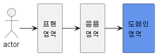

# 6. 응용 서비스와 표현 영역

## 1. 표현 영역과 응용 영역

- 1장부터 5장까지는 도메인의 구성요소와 JPA를 이용한 리포지터리 구현 방법에 대한 내용을 주로 다뤘다.
- 도메인 영역을 잘 구현하지 않으면 사용자의 요구를 충족하는 제대로 된 소프트웨어를 만들지 못한다.
- 하지만 도메인 영역만 잘 만든다고 끝나는 것은 아니다. 도메인이 제 기능을 하려면 사용자와 도메인을 연결해주는 매개체가 필요하다.
- 2장 아키텍처에서 설명한 응용 영역과 표현 영역이 사용자와 도메인을 연결해 주는 매개체 역할을 한다.



- 표현 영역은 사용자의 요청을 해석하고 응용 서비스의 결과를 응답한다.
  - 사용자가 웹 브라우저에서 폼에 ID와 암호를 입력한 뒤에 전송 버튼을 클릭하면 요청 파라미터를 포함한 HTTP 요청을 표현 영역에 전달한다.
  - 요청을 받은 표현 영역은 URL, 요청 파라미터, 쿠키, 헤더 등을 이용해서 사용자가 실행하고 싶은 기능을 판별하고 그 기능을 제공하는 응용 서비스를 실행한다.
  - 응용 서비스의 메서드가 요구하는 파라미터와 표현 영역이 사용자로부터 전달받은 데이터는 형식이 일치하지 않기 때문에 표현 영역은 응용 서비스가 요구하는 형식으로 사용자 요청을 변환한다.
    - 표현 영역의 코드는 다음과 같이 폼에 입력한 요청 파라미터 값을 사용해서 응용 서비스가 요구하는 객체를 생성한 뒤, 응요 서비스의 메서드를 호출한다.
    ```java
    @PostMapping("/member/join")
    public ModelAndView join(HttpServletRequest request) {
    	String email = request.getParameter("email");
    	String password = request.getParameter("password");
    	// 사용자 요청을 응용 서비스에 맞게 변환
    	JoinRequest joinReq = new JoinRequest(email. password);
    	// 변환한 객체를 이용해서 응용 서비스 실행
    	joinService.join(joinReq);
    	...
    }
    ```
  - 응용 서비스를 실행한 뒤에 표현 영역은 실행 결과를 사용자에게 알맞은 형식으로 응답한다.
    - 사용자 요청에 맞게 HTML이나 JSON 형식으로 응답할 것이다.
- 실제 사용자가 원하는 기능을 제공하는 것은 응용 영역에 위치한 서비스다.
  - 사용자가 회원 가입을 요청했다면 실제 그 요청을 위한 기능을 제공하는 주체는 응용 서비스에 위치한다.
  - 응용 서비스는 기능을 실행하는 데 필요한 입력 값을 메서드 인자로 받고 실행 결과를 리턴한다.
  - 사용자와 상호작용은 표현 영역이 처리하기 때문에, 응용 서비스는 표현 영역에 의존하지 않는다.
    - 응용 영역은 사용자가 웹 브라우저를 사용하는지 REST API를 호출하는지, TCP 소켓을 사용하는지를 알 필요가 없다.

## 2. 응용 서비스의 역할

- 응용 서비스는 사용자(클라이언트)가 요청한 기능을 실행한다.
- 응용 서비스는 사용자의 요청을 처리하기 위해 리포지터리에서 도메인 객체를 가져와 사용한다.
- 응용 서비스의 주요 역할은 도메인 객체를 사용해서 사용자의 요청을 처리하는 것이므로 표현 영역 입장에서 보았을 때 응용 서비스는 도메인 영역과 표현 영역을 연결해 주는 창구 역할을 한다.
- 응용 서비스는 주로 도메인 객체 간의 흐름을 제어하기 때문에 다음과 같이 단순한 형태를 갖는다.

```java
public Result doSomeFunc(SomeReq req) {
	// 1. 리포지터리에서 애그리거트를 구한다.
	SomeAgg agg = someAggRepository.findById(req.getId());
	checkNull(agg);

	// 2. 애그리거트의 도메인 기능을 실행한다.
	agg.doFunc(req.getValue());

	// 3. 결과를 리턴한다.
	return createSuccessResult(agg);
}
```

- 새로운 애그리거트를 생성하는 응용 서비스 역시 간단하다.

```java
public Result doSomeCreation(CreateSomeReq req) {
	// 1. 데이터 중복 등 데이터가 유효한지 검사한다.
	validate(req);

	// 2. 애그리거트를 생성한다.
	SomeAgg newAgg = createSome(req);

	// 3. 리포지터리에 애그리거트를 저장한다.
	someAggRepository.save(newAgg);

	// 4. 결과를 리턴한다.
	return createSuccessResult(newAgg);
}
```

- 응용 서비스가 복잡하다면 응용 서비스에서 도메인 로직의 일부를 구현하고 있을 가능성이 높다.
  - 응용 서비스가 도메인 로직을 일부 구현하면 코드 중복, 로직 분산 등 코드 품질에 안좋은 영향을 줄 수 있다.
- 응용 서비스는 트랜잭션 처리도 담당한다.
  - 응용 서비스는 도메인의 상태 변경을 트랜잭션으로 처리해야 한다.
  - 한 번에 다수 회원을 차단 상태로 변경하는 응용 서비스를 생각해 보자.
    - 이 서비스는 차단 대상이 되는 Member 애그리거트 목록을 구하고 차례대로 차단 기능을 실행할 것이다.
    ```java
    public void blockMembers(String[] blockingIds) {
    	if (blockingIds == null || blockingIds.length == 0) {
    		return;
    	}
    	List<Member> members = memberRepository.findByIdIn(blockingIds);
    	for (Member mem : members) {
    		mem.block();
    	}
    }
    ```
    - blockMembers() 메서드가 트랜잭션 범위에서 실행되지 않는다고 가정해보자.
    - Member 객체의 block() 메서드를 실행해서 상태를 변경했는데 DB에 반영하는 도중 문제가 발생하면 일부 Member만 차단 상태가 되어 데이터 일관성이 깨지게 된다.
    - 이런 상황이 발생하지 않으려면 트랜잭션 범위해서 응용 서비스를 실행해야 한다.
- 트랜잭션 외에 응용 서비스의 주요 역할로 접근 제어와 이벤트 처리가 있는데 이에 대한 내용은 뒤에서 살펴본다.

### 2.1. 도메인 로직 넣지 않기

- 도메인 로직은 도메인 영역에 위치하고 응용 서비스는 도메인 로직을 구현하지 않는다고 했다.

  - 암호 변경 기능을 예로 들어보자.
  - 암호 변경 기능을 위한 응용 서비스는 Member 애그리거트와 관련 리포지터리를 이용해서 다음 코드처럼 도메인 객체 간의 실행 흐름을 제어한다.

  ```java
  public class ChangePasswordService {

  	public void changePassword(String memberId, String oldPw, String newPw) {
  		Member member = memberRepository.findById(memberId);
  		checkMemberExists(member);
  		member.changePassword(oldPw, newPw);
  	}
  	...
  }
  ```

  - Member 애그리거트는 암호를 변경하기 전에 기존 암호를 올바르게 입력했는지 확인하는 로직을 구현한다.

  ```java
  public class Member {

  	public void changePassword(String oldPw, String newPw) {
  		if (!matchPassword(oldPw)) {
  			throw new BadPasswordException();
  		}
  	}

  	// 현재 암호와 일치하는지 검사하는 도메인 로직
  	public boolean matchPassword(String pwd) {
  		return passwordEncoder.matched(pwd);
  	}

  	public void setPassword(String newPw) {
  		if (isEmpty(newPw)) {
  			throw new IllegalArgumentException("no new password");
  		}
  		this.password = newPw;
  	}
  }
  ```

  - 기존 암호를 올바르게 입력했는지 확인하는 것은 도메인의 핵심 로직이기 때문에 다음 코드처럼 응용 서비스에서 이 로직을 구현하면 안 된다.

  ```java
  public class ChangePasswordService {

  	public void changePassword(String memberId, String oldPw, String newPw) {
  		Member member = memberRepository.findById(memberId);
  		checkMemberExists(member);

  		if (!matchPassword(oldPw, member.getPassword())) {
  			throw new BadPasswordException();
  		}
  		member.setPassword(newPw);
  	}
  	...
  }
  ```

- 도메인 로직을 도메인 영역과 응용 서비스에 분산해서 구현하면 코드 품질에 문제가 발생한다.

  - 첫 번째 문제는 코드의 응집성이 떨어진다는 것이다.
    - 도메인 데이터와 그 데이터를 조작하는 도메인 로직이 한 영역에 위치하지 않고 서로 다른 영역에 위치한다는 것은 도메인 로직을 파악하기 위해 여러 영역을 분석해야 한다는 것을 의미한다.
  - 두 번째 문제는 여러 응용 서비스에서 동일한 도메인 로직을 구현할 가능성이 높아진다는 것이다.

    - 비정상적인 계정 정지를 막기 위해 암호를 확인한다고 해보자.
    - 이 경우 계정 정지 기능을 구현하는 응용 서비스는 다음과 같이 암호를 확인하는 코드를 구현해야 한다.

    ```java
    public class DeactivationService {

    	public void deactivate(String memberId, String pwd) {
    		Member member = memberRepository.findById(memberId);
    		checkMemberExists(member);

    		if (!matchPassword(oldPw, member.getPassword())) {
    			throw new BadPasswordException();
    		}
    		member.deactivate();
    	}
    	...
    }
    ```

    - 코드 중복을 막기 위해 응용 서비스 영역에 별도의 보조 클래스를 만들 수 있지만, 애초에 도메인 영역에 암호 확인 기능을 구현했으면 응용 서비스는 그 기능을 사용하기만 하면 된다.
    - 다음과 같이 암호 데이터를 가진 Member 객체에 암호 확인 기능을 구현하고 응용 서비스에서는 도메인이 제공하는 기능을 제공하면 응용 서비스가 도메인 로직을 구현하면서 발생하는 코드 중복 문제는 발생하지 않는다.

    ```java
    public class DeactivationService {

    	public void deactivate(String memberId, String pwd) {
    		Member member = memberRepository.findById(memberId);
    		checkMemberExists(member);

    		if (!matchPassword(oldPw, member.getPassword())) {
    			throw new BadPasswordException();
    		}
    		member.deactivate();
    	}
    	...
    }
    ```

- 일부 도메인 로직이 응용 서비스에 출현하면서 발생하는 두 가지 문제는 결과적으로 코드 변경을 어렵게 만든다.
- 소프트웨어가 가져야 할 중요한 경쟁 요소 중 하나는 변경 용이성인데, 변경이 어렵다는 것은 그만큼 소프트웨어의 가치가 떨어진다는 것을 의미한다.
- 소프트웨어의 가치를 높이려면 도메인 로직을 도메인 영역에 모아서 코드 중복을 줄이고 응집도를 높여야 한다.

## 3. 응용 서비스의 구현

- 응용 서비스는 표현 영역과 도메인 영역을 연결하는 매개체 역할을 하는데 이는 디자인 패턴에서 파사드와 같은 역할을 한다.
- 응용 서비스 자체는 복잡한 로직을 수행하지 않기 때문에 응용 서비스의 구현은 어렵지 않다.
- 이 절에서는 응용 서비스를 구현할 때 몇 가지 고려할 사항과 트랜잭션과 같은 구현 기술의 연동에 대해 살펴본다.

### 3.1. 응용 서비스의 크기

- 응용 서비스 자체의 구현은 어렵지 않지만 몇 가지 생각할 거리가 있다. 그 중 하나가 응용 서비스의 크기다.
  - 회원 도메인을 생각해보자.
  - 응용 서비스는 회원 가입하기, 회원 탈퇴하기, 회원 암호 변경하기, 비밀번호 초기화하기와 같은 기능을 구현하기 위해 도메인 모델을 사용하게 된다.
  - 이 경우 응용 서비스는 보통 다음의 두 가지 방법 중 한 가지 방식으로 구현한다.
    - 한 응용 서비스 클래스에 회원 도메인의 모든 기능 구현하기
    - 구분되는 기능별로 응용 서비스 클래스를 따로 구현하기
- 한 응용 서비스 클래스에 회원 도메인의 모든 기능 구현하기
  - 회원과 관련된 기능을 한 클래스에서 모두 구현하면 다음과 같은 모습을 갖는다.
  ```java
  public class MemberService {
  	// 각 기능을 구현하는 데 필요한 리포지터리, 도메인 서비스 필드 추가
  	private MemberRepository memberRepository;

  	public void join(MemberJoinRequest joinRequest) {...}
  	public void changePassword(String memberId, String curPw, String newPw) {...}
  	public void initializePassword(String memberId) {...}
  	public void leave(String memberId, String curPw) {...}
  }
  ```
  - 한 도메인과 관련된 기능을 구현한 코드가 한 클래스에 위치하므로 각 기능에서 동일 로직에 대한 코드 중복을 제거할 수 있다는 장점이 있다.
  - 반면에 한 서비스 클래스의 크기가 커진다는 것은 이 방식의 단점이다.
  - 코드 크기가 커지면 연관성이 적은 코드가 한 클래스에 함께 위치할 가능성이 높아지게 되는데 결과적으로 관련 없는 코드가 뒤섞여 코드를 이해하는 데 방해가 된다.
  - 게다가 한 클래스에 코드가 모이기 시작하면 엄연히 분리하는 것이 좋은 상황임에도 습관적으로 기존에 존재하는 클래스에 억지로 끼워 넣게 된다.
  - 이것은 코드를 점점 얽히게 만들어 코드 품질을 낮추는 결과를 초래한다.
- 구분되는 기능별로 응용 서비스 클래스를 따로 구현하기
  - 한 응용 클래스에서 한 개 내지 2~3개의 기능을 구현하는 방식이다.
  - 다음과 같이 암호 변경 기능만을 위한 응용 서비스 클래스를 별도로 구현하는 식이다.
  ```java
  public class ChangePasswordService {
  	private MemberRepository memberRepository;

  	public void changePassword(String memberId, String curPw, String newPw) {
  		Member member = memberRepository.findById(memberId);
  		if (member == null) {
  			throw new NoMemberException(memberId);
  		}
  		memberchangePassword(curPw, newPw);
  	}
  	...
  }
  ```
  - 이 방식을 사용하면 클래스 개수는 많아지지만 한 클래스에 관련 기능을 모두 구현하는 것과 비교해서 코드 품질을 일정 수준으로 유지하는 데 도움이 된다.
  - 또한 각 클래스별로 필요한 의존 객체만 포함하므로 다른 기능을 구현한 코드에 영향을 받지 않는다.
  - 반면 각 기능마다 동일한 로직을 구현할 경우 여러 클래스에 중복해서 동일한 코드를 구현할 가능성이 있다.
  - 이 경우 다음과 같이 별도 클래스에 로직을 구현해서 코드가 중복되는 것을 방지할 수 있다.
  ```java
  // 각 응용 서비스에서 공통되는 로직을 별도 클래스로 구현
  public final class MemberServiceHelper {
  	public static Member findExistingMember(MemberRepository repo,
  																					String memberId) {
  		Member member = memberRepository.findById(memberId);
  		if (member == null) {
  			throw new NoMemberException(memberId);
  		}
  		return member;
  	}
  }

  // 공통 로직을 제공하는 메서드를 응용 서비스에서 사용
  public class ChangePasswordService {
  	private MemberRepository memberRepository;

  	public void changePassword(String memberId, String curPw, String newPw) {
  		Member member = findExistingMember(memberRepository, memberId);
  		member.changePassword(curPw, newPw);
  	}
  	...
  }
  ```

### 3.2. 응용 서비스의 인터페이스와 클래스

- 응용 서비스를 구현할 때 논쟁이 될 만한 것이 인터페이스가 필요한 지이다.
- 다음과 같이 인터페이스를 만들고 이를 상속한 클래스를 만드는 것이 필요할까?

```java
public interface ChangePasswordService {
	public void changePassword(String memberId, String curPw, String newPw);
}
```

```java
public class ChangePasswordServiceImpl implements ChangePasswordService {
	... // 구현
}
```

- 인터페이스가 필요한 몇 가지 상황이 있는데 그중 하나는 구현 클래스가 여러 개인 경우다.
- 구현 클래스가 다수 존재하거나 런타임에 구현 객체를 교체해야 할 때 인터페이스를 유용하게 사용할 수 있다.
- 그런데 응용 서비스는 런타임에 교체하는 경우가 거의 없고 한 응용 서비스의 구현 클래스가 두 개인 경우도 드물다.
- 이런 이유로 인터페이스와 클래스를 따로 구현하면 소스 파일만 많아지고 구현 클래스에 대한 간접 참조가 증가해서 전체 구조가 복잡해진다.
  - 따라서 인터페이스가 명확하게 필요하기 전까지는 응용 서비스에 대한 인터페이스를 작성하는 것이 좋은 선택이라고 볼 수는 없다.
- 테스트 주도 개발을 즐겨하고 표현 영역부터 개발을 시작한다면, 미리 응용 서비스를 구현할 수 없으므로 응용 서비스의 인터페이스부터 작성하게 될 것이다.
  - 스프링 MVC의 컨트롤러를 TDD로 먼저 개발한다면, 컨트롤러에서 사용할 응용 서비스 클래스의 구현은 존재하지 않으므로 응용 서비스의 인터페이스를 이용해서 컨트롤러의 구현을 완성해 나갈 수 있다.
- 표현 영역이 아닌 도메인 영역이나 응용 영역의 개발을 먼저 시작하면 응용 서비스 클래스가 먼저 만들어진다.
- 이렇게 되면 표현 영역의 단위 테스트를 위해 응용 서비스 클래스의 가짜 객체가 필요한데 이를 위해 인터페이스를 추가할 수도 있다.
- 하지만 Mockito와 같은 테스트 도구는 클래스에 대해서도 테스트용 객체를 만들 수 있기 때문에 응용 서비스에 대한 인터페이스가 없어도 표현 영역을 테스트할 수 있다.
- 이는 결과적으로 응용 서비스에 대한 인터페이스 필요성을 약화시킨다.

### 3.3. 메서드 파라미터와 값 리턴

- 응용 서비스가 제공하는 메서드는 도메인을 이용해서 사용자가 요구한 기능을 실행하는 데 필요한 값을 파라미터로 전달받아야 한다.
  - 암호 변경 응용 서비스는 암호 변경 기능을 구현하는 데 필요한 회원 ID, 현재 암호, 변경할 암호를 파라미터로 전달 받는다.
  ```java
  public class ChangePasswordService {
  	// 암호 변경 기능 구현에 필요한 값을 파라미터로 전달받음
  	public void changePassword(String memberId, String curPw, String newPw) {
  		...
  	}
  }
  ```
  - 위 코드처럼 필요한 각 값을 개별 파라미터로 전달받을 수도 있고 다음 코드처럼 값 전달을 위해 별도 데이터 클래스를 만들어 전달받을 수도 있다.
  ```java
  public class ChangePasswordRequest {
  	private String memberId;
  	private String currentPassword;
  	private String newPassword;

  	... // get 메서드 등 생략
  }
  ```
  - 응용 서비스는 파라미터로 전달 받은 데이터를 사용해서 필요한 기능을 구현하면 된다.
  ```java
  public class ChangePasswordService {
  	public void changePassword(ChangePasswordRequest req) {
  		Member member = findExistingMember(req.getMemberId());
  		member.changePassword(req.getCurrentPassword(), req.getNewPassword());
  	}
  	...
  }
  ```
- 스프링 MVC와 같은 웹 프레임워크는 웹 요청 파라미터를 자바 객체로 변환하는 기능을 제공하므로 응용 서비스에 데이터로 전달할 요청 파라미터가 두 개 이상 존재하면 데이터 전달을 위한 별도 클래스를 사용하는 것이 편리하다.

```java
@Controller
@RequestMapping("/member/changePassword")
public class MemberPasswordController {

	// 클래스를 이용해서 응용 서비스에 데이터를 전달하면
	// 프레임워크가 제공하는 기능을 활용하기에 좋음
	@PostMapping()
	public String submit(ChangePasswordRequest changePwdReq) {
		Authentication auth = SecurityContext.getAuthentication();
		changePwdReq.setMemberId(auth.getId());
		try {
			changePasswordService.changePassword(changePwdReq);
		} catch(NoMemberException ex) {
			// 알맞은 익셉션 처리 및 응답
		}
	}
	...
}
```

- 응용 서비스의 결과를 표현 영역에서 사용해야 하면 응용 서비스 메서드의 결과로 필요한 데이터를 리턴한다.
  - 대표적인 예가 식별자다.
  - 온라인 쇼핑몰은 주문 후 주문 상세 내역을 볼 수 있는 링크를 바로 보여준다.
  - 이 링크를 제공하려면 방금 요청한 주문의 번호를 알아야 한다.
  - 이 요구를 충족하려면 주문 응용 서비스는 주문 요청 처리 후에 주문번호를 결과로 리턴해야 한다.
    - 또는 애그리거트 객체를 그대로 리턴할 수도 있을 것이다.
  ```java
  public class OrderService {

  	@Transactional
  	public OrderNo placeOrder(OrderRequest orderRequest) {
  		OrderNo orderNo = orderRepository.nextId();
  		Order order = createOrder(orderNo, orderRequest);
  		orderRepository.save(order);
  		// 응용 서비스 실행 후 표현 영역에서 필요한 값 리턴
  		return orderNo;
  	}
  	...
  }
  ```
  - 표현 영역 코드는 응용 서비스가 리턴한 주문번호 객체 또는 주문 애그리거트 객체에서 주문번호를 구해 사용자에게 보여줄 응답 화면을 생성하면 된다.
- 응용 서비스에서 애그리거트 자체를 리턴하면 코딩을 편할 수 있지만 도메인의 로직 실행을 응용 서비스와 표현 영역 두 곳에서 할 수 있게 된다.
- 이것은 기능 실행 로직을 응용 서비스와 표현 영역에 분산시켜 코드의 응집도를 낮추는 원인이 된다.
- 애그리거트의 상태를 변경하는 응용 서비스가 애그리거트를 리턴해도 애그리거트가 제공하는 기능을 컨트롤러나 뷰 코드에서 실행하면 안 된다는 규칙을 정할 수 있겠지만, 그보다는 응용 서비스는 표현 영역에서 필요한 데이터만 리턴하는 것이 기능 실행 로직의 응집도를 높이는 확실한 방법이다.

### 3.4. 표현 영역에 의존하지 않기

- 응용 서비스의 파라미터 타입을 결정할 때 주의할 점은 표현 영역과 관련된 타입을 사용하면 안 된다는 점이다.
  - HttpServletRequest
  - HttpSession
- 위와 같은 타입을 사용하게 되면 응용 서비스가 표현 영역을 의존하게 된다.
- 응용 서비스에서 표현 영역에 대한 의존이 발생하면 응용 서비스만 단독으로 테스트하기가 어려워진다.
- 게다가 표현 영역의 구현이 변경되면 응용 서비스의 구현도 함께 변경해야 하는 문제도 발생한다.
- 이 두 문제보다 더 심각한 것은 응용 서비스가 표현 영역의 역할까지 대신하는 상황이 벌어질 수도 있다는 것이다.
  - 응용 서비스에 파라미터로 HttpServletRequest를 전달했는데 응용 서비스에서 HttpSession을 생성하고 세션에 인증과 관련된 정보를 담는다고 해보자.
  ```java
  public class AuthenticationService {
  	public void authenticate(HttpServletRequest request) {
  		String id = request.getParameter("id");
  		String password = request.getParameter("password");
  		if (checkIdPasswordMatching(id, password)) {
  			// 응용 서비스에서 표현 영역의 상태 처리
  			HttpSession session = request.getSession();
  			session.setAttribute("auth", new Authentication(id));
  		}
  	}
  	...
  }
  ```
  - HttpSession이나 쿠키는 표현 영역의 상태에 해당하는데 이 상태를 응용 서비스에서 변경해 버리면 표현 영역의 코드만으로 표현 영역의 상태가 어떻게 변경되는지 추적하기 어려워진다.
  - 즉, 표현 영역의 응집도가 깨지는 것이다.
  - 이것은 결과적으로 코드 유지 보수 비용을 증가시키는 원인이 된다.
- 따라서 서비스 메서드의 파라미터와 리턴 타입으로 표현 영역의 구현 기술을 사용하지 않아야 한다.

### 3.5. 트랜잭션 처리

- 회원 가입에 성공했다고 하면서 실제로 회원 정보를 DB에 삽입하지 않으면 고객은 로그인을 할 수 없다.
- 비슷하게 배송지 주소를 변경하는 데 실패했다는 안내 화면을 보여줬는데 실제로는 DB에 변경된 배송지 주소가 반영되어 있다면 고객은 물건을 제대로 받지 못하게 된다.
- 이 두 가지는 트랜잭션과 관련된 문제로 트랜잭션을 관리하는 것은 응용 서비스의 중요한 역할이다.
- 스프링과 같은 프레임워크가 제공하는 트랜잭션 관리 기능을 이용하면 쉽게 트랜잭션을 처리할 수 있다.

```java
public class ChangePasswordService {
	@Transactional
	public void changePassword(ChangePasswordRequest req) {
		Member member = findExistingMember(req.getMemberId());
		member.changePassword(req.getCurrentPassword(), req.getNewPassword());
	}
	...
}
```

- 프레임워크가 제공하는 트랜잭션 기능을 적극 사용하는 것이 좋다.
- 프레임워크가 제공하는 규칙을 따르면 간단한 설정만으로 트랜잭션을 시작하여 커밋하고 익셉션이 발생하면 롤백할 수 있다.
- 스프링은 @Transactional이 적용된 메서드가 RuntimeException을 발생시키면 롤백하고 그렇지 않으면 커밋하므로 이 규칙에 따라 코드를 작성하면 트랜잭션 처리 코드를 간결하게 유지할 수 있다.

## 4. 표현 영역

## 5. 값 검증

## 6. 권한 검사
