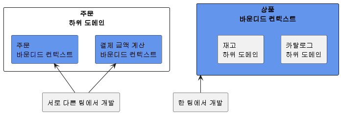
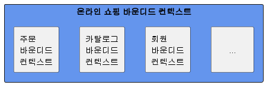
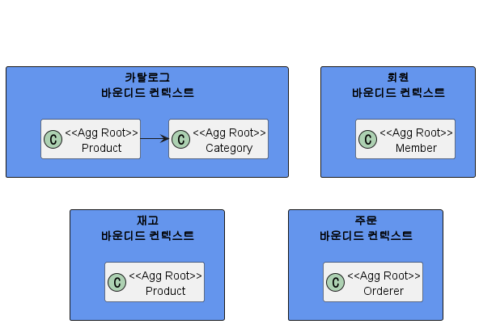
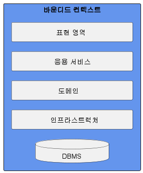
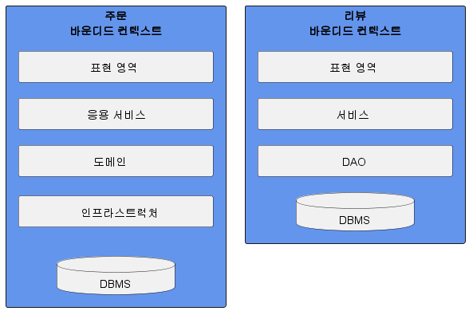
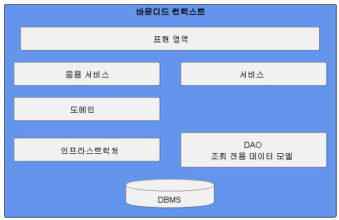
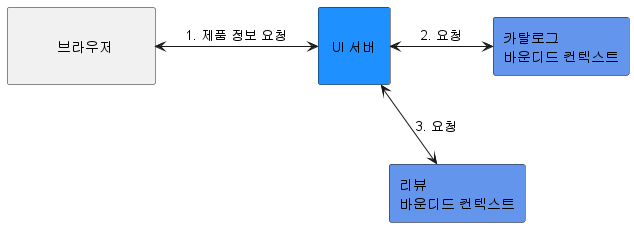

# 9. 도메인 모델과 바운디드 컨텍스트

## 1. 도메인 모델과 경계

- 처음 도메인 모델을 만들 때 빠지기 쉬운 함정이 도메인을 완전하게 표현하는 단일 모델을 만드는 시도를 하는 것이다.
- 1장에서 말한 것처럼 한 도메인은 다시 여러 하위 도메인으로 구분된다.
- 따라서 한 개의 모델로 여러 하위 도메인을 모두 표현하려고 시도하면 오히려 모든 하위 도메인이 맞지 않는 모델을 만들게 된다.
  - 카탈로그에서 상품, 재고 관리에서 상품, 주문에서 상품, 배송에서 상품은 이름만 같지 실제로 의미하는 것이 다르다.
  - 카탈로그 도메인의 상품: 상품 이미지, 상품명, 상품 가격, 옵션 목록, 상세 설명과 같은 상품 정보가 위주
  - 재고 관리 도메인의 상품: 실존하는 개별 객체를 추적하기 위한 목적으로 상품을 사용
  - 즉 카탈로그에서는 물리적으로 한 개인 상품이 재고 관리에서는 여러 개 존재할 수 있다.
- 논리적으로 같은 존재처럼 보이지만 하위 도메인에 따라 다른 용어를 사용하는 경우도 있다.
  - 카탈로그 도메인의 상품이 검색 도메인에서는 문서라고 불린다.
  - 회원 도메인에서의 회원이 주문 도메인에서는 주문자이며, 배송 도메인에서는 받는 사람이라고 불린다.
    
- 이렇게 하위 도메인마다 같은 용어라도 의미가 다르고 같은 대상이라도 지칭하는 용어가 다를 수 있기 때문에 한 개의 모델로 모든 하위 도메인을 표현하려는 시도는 올바른 방법이 아니며 표현할 수도 없다.
  - 하위 도메인마다 사용하는 용어가 다르기 때문에 올바른 도메인 모델을 개발하려면 하위 도메인마다 모델을 만들어야 한다.
  - 각 모델은 명시적을 구분되는 경계를 가져서 섞이지 않도록 해야 한다.
- 여러 하위 도메인의 모델이 섞이기 시작하면 모델의 의미가 약해질 뿐만 아니라 여러 도메인의 모델이 서로 얽힌다.
- 때문에 각 하위 도메인별로 다르게 발전하는 요구사항을 모델에 반영하기 어려워진다.
- 모델은 특정한 컨텍스트 하에서 완전한 의미를 갖는다.
  - 같은 제품이라도 카탈로그 컨텍스트와 재고 컨텍스트에서 의미가 서로 다르다.
- 이렇게 구분되는 경계를 갖는 컨텍스트를 DDD에서는 바운디드 컨텍스트라고 부른다.

## 2. 바운디드 컨텍스트

- 바운디드 컨텍스트는 모델의 경계를 결정하며 한 개의 바운디드 컨텍스트는 논리적으로 한 개의 모델을 갖는다.
- 바운디드 컨텍스트는 용어를 기준으로 구분한다.
  - 카탈로그 컨텍스트와 재고 컨텍스트는 서로 다른 용어를 사용하므로 이 용어를 기준으로 컨텍스트를 분리할 수 있다.
- 바운디드 컨텍스트는 실제로 사용자에게 기능을 제공하는 물리적 시스템으로 도메인 모델은 바운디드 컨텍스트 안에서 도메인을 구현한다.
- 이상적으로 하위 도메인과 바운디드 컨텍스트가 일대일 관계를 가지면 좋겠지만 현실은 그렇지 않을 때가 많다.
- 바운디드 컨텍스트는 기업의 팀 조직 구조에 따라 결정되기도 한다.
  - 주문 하위 도메인이라는 주문을 처리하는 팀과 복잡한 결제 금액 계산 로직을 구현하는 팀이 따로 있다고 해보자.
  - 이 경우 주문 하위 도메인에 주문 바운디드 컨텍스트와 결제 금액 계산 바운디드 컨텍스트가 존재하게 된다.
- 용어를 명확하게 구분하지 못해 두 하위 도메인을 하나의 바운디드 컨텍스트에서 구현하기도 한다.
  - 카탈로그와 재고 관리가 아직 명확하게 구분되지 않은 경우 두 하위 도메인을 하나의 바운디드 컨텍스트에서 구현하기도 한다.

- 규모가 작은 기업은 전체 시스템을 한 개 팀에서 구현할 때도 있다.
  - 소규모 쇼핑몰은 한 개의 웹 애플리케이션으로 온라인 쇼핑을 서비스하며 하나의 시스템에서 회원, 카탈로그, 재고, 구매, 결제와 관련된 모든 기능을 제공한다.
  - 즉 여러 하위 도메인을 한 개의 바운디드 컨텍스트에서 구현한다.
- 여러 하위 도메인을 하나의 바운디드 컨텍스트에서 개발할 때 주의할 점은 하위 도메인의 모델이 섞이지 않도록 하는 것이다.
- 한 프로젝트에 각 하위 도메인의 모델이 위치하면 전체 하위 도메인을 위한 단일 모델을 만들고 싶은 유혹에 빠지기 쉽다.
  - 이런 유혹에 걸려들면 도메인 모델이 개별 하위 도메인을 제대로 반영하지 못하게 된다.
  - 이는 하위 도메인별로 기능을 확장하기 어렵게 되고 서비스 경쟁력을 떨어뜨리는 원인이 된다.
- 비록 한 개의 바운디드 컨텍스트가 여러 하위 도메인을 포함하더라고 하위 도메인마다 구분되는 패키지를 갖도록 구현해야 한다.
  - 이렇게 함으로써 하위 도메인을 위한 모델이 서로 뒤섞이지 않고 하위 도메인마다 바운디드 컨텍스트를 갖는 효과를 낼 수 있다.

- 바운디드 컨텍스트는 도메인 모델을 구분하는 경계가 되기 때문에 바운디드 컨텍스트는 구현하는 하위 도메인에 알맞은 모델을 포함한다.
  - 같은 사용자라 하더라도 주문 바운디드 컨텍스트와 회원 바운디드 컨텍스트가 갖는 모델이 달라진다.
    - 회원의 Member는 애그리거트 루트이지만 주문의 Orderer는 밸류가 된다.
  - 같은 상품이라도 카탈로그 바운디드 컨텍스트의 Product와 재고 바운디드 컨텍스트의 Product는 각 컨텍스트에 맞는 모델을 갖는다.
    - 카탈로그의 Product는 상품이 속할 Category와 연관을 갖지만 재고의 Product는 카탈로그의 Category와 연관을 맺지 않는다.
      

## 3. 바운디드 컨텍스트 구현

- 바운디드 컨텍스트가 도메인 모델만 포함하는 것은 아니다.
- 바운디드 컨텍스트는 도메인 기능을 사용자에게 제공하는 데 필요한 표현 영역, 응용 서비스, 인프라스트럭처 영역을 모두 포함한다.
- 도메인 모델의 데이터 구조가 바뀌면 DB 테이블 스키마도 함께 변경해야 하므로 테이블도 바운디드 컨텍스트에 포함된다.

- 표현 영역은 인간 사용자를 위해 HTML 페이지를 생성할 수도 있고, 다른 바운디드 컨텍스트를 위해 REST API를 제공할 수도 있다.
- 모든 바운디드 컨텍스트를 반드시 도메인 주도로 개발할 필요는 없다.
  - 상품의 리뷰는 복잡한 도메인 로직을 갖지 않기 때문에 CRUD 방식으로 구현해도 된다.
  - 즉 DAO와 데이터 중심의 밸류 객체를 이용해서 리뷰 기능을 구현해도 기능을 유지 보수하는 데 큰 문제가 없다.
    
- 서비스-DAO 구조를 사용하면 도메인 기능이 서비스에 흩어지게 되지만 도메인 기능 자체가 단순하면 서비스-DAO로 구성된 CRUD 방식을 사용해도 코드를 유지 보수하는 데 문제 되지 않는다고 생각한다.
- 한 바운디드 컨텍스트에서 두 방식을 혼합해서 사용할 수도 있다.
  - 대표적으로 CQRS(Query Responsibility Segregation) 패턴이다.
  - CQRS는 상태를 변경하는 명령 기능과 내용을 조회하는 쿼리 기능을 위한 모델을 구분하는 패턴이다.
  - 이 패턴을 단일 바운디드 컨텍스트에 적용하면 아래 그림과 같이 상태 변경과 관련된 기능은 도메인 모델 기반으로 구현하고 조회 기능은 서비스-DAO를 이용해서 구현할 수 있다.

- 각 바운디드 컨텍스트는 서로 다른 구현 기술을 사용할 수도 있다.
  - 웹 MVC는 스프링 MVC를 사용하고 리포지토리 구현 기술로는 JPA/하이버네이트를 사용하는 바운디드 컨텍스트가 존재 할 수도 있다.
  - Netty를 이용해서 REST API를 제공하고 마이바티스를 리포지터리 구현 기술로 사용하는 바운디드 컨텍스트가 존재할 수도 있다.
  - 어떤 바운디드 컨텍스트는 RDBMS 대신 몽고DB와 같은 NoSQL을 사용할 수도 있을 것이다.
- 바운디드 컨텍스트가 반드시 사용자에게 보여지는 UI를 가지고 있어야 하는 것은 아니다.
  - 웹 브라우저는 아래 그림처럼 카탈로그 바운디드 컨텍스트를 통해 상세 정보를 읽어온다.
  - 그리고 리뷰 바운디드 컨텍스트의 REST API를 직접 호출해서 로딩한 JSON 데이터를 알맞게 가공해서 리뷰 목록을 보여줄 수도 있다.
    
  - 아래 드림과 같이 UI를 처리하는 서버를 두고 UI서버가 바운디드 컨텍스트와 통신해서 사용자 요청을 처리하는 방법도 있다.
    
  - 이 구조에서 UI서버는 각 바운디드 컨텍스트를 위한 파사드 역할을 수행한다.
  - 브라우저가 UI서버에 요청을 보내면 UI서버는 카탈로그와 리뷰 바운디드 컨텍스트로부터 필요한 정보를 읽어와 조합한 뒤 브라우저에 응답을 제공한다.

## 4. 바운디드 컨텍스트 통합

## 5. 바운디드 컨텍스트 간 관계

## 6. 컨텍스트 맵
