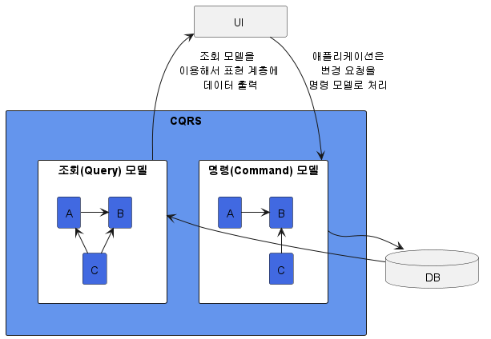
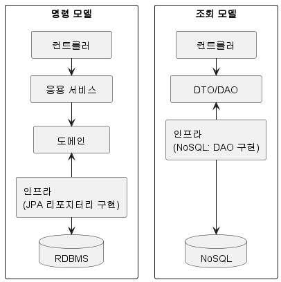

# 11. CQRS

## 1. 단일 모델의 단점

- 조회 화면 특성상 조회 속도가 빠를수록 좋은데 여러 애그리거트의 데이터가 필요하면 구현 방법을 고민해야 한다.
- 단일 모델은 시스템 상태를 변경할 때와 조회할 때 단일 도메인 모델을 사용하기 때문에 아래와 같은 문제가 생긴다.
  - 식별자를 이용해서 애그리거트를 참조하는 방식을 사용한 경우
    - 즉시 로딩과 같은 JPA의 쿼리 관련 최적화 기능을 사용할 수 없다.
  - 직접 참조하는 방식을 사용한 경우
    - 조회 화면 특성에 따라 같은 연관도 즉시 로딩이나 지연 로딩으로 처리해야 한다.
    - DBMS가 제공하는 전용 기능이 필요하면 JPA의 네이티브 쿼리를 사용해야 한다.
- 객체 지향으로 도메인 모델을 구현할 때 주로 사용하는 ORM 기법은 도메인 상태 변경을 구현하는 데는 적합하다.
- 하지만 여러 애그리거트에서 데이터를 가져와 출력하는 기능을 구현하기에는 구현을 복합하게 만든다.
- 상태 변경을 위한 모델과 조회를 위한 모델을 분리하면 위에서 언급한 구현 복잡도를 낮출 수 있다.

## 2. CQRS

- 시스템이 제공하는 기능은 크게 두 가지로 나눌 수 있다.
  - 상태를 변경하는 기능
    - 주로 한 애그리거트의 상태를 변경한다.
  - 상태 정보를 조회하는 기능
    - 두 개 이상의 애그리거트가 필요한 경우가 많다.
- 상태를 변경하는 기능과 상태 정보를 조회하는 기능은 범위가 정확하게 일치하지 않는다.
- 단일 모델로 두 기능을 모두 구현하면 모델이 불필요하게 복잡해진다.
- CQRS(Command Query Responsibility Segregation) 방법을 사용하면 단일 모델을 사용할 때 발생하는 복잡도 문제를 해결할 수 있다.

- CQRS를 사용하면 각 모델에 맞는 구현 기술을 선택할 수 있다.

- 명령 모델
  - 객체를 기반으로 한 도메인 모델을 이용해서 구현한다.
  - RDBMS를 사용한다.
- 조회 모델
  - 필요한 정보를 담고 있는 데이터 타입을 이용한다.
  - NoSQL을 사용한다.
  - 단순히 데이터를 읽어와 조회하는 기능은 응용 로직이 복잡하지 않기 때문에 컨트롤러에서 바로 DAO를 실행해도 무방하다.
- 위 그림에서 저장소 간 데이터 동기화는 이벤트를 활용해서 처리한다.

### 2.1. 웹과 CQRS

- 일반적으로 웹 서비스는 상태 변경보다 조회 요청이 많다.
- 따라서 조회 성능을 높이기 위해 다양한 방법을 사용한다.
  - 쿼리를 최적화한다.
  - 메모리에 조회 데이터를 캐싱한다.
  - 조회 전용 저장소를 따로 사용하기도 한다.
- 위와 같은 다양한 기법은 결과적으로 CQRS를 적용하는 것과 같은 효과를 만든다.
  - 쿼리를 최적화한다. → 조회 화면에 보여줄 데이터를 빠르게 읽어 올 수 있도록 쿼리를 작성한다.
  - 메모리에 조회 데이터를 캐싱한다. → 조회 전용 모델을 캐싱한다.
- 차이점은 명시적으로 명시적으로 조회와 명령 모델을 구분하지 않을 뿐이다.
- 조회 속도를 위해 별도 처리를 하고 있다면 명시적으로 조회와 명령 모델을 구분하자.
- 이를 통해 조회 기능 때문에 명령 모델이 복잡해지는 것을 막을 수 있고, 명령 모델에 관계없이 조회 기능에 특화된 구현 기법을 쉽게 적용한 수 있다.

### 2.2. CQRS 장단점

- 장점
  - 명령 모델 구현시 도메인 자체에 집중할 수 있다.
  - 명령 모델에서 조회 관련 로직이 사라져 복잡도가 낮아진다.
    - 조회 성능을 위한 코드가 명령 모델에 없어진다.
  - 조회 성능을 향상시키는 데 유리하다.
    - 캐시뿐만 아니라 조회 저장소를 사용하면 조회 처리량을 대폭 늘릴 수 있다.
    - 조회 전용 모델을 사용하기 때문에 조회 성능을 높이기 위한 코드가 명령 모델에 영향을 주지 않는다.
- 단점
  - 구현해야 할 코드가 더 많다.
  - 더 많은 구현 기술이 필요하다.
    - 조회와 명령 모델이 서로 다른 구현 기술을 사용할 수 있다.
    - 메시징을 사용하는 경우도 있다.
- 이런 장단점을 고려해서 CQRS 패턴을 도입할지 결정해야 한다.
- 도메인이 복잡하지 않은데 CQRS를 도입하면 두 모델을 유지하는 비용만 높아지고 얻을 수 있는 이점이 없다.
- 반면 트래픽이 높은 서비스인데 단일 모델을 고집하면 유지 보수 비용이 오히려 높아질 수 있다.
