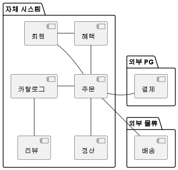
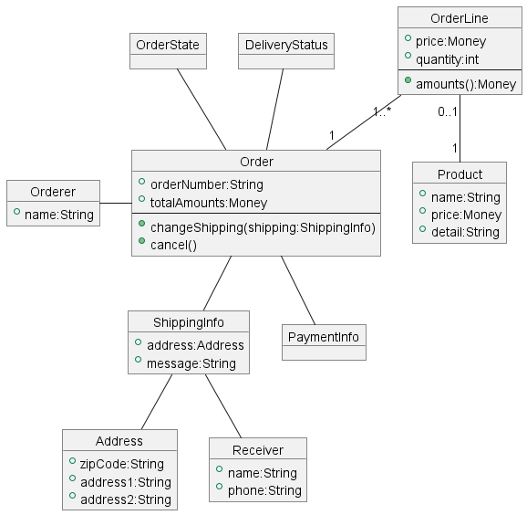
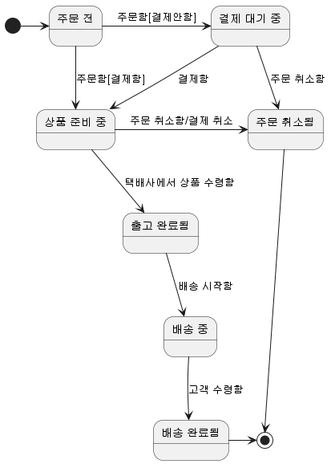
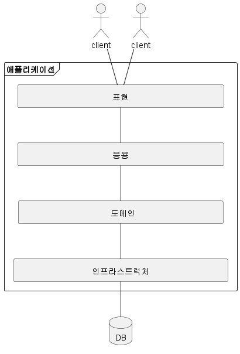

# 1. 도메인 모델 시작하기

## 1. 도메인이란?

- 개발자 입장에서 온라인 서점은 구현해야 할 소프트웨어의 대상이다. 온라인 서점은 상품 조회, 구매, 결제, 배송 추척 등의 기능을 제공해야 한다. 이때 온라인 서점은 해결하고자 하는 문제 영역, 즉 도메인에 해당한다.
- 한 도메인은 다시 하위 도메인으로 나눌 수 있다.  
  
  - 온라인 서점 도메인은 위 그림과 같이 몇 개의 하위 도메인으로 나눌 수 있다.
  - 카탈로그 하위 도메인: 상품 목록 제공
  - 주문 하위 도메인: 고객의 주문 처리
  - 혜택 하위 도메인: 쿠폰이나 특별할인과 같은 서비스 제공
  - 배송 하위 도메인: 구매한 상품을 전달하는 일련의 과정
  - 한 하위 도메인은 다른 하위 도메인과 연동하여 완전한 기능을 제공한다.
    - 고객이 물건을 구매하면 주문, 결제, 배송, 혜택 하위 도메인의 기능이 엮인다.
- 특정 도메인을 위한 소프트웨어라고 해서 도메인이 제공해야 할 모든 기능을 직접 구현하는 것은 아니다.
  - 일부 기능은 자체 시스템으로 구현하고, 나머지 기능은 외부 업체의 시스템을 사용한다.  
    
- 도메인마다 고정된 하위 도메인이 존재하는 것은 아니다.
  - 모든 온라인 쇼핑몰이 혜택을 제공하는 것은 아니다.
  - 소규모 쇼핑몰은 엑셀을 이용해서 수작업으로 정산을 처리한다.
- 하위 도메인을 어떻게 구성할지는 상황에 따라 달라진다.
  - 기업 고객을 대상으로 대형 장비를 판매하는 곳은 온라인으로 카탈로그를 제공하는 주문서를 받는 정도만 필요하며, 온라인 결제나 배송 추적과 같은 기능을 제공할 필요가 없다.
  - 일반 고객을 대상으로 물건을 판매한다면 카탈로그, 리뷰, 주문, 결제, 배송, 회원 기능 등이 필요하다.

## 2. 도메인 전문가와 개발자 간 지식 공유

- 온라인 홍보, 정산, 배송 등 각 영역에는 전문가가 있다. 이들은 지식과 경험을 바탕으로 본인들이 원하는 기능 개발을 요구한다.
  - 회계 담당자는 엑셀로 맞추던 정산 금액 계산을 자동화해 주는 기능을 요구할 수 있다.
- 개발자는 요구사항을 분석하고 설계하여 코드를 작성하며 테스트하고 배포한다. 이 과정에서 요구사항은 첫 단추와 같다. 첫 단추를 잘못 끼우면 모든 단추가 잘못 끼워진다.
- 도메인 전문가 만큼은 아니겠지만 이해관계자와 개발자도 도메인 지식을 갖춰야 한다. 도메인 전문가, 관계자, 개발자가 같은 지식을 공유하고 직접 소통할수록 도메인 전문가가 원하는 제품을 만들 가능성이 높아진다.

## 3. 도메인 모델

- 도메인 모델은 특정 도메인을 개념적으로 표현한 것이다.
- 주문 도메인을 생각해보자.
  - 상품을 몇개 살지 선택하고 배송지를 입력한다.
  - 선택한 상품 가격을 이용해서 총 지불 금액을 계산한다.
  - 금액 지불을 위한 결제 수단을 선택한다.
  - 주문한 뒤에도 배송 전이면 배송지 주소를 변경하거나 주문을 취소할 수 있다.
- 객체 기반 주문 도메인 모델  
  
  - 도메인의 모든 내용을 담고 있지는 않지만 주문(Order), 주문번호(orderNumber)와 지불할 총금액(totalAmounts)이 있고, 배송정보(ShippingInfo)를 변경할 수 있음을 알 수 있다.
  - 도메인을 이해하려면 도메인이 제공하는 기능과 주요 데이터 구성을 파악해야 하는데, 기능과 데이터를 함께 보여주는 객체 모델은 도메인을 모델링하기에 적합하다.
- 상태 다이어그램 기반 주문 상태 모델  
  
  - 이 다이어그램을 보면 상품 준비 중 상태에서 주문을 취소하면 결제 취소가 함께 이루어진다는 것을 알 수 있다.
- 도메인 모델을 표현할 때 UML 표기법만 사용해야 하는 것은 아니다. 도메인을 이해하는 데 도움이 된다면 표현 방식이 무엇인지는 중요하지 않다.
  - 관계가 중요한 경우: 그래프로 모델링
  - 계산 규칙이 중요한 경우: 수학 공식을 활용해서 모델링
- 도메인 모델은 도메인 자체를 이해하기 위한 개념 모델이다.
- 개념 모델을 이용해서 바로 코드를 작성할 수 있는 것은 아니기에 구현 모델이 따로 필요하다. 하지만 구현 모델이 개념 모델을 최대한 따르도록 할 수는 있다.
  - 객체 기반 모델 개념 모델: 객체 지향 언어를 이용해서 유사한 구현 모델을 만든다.
  - 수학적 모델 기반 개념 모델: 함수를 이용해서 유사한 구현 모델을 만든다.

### 하위 도메인과 모델

- 상술했듯 도메인은 다수의 하위 도메인으로 구성된다.
- 각 하위 도메인이 다루는 영역은 서로 다르기 때문에 같은 용어라도 하위 도메인마다 의미가 달라질 수 있다.
  - 카탈로그 도메인의 상품: 상품 가격, 상세 내용을 담고 있는 정보
  - 배송 도메인의 상품: 고객에게 실제 배송되는 물리적인 상품
- 도메인에 따라 용어의 의미가 결정되므로 여러 하위 도메인을 하나의 다이어그램에 모델링하면 안된다. 즉, 카탈로그 도메인과 배송 도메인은 모델을 따로 만들어야 한다.
- 모델의 각 구성요소는 특정 도메인으로 한정할 때 비로소 의미가 완전해진다.

## 4. 도메인 모델 패턴

- 일반적인 애플리케이션의 아키텍처는 아래 그림과 같이 네 개의 영역으로 구성된다.  
  

| 영역                | 설명                                                                                                      |
| ------------------- | --------------------------------------------------------------------------------------------------------- |
| 표현 계층           | 사용자의 요청을 처리하고 사용자에게 정보를 보여준다. 사용자는 사람뿐만 아니라 외부 시스템일 수도 있다.    |
| 응용 계층           | 사용자가 요청한 기능을 실행한다. 업무 로직을 직접 구현하지 않으며 도메인 계층을 조합해서 기능을 실행한다. |
| 도메인 계층         | 시스템이 제공할 도메인 규칙을 구현한다.                                                                   |
| 인프라스트럭처 계층 | 데이터베이스나 메시징 시스템과 같은 외부 시스템과의 연동을 처리한다.                                      |

- 앞서 살펴본 도메인 모델이 도메인 자체를 이해하는 데 필요한 개념 모델을 의미한다면, 지금 살펴보는 도메인 모델은 아키텍처 상의 도메인 계층을 객체 지향 기법으로 구현하는 패턴을 의미한다.
- 도메인 계층은 도메인의 핵심 규칙을 구현한다.
  - 주문 도메인의 경우 **출고 전에 배송지를 변경할 수 있다**라는 규칙과 **주문 취소는 배송 전에만 할 수 있다**라는 규칙을 구현한 코드가 도메인 계층에 위치하게 된다.
- 도메인 모델 패턴은 위와 같은 예시를 객체 지향 기법으로 구현하는 패턴이다.

```java
public class Order {
	private OrderState state;
	private ShippingInfo shippingInfo;

	public void changeShippingInfo(ShippingInfo newShippingInfo) {
		if (!state.isShippingChangeable()) {
			throw new IllegalStateException("can't change shipping in " + state);
		}
		this.shippingInfo = newShippingInfo;
	}
}

public enum OrderState {
	PAYMENT_WAITING {
		public boolean isShippingChangeable() {
			return true;
		}
	}
	PREPARING {
		public boolean isShippingChangeable() {
			return true;
		}
	}
	SHIPPED, DELIVERING, DELIVERY_COMPLETED;

	public boolean isShippingChangeable() {
		return false;
	}
}
```

- 위 코드는 주문 도메인의 일부 기능을 도메인 모델 패턴으로 구현한 것이다.
- 주문 상태를 표현하는 OrderState는 배송지를 변경할 수 있는지를 검사할 수 있는 isShippingChangeable() 메서드를 제공하고 있다.
- 주문 대기 중 (PAYMENT_WAITING), 상태와 상품 준비 중 (PREPARING) 상태의 isShippingChangeable() 메서드만 true를 리턴한다.
- 즉, OrderState는 주문 대기 중이거나 상품 준비 중에는 배송지를 변경할 수 있다는 도메인 규칙을 구현하고 있다.

```java
public class Order {
	private OrderState state;
	private ShippingInfo shippingInfo;

	public void changeShippingInfo(ShippingInfo newShippingInfo) {
		if (!state.isShippingChangeable()) {
			throw new IllegalStateException("can't change shipping in " + state);
		}
		this.shippingInfo = newShippingInfo;
	}

	private boolean isShippingChangeable() {
		return state == OrderState.PAYMENT_WAITING || state == OrderState.PREPARING
	}
}

public enum OrderState {
	PAYMENT_WAITING, PREPARING,	SHIPPED, DELIVERING, DELIVERY_COMPLETED;
}
```

- 위 코드는 배송지 정보 변경 가능 여부를 판단하는 메서드를 Order로 수정한 코드이다.
- 배송지 변경 가능여부 판단 규칙이 OrderState와 다른 정보를 함께 사용한다면 OrderState만으로는 배송지 가능 여부를 판단할 수 없으므로 Order에서 로직을 구현해야 한다.
- 배송지 변경 가능 여부를 판단하는 기능이 Order에 있든 OrderState에 있든 중요한 점은 주문과 관련된 중요 업무 규칙을 주문 도메인인 Order나 OrderState에서 구현한다는 점이다.
- 핵심 규칙을 구현한 코드는 도메인 모델에만 위치하기 때문에 규칙이 바뀌거나 규칙을 확장해야 할 때 다른 코드에 영향을 덜 주고 변경 내역을 모델에 반영할 수 있게 된다.

### 개념 모델과 구현 모델

- 개념 모델은 순수하게 문제를 분석한 결과물이다. 데이터베이스, 트랜잭션 처리, 성능, 구현 기술과 같은 것을 고려하고 있지 않다. 따라서 개념 모델을 구현 가능한 형태의 모델로 전환하는 과정을 거치게 된다.
- 개념 모델을 만들 때 처음부터 완벽하게 도메인을 표현하는 모델을 만드는 시도를 할 수 있지만 이것은 불가능하다. 소프트웨어를 개발하는 동안 개발자와 관계자들은 해당 도메인을 더 잘 이해하게 된다. 따라서 시간이 지난 후 완전히 다른 의미로 해석되는 경우도 있다.
- 따라서 처음에는 전반적인 개요를 알 수 있는 수준의 개념 모델로 도메인의 전체 윤곽을 이해하는 데 집중하고, 구현하는 과정에서 개념 모델을 구현 모델로 점진적으로 발전시켜 나가야 한다.

## 5. 도메인 모델 도출

- 도메인을 모델링 도출의 기본은 핵심 구성요소, 규칙, 기능을 찾는 것이다.
- 이 과정은 요구사항에서 출발한다. 아래는 주문 도메인과 관련된 몇 가지 요구사항이다.
  - 최소 한 종류 이상의 상품을 주문해야 한다.
  - 한 상품을 한 개 이상 주문할 수 있다.
  - 총 주문 금액은 각 상품의 구매 가격 합을 모두 더한 금액이다.
  - 각 상품의 구매 가격 합은 상품 가격에 구매 개수를 곱한 값이다.
  - 주문할 때 배송지 정보를 반드시 지정해야 한다.
  - 배송지 정보는 받는 사람 이름, 전화번소, 주소로 구성된다.
  - 출고를 하면 배송지를 변경할 수 없다.
  - 출고 전에 주문을 취소할 수 있다.
  - 고객이 결제를 완료하기 전에는 상품을 준비하지 않는다.
- 다음 요구사항으로 알 수 있는 것은 주문은 ‘출고 상태로 변경하기', ‘배송지 정보 변경하기', ‘주문 취소하기', ‘결제 완료하기' 기능을 제공한다는 것이다.
  - 출고를 하면 배송지를 변경할 수 없다.
  - 출고 전에 주문을 취소할 수 있다.
  - 고객이 결제를 완료하기 전에는 상품을 준비하지 않는다.
  ```java
  public class Order {
  	public void changeShipped() {...}
  	public void changeShippingInfo(ShippingInfo newShipping) {...}
  	public void cancel() {...}
  	public void completePayment() {...}
  }
  ```
  - 상세 구현까지 할 수 있는 수준은 아니지만 Order에 관련 기능을 메서드로 추가했다.
- 다음 요구사항은 주문 항목이 어떤 데이터로 구성되는지 알려준다.

  - 한 상품을 한 개 이상 주문할 수 있다.
  - 각 상품의 구매 가격 합은 상품 가격에 구매 개수를 곱한 값이다.

  ```java
  public class OrderLine {
  	private Product product;
  	private int price;
  	private int quantity;
  	private int amounts;

  	public OrderLine(Product product, int price, int quantity) {
  		this.product = product;
  		this.price = price;
  		this.quantity = quantity;
  		this.amounts = calculateAmounts();
  	}

  	private int calculateAmounts() {
  		return price * quantity;
  	}

  	public int getAounts() {...}
  }
  ```

  - OrderLine은 적어도 주문할 상품, 상품의 가격, 구매 개수를 포함해야 한다. 추가로 각 구매 항목의 구매 가격도 제공하도록 반영했다.

- 다음 요구사항은 Order와 OrderLine과의 관계를 알려준다.

  - 최소 한 종류 이상의 상품을 주문해야 한다.
  - 총 주문 금액은 각 상품의 구매 가격 합을 모두 더한 금액이다.

  ```java
  public class Order {
  	private List<OrderLine> orderLines;
  	private Monty totalAmounts;

  	public Order(List<OrderLine> orderLines) {
  		setOrderLines(orderLines);
  	}

  	private void setOrderLines(List<OrderLine> orderLines) {
  		verifyAtLeastOneOrMoreOrderLines(orderLines);
  		this.orderLines = orderLines;
  		calculateTotalAmounts();
  	}

  	private void verifyAtLeastOneOrMoreOrderLines(List<OrderLine> orderLines) {
  		if (orderLines == null || orderLines.empty() {
  			throw new IllegalArgumentException("no OrderLine");
  		}
  	}

  	private void calculateTotalAmounts() {
  		int sum = orderLines.stream()
  												.mapToInt(x -> x.getAmount())
  												.sum();
  		this.totalAmounts = new Money(sum);
  	}

  	... // 다른 메서드들
  }
  ```

  - 한 종류 이상의 상품을 주문할 수 있으므로 Order는 최소 한 개 이상의 OrderLine을 포함해야 한다. 또한 총 주문 금액은 OrderLine의 구매 가격의 합에서 구할 수 있다.
  - 두 요구사항은 Order에 위와 같이 반영할 수 있다.
    - Order는 한 개 이상의 OrderLine을 가질 수 있으므로 Order를 생성할 때 OrderLine 목록을 List로 전달한다.
    - 생성자에서 `setOrderLines`를 호출한 뒤, `verifyAtLeastOneOrMoreOrderLines` 메서드를 통해서 제약 조건을 검사한다.
    - 또한 `calculateTotalAmounts`를 통해서 총 주문 금액을 계산한다.

- 배송지 정보는 이름, 전화번호, 주소 데이터를 가지므로 ShippingInfo 클래스를 다음과 같이 정의할 수 있다.

  ```java
  public class ShippingInfo {
  	private String receiverName;
  	private String receiverPhoneNumber;
  	private String shippingAddress1;
  	private String shippingAddress2;
  	private String shippingZipcode;

  	... 생성자, getter
  }
  ```

- 앞서 요구사항 중, ‘주문할 때 배송지 정보를 반드시 지정해야 한다'라는 내용이 있다. 이를 반영하면 Order는 다음과 같이 된다.

  ```java
  public class Order {
  	private List<OrderLine> orderLines;
  	private Monty totalAmounts;

  	public Order(List<OrderLine> orderLines, ShippingInfo shippingInfo) {
  		setOrderLines(orderLines);
  		setShippingInfo(shippingInfo);
  	}

  	private void setShippingInfo(ShippingInfo shippingInfo) {
  		if (shippingInfo == null) {
  			throw new IllegalArgumentException("no ShippingInfo");
  		}
  		this.shippingInfo = shippingInfo;
  	}

  	... // 다른 메서드들
  }
  ```

  - 생성자에서 호출하는 `setShippingInfo` 메서드는 ShippingInfo 가 null이면 Exception이 발생하는데, 이렇게 함으로써 ‘배송지 정보 필수'라는 도메인 규칙을 구현한다.

- 도메인을 구현하다 보면 특정 조건이나 상태에 따라 제약이나 규칙이 달리 적용되는 경우가 많다.
- 이 요구사항은 출고 상태가 되기 전과 후, 결제 상태의 제약 사항을 기술하고 있다.

  - 출고를 하면 배송지 정보를 변경할 수 없다.
  - 출고 전에 주문을 취소할 수 있다.
  - 고객이 결제를 완료하기 전에는 상품을 준비하지 않는다.

  ```java
  public enum OrderState {
  	PAYMENT_WAITING, PREPARING, SHIPPED, DELIVERING, DELIVERY_COMPLETED, CANCELED;
  }
  ```

  - 존재 할 수 있는 상태를 위와 같이 열거 타입으로 나타낼 수 있다.
  - 배송지 변경이나 주문 취소 기능은 출고 전에만 가능하다는 제약 규칙이 있으므로 이 규칙을 적용하기 위해 changeShippingInfo()와 cancel()은 veryfyNotYetShipped() 메서드를 먼저 실행한다.

  ```java
  public class Order {
  	private OrderState state;

  	public void changeShippingInfo(ShippingInfo newShippingInfo) {
  		verifyNotYetShipping();
  		setShippingInfo(newShippingInfo);
  	}

  	public void cancel() {
  		verifyNotYetShipping();
  		this.state = OrderState.CANCELED;
  	}

  	private void verifyNotYetShipping() {
  		if (state != OrderState.PAYMENT_WAITING && state != OrderState.PREPARING) {
  			throw new IllegalStateException("alreay shipped");
  		}
  }
  ```

  > 앞서 도메인 모델 패턴을 설명할 때는 isShippingChangeable 메서드로 제약 조건을 검사했는데, 지금은 도메인을 더 잘 알게 되었기 때문에 이름을 변경했다.
  > 최초에는 배송지 정보 변경에 대한 제약 조건만 파악했기 때문에 isShippingChangeable를 사용했지만, 요구 사항을 분석하면서 배송지 정보 변경과 주문 취소가 둘 다 ‘출고 전에 가능'하다는 제약이 있음을 알게 되었고 ‘출고 전'이라는 의미를 반영하기 위해 메서드 이름을 verifyNotYetShipping으로 변경했다.

- 지금까지 주문과 관련된 요구사항에서 도메인 모델을 점진적으로 만들어 나갔다. 일부는 구현했고, 일부는 이름 정도만 결정했다.
- 이렇게 만든 모델은 요구사항 정련을 위해 도메인 전문가나 다른 개발자와 논의하는 과정에서 공유되기도 한다.

### 문서화

- 문서화를 하는 주된 이유는 지식을 공유하기 위함이다. 구현은 코드에 있으므로 코드를 보면 다 알 수 있지만 코드는 상세한 모든 내용을 다루고 있기 때문에 코드를 이용해서 전체 소프트웨어를 분석하려면 많은 시간이 투자되어야 한다.
- 전반적인 기능 목록이나 모듈 구조, 빌드 과정은 코드를 보고 직접 이해하는 것보다 상위 수준에서 정리한 문서를 참조하는 것이 소프트웨어 전반을 빠르게 이해하는 데 도움이 되며, 세부적이거나 더 깊게 이해할 필요가 있는 부분은 코드로 분석해 나가면 된다.
- 코드를 보면서 깊게 이해하게 되므로 코드 자체도 문서화의 대상이 된다. 도메인 지식이 잘 묻어나도록 코드를 작성하지 않으면 코드의 동작 과정은 해석할 수 있어도 도메인 관점에서 왜 코드를 그렇게 작성했는지 이해하기 어렵다.
  - 즉, 코드를 뵉 좋게 작성하는 것뿐만 아니라 도메인 관점에서 코드가 도메인을 잘 표현해야 비로소 코드의 가독성이 높아지고 문서로서 코드가 의미를 같는다.

## 6. 엔티티와 밸류

- 엔티티와 밸류를 제대로 구분해야 도메인을 올바르게 설계하고 구현할 수 있기 때문에 이 둘의 차이를 명확하게 이해하는 것은 도메인을 구현하는 데 있어 중요하다.

### 6.1. 엔티티

- 엔티티의 가장 큰 특징은 식별자를 가진다는 것이다.
  - 식별자는 엔티티 객체마다 고유해서 각 엔티티는 서로 다른 식별자를 갖는다.
  - 예를 들어 각 주문은 주문번호를 가지고 있는데 이 주문번호는 각 주문마다 서로 다르다. 따라서 주문번호가 식별자가 된다.

### 6.2. 엔티티의 식별자 생성

- 흔히 식별자는 다음 중 한가지 방식으로 생성한다.
  - 특정 규칙에 따라 생성
    - 이 규칙은 도메인 그리고 회사마다 다르다.
    - 흔히 사용하는 규칙은 현재 시간과 다른 값을 함께 조합하는 것이다.
  - UUID나 Nano ID와 같은 고유 식별자 생성기 사용
    - 다수의 개발 언어가 UUID 생성기를 제공하고 있으므로 마땅한 규칙이 없다면 UUID를 식별자로 사용해도 된다.
  - 값을 직접 입력
    - 회원의 아이디나 이메일과 같은 식별자는 값을 직접 입력한다. 사용자가 직접 입력하기 때문에 중복되지 않도록 사전에 방지하는 것이 중요하다.
  - 일련번호 사용 (시퀀스나 DB의 자동 증가 컬럼 사용)
    - 일련번호는 주로 데이터베이스가 제공하는 자동 증가 기능을 사용한다.
    - 자동 증가 컬럼은 DB 테이블에 데이터를 삽입해야 비로소 값을 알 수 있기 때문에 테이블에 데이터를 추가하기 전에는 식별자를 알 수 없다

### 6.3. 밸류 타입

- 밸류 타입은 개념적으로 완전한 하나를 표현할 때 사용한다.

  - ShippingInfo 클래스의 receiverName 필드와 receiverPhoneNumber 필드는 서로 다른 두 데이터를 담고 있지만 개념적으로 받는 사람을 의미한다.
  - shippingAddress1 필드와 shippingAddress2 필드, shippingZipcode 필드는 주소라는 하나의 개념을 표현한다.
  - 따라서 위 예시는 다음과 같이 밸류 타입으로 작성할 수 있다.

  ```java
  public class Receiver {
  	private String name;
  	private String phoneNumber;

  	public Receiver(String name, String phoneNumber) {
  		this.name = name;
  		this.phoneNumber = phoneNumber;
  	}

  	... // get 메서드
  }
  ```

  ```java
  public class Address {
  	private String address1;
  	private String address2;
  	private String zipcode;

  	public Address(String address1, String address2, String zipcode) {
  		this.address1 = address1;
  		this.address2 = address2;
  		this.zipcode = zipcode;
  	}

  	... // get 메서드
  }
  ```

  - 밸류 타입을 이용해서 ShippingInfo 클래스를 다시 구현해보자. 배송정보가 받는 사람과 주소로 구성된다는 것을 쉽게 알 수 있다.

  ```java
  public class ShippingInfo {
  	private Receiver receiver;
  	private Address address;

  	... // 생성자, get 메서드
  }
  ```

- 밸류 타입은 의미를 명확하게 표현하기 위해 밸류 타입을 사용하는 경우도 있다.

  - OrderLine의 price와 amounts는 int 타입을 사용하고 있지만 ‘돈’을 의미하는 값이다.
  - Money 타입을 만들어 사용하면 코드를 이해하는 데 도움이 된다.

  ```java
  public class Money {
  	private int value;

  	public Money(int value) {
  		this.value = value;
  	}

  	public int getValue() {
  		return value;
  	}
  }
  ```

  ```java
  public class OrderLine {
  	private Product product;
  	private Money price;
  	private int quantity;
  	private Money amounts;

  	... // 생성자, get 메서드
  }
  ```

- 밸류 타입의 또 다른 장점은 밸류 타입을 위한 기능을 추가할 수 있다는 것이다.

  - Money 타입은 다음과 같이 돈 계산을 위한 기능을 추가할 수 있다.

  ```java
  public class Money {
  	private int value;

  	public Money(int value) {
  		this.value = value;
  	}

  	public int getValue() {
  		return value;
  	}

  	public Money add(Money money) {
  		return new Money(this.value + money.value);
  	}

  	public Money multiply(int multiplier) {
  		return new Money(value * multiplier);
  	}
  }
  ```

- 밸류 객체의 데이터를 변경할 때는 기존 데이터를 변경하기보다는 변경한 데이터를 새로 갖는 객체를 생성하는 방식을 선호한다.
  - 위 Money 클래스의 add 메서드는 새로운 객체를 생성해서 리턴한다.
- Money처럼 데이터 변경 기능을 제공하지 않는 타입을 불변(immutable)이라고 표현한다. 불변 타입의 가장 중요한 장점은 안전한 코드를 작성할 수 있다는 것이다.
  - OrderLine을 예로 들어보자.
  ```java
  Money price = new Money(1000);
  int quantity = 3;
  OrderLine line = new OrderLine(product, price, quantity);
  // OrderLine 객체의 amounts는 3000이 된다.
  // 만약 price.setValue(0)로 값을 변경할 수 있다면?
  // amounts(3000) != price(0) * quantity(3)
  ```
  - 만약 price의 값을 변경할 수 있다면 amounts = price \* quantity의 규칙이 깨지게 된다.

### 6.4. 엔티티 식별자와 밸류 타입

- 엔티티 식별자의 실제 데이터는 String과 같은 문자열로 구성된 경우가 많다.
  - 신용카드 번호
  - 온라인 서비스 이메일 주소
- 식별자는 단순한 문자열이 아니라 도메인의 특별한 의미를 지니는 경우가 많기 때문에 식별자를 위한 밸류 타입을 사용해서 의미가 잘 드러나도록 할 수 있다.
  - Order의 식별자 타입으로 String 대신 OrderNo 밸류 타입을 사용하면 타입을 통해 주문번호라는 것을 알 수 있다.
  - OrderNo 대신에 String 타입을 사용한다면 ‘id’라는 필드 이름만으로는 해당 필드가 주문번호인지를 알 수 없다. 필드의 의미가 드러나도록 하려면 ‘id’라는 이름 대신 ‘orderNo’라는 필드 이름을 사용해야 한다.
  - 반면에 식별자를 위해 OrderNo 타입을 만들면 타입 자체로 주문번호라는 것을 알 수 있으므로 필드 이름이 ‘id’여도 실제 의미를 찾는 것은 어렵지 않다.

### 6.5. 도메인 모델에 set메서드 넣지 않기

- get/set 메서드를 습관적으로 추가하는 것은 좋지 않은 버릇이다. 특히 set 메서드는 도메인의 핵심 개념이나 의도를 코드에서 사라지게 한다.
  - Order의 메서드를 다음과 같이 set메서드로 변경해보자.
  ```java
  public class Order {
  	public void setShippingInfo(ShippingInfo newShipping) {...}
  	public void setOrderState() {...}
  }
  ```
  - changeShippingInfo가 배송지 정보를 변경한다는 의미를 가졌다면 setShippingInfo 메서드는 단순히 배송지 값을 설정한다는 것을 의미한다.
  - completePayment는 결제를 완료했다는 의미를 갖는 반면에 setOrderState는 단순히 주문 상태 값을 설정한다는 것을 의미한다.
  - 구현할 때에도 completePayment는 결제 완료 처리 코드를 구현하니까 결제 완료와 관련된 도메인 지식을 코드로 구현하는 것이 자연스럽다. setOrderState는 단순히 상태 값만 변경할지 아니면 상태 값에 따른 처리를 위한 코드를 함께 구현할지 애매하다.
- set 메서드의 또 다른 문제는 도메인 객체를 생성할 때 온전하지 않은 상태가 될 수 있다.

  ```java
  // set 메서드로 필요한 모든 값을 전달해야 함
  order.setOrderLine(lines);
  order.setShippingInfo(shippingInfo);

  // 주문자(Orderer)를 설정하지 않은 상태에서 주문 완료 처리
  order.setState(OrderState.PREPARING);
  ```

  - 위 코드는 주문자(orderer) 설정을 누락하고 있다.
  - orderer 값이 정상인지 확인하기 위해서 orderer가 null인지 검사하는 코드를 setState 메서드에 위치하는 것도 맞지 않다.
  - 위 상황을 막으려면 생성 시점에 필요한 것을 전달해 주어야 한다. 생성자를 통해 필요한 것을 모두 받으면 생성자를 호출하는 시점에 필요한 데이터가 올바른지 확인할 수 있다.

  ```java
  public class Order {
  	public Order(Orderer orderer, List<OrderLine> orderLines, ShippingInfo shippingInfo) {
  		setOrderer(orderer);
  		setOrderLines(orderlines);
  		... // 다른 값 설정
  	}

  	private void setOrderer(Orderer orderer) {
  		if (orderer == null) {
  			throw new IllegalArgumentException("no orderer");
  		}
  		this.orderer = orderer;
  	}

  	private void setOrderLines(List<OrderLine> orderLines) {
  		verifyAtLeastOneOrMoreOrderLines(orderLines);
  		this.orderLines = orderLines;
  		calculateTotalAmounts();
  	}

  	private void verifyAtLeastOneOrMoreOrderLines(List<OrderLine> orderLines) {
  		if (orderLines == null || orderLines.empty() {
  			throw new IllegalArgumentException("no OrderLine");
  		}
  	}

  	private void calculateTotalAmounts() {
  		int sum = orderLines.stream()
  												.mapToInt(x -> x.getAmount())
  												.sum();
  		this.totalAmounts = new Money(sum);
  	}
  }
  ```

  - 이 코드의 set 메서드는 앞서 언급한 set 메서드와 중요한 차이점이 있는데, 그것은 접근 범위가 private이라는 점이다. 클래스 내부에서 데이터를 변경할 목적으로 사용된다.

## 7. 도메인 용어와 유비쿼터스 언어

- 코드를 작성할 때 도메인에서 사용하는 용어는 매우 중요하다. 도메인에서 사용하는 용어를 코드에 반영하지 않으면 그 코드는 개발자에게 의미를 해석해야 하는 부담을 준다.
  - 예를 들어 OrderState를 다음과 같이 구현했다고 가정해보자.
  ```java
  public enum OrderState {
  	STEP1, STEP2, STEP3, STEP4, STEP5, STEP6;
  }
  ```
  - 이 개발자는 Order 코드를 다음과 같이 작성을 가능성이 높다.
  ```java
  public class Order {
  	public void changeShippingInfo(ShippingInfo newShippingInfo) {
  		verifyStep1OrStep2();
  		setShippingInfo(newShippingInfo);
  	}

  	private void verifyStep1OrStep2() {
  		if (state != OrderSTate.STEP1 && state != OrderSTate.STEP2) {
  			throw new IllegalStateException("already shipped");
  		}
  	}
  }
  ```
  - 배송지 변경은 ‘출고 전’에 가능한데 이 코드의 verifyStep1OrStep2라는 이름에는 도메인 규칙이 드러나지 않는다. 그저 STEP1과 STEP2인지 검사만 할 뿐이다.
  - 이 코드의 의미를 이해하려면 STEP1과 STEP2가 각각 ‘결제 대기 중’, ‘상품 준비 중’ 상태임을 알아야 한다.
  - 또한 기획자나 도메인 전문가가 개발자와 업무 회의에서 ‘출고 전’이라는 단어를 사용하면 개발자는 ‘출고 전은 STEP1과 STEP2’라고 도메인 지식을 코드로 해석해야 한다.
- 에릭 에반스는 도메인 주도 설계에서 언어의 중요함을 강조하기 위해 유비쿼터스 언어라는 용어를 사용했다.
  - 전문가, 관계자, 개발자가 도메인과 관련된 공통의 언어를 만들고 이를 대화, 문서, 도메인 모델, 코드, 테스트 등 모든 곳에서 같은 용어를 사용한다.
  - 이렇게하면 소통 과정에서 발생하는 용어의 모호함을 줄일 수 있고 개발자는 도메인과 코드 사이에서 불필요한 해석 과정을 줄일 수 있다.
- 도메인 용어는 좋은 코드를 만드는 데 매우 중요한 요소임에 틀림없지만 국내 개발자는 이 점에 있어 불리한 점이 있다. 바로 영어다.
  - 도메인에서 사용하는 용어의 의미를 명확하게 전달하는 영단어를 찾기 힘든 경우도 있고, 반대로 비슷한 의미의 영단어가 많으면 각 단어의 뉘앙스나 미세한 차이를 몰라서 선택하기 어려울 때도 있다.
- 알맞은 영단어를 찾는 것은 쉽지 않지만 시간을 들여 찾는 노력을 해야 한다. 도메인에 어울리지 않는 단어를 사용하면 코드는 도메인과 점점 멀어지게 된다. 그러니 도메인 용어에 알맞은 단어를 찾는 시간을 아까워하지 말자.
