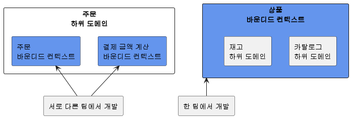

# 9. 도메인 모델과 바운디드 컨텍스트

## 1. 도메인 모델과 경계

- 처음 도메인 모델을 만들 때 빠지기 쉬운 함정이 도메인을 완전하게 표현하는 단일 모델을 만드는 시도를 하는 것이다.
- 1장에서 말한 것처럼 한 도메인은 다시 여러 하위 도메인으로 구분된다.
- 따라서 한 개의 모델로 여러 하위 도메인을 모두 표현하려고 시도하면 오히려 모든 하위 도메인이 맞지 않는 모델을 만들게 된다.
  - 카탈로그에서 상품, 재고 관리에서 상품, 주문에서 상품, 배송에서 상품은 이름만 같지 실제로 의미하는 것이 다르다.
  - 카탈로그 도메인의 상품: 상품 이미지, 상품명, 상품 가격, 옵션 목록, 상세 설명과 같은 상품 정보가 위주
  - 재고 관리 도메인의 상품: 실존하는 개별 객체를 추적하기 위한 목적으로 상품을 사용
  - 즉 카탈로그에서는 물리적으로 한 개인 상품이 재고 관리에서는 여러 개 존재할 수 있다.
- 논리적으로 같은 존재처럼 보이지만 하위 도메인에 따라 다른 용어를 사용하는 경우도 있다.
  - 카탈로그 도메인의 상품이 검색 도메인에서는 문서라고 불린다.
  - 회원 도메인에서의 회원이 주문 도메인에서는 주문자이며, 배송 도메인에서는 받는 사람이라고 불린다.
    
- 이렇게 하위 도메인마다 같은 용어라도 의미가 다르고 같은 대상이라도 지칭하는 용어가 다를 수 있기 때문에 한 개의 모델로 모든 하위 도메인을 표현하려는 시도는 올바른 방법이 아니며 표현할 수도 없다.
  - 하위 도메인마다 사용하는 용어가 다르기 때문에 올바른 도메인 모델을 개발하려면 하위 도메인마다 모델을 만들어야 한다.
  - 각 모델은 명시적을 구분되는 경계를 가져서 섞이지 않도록 해야 한다.
- 여러 하위 도메인의 모델이 섞이기 시작하면 모델의 의미가 약해질 뿐만 아니라 여러 도메인의 모델이 서로 얽힌다.
- 때문에 각 하위 도메인별로 다르게 발전하는 요구사항을 모델에 반영하기 어려워진다.
- 모델은 특정한 컨텍스트 하에서 완전한 의미를 갖는다.
  - 같은 제품이라도 카탈로그 컨텍스트와 재고 컨텍스트에서 의미가 서로 다르다.
- 이렇게 구분되는 경계를 갖는 컨텍스트를 DDD에서는 바운디드 컨텍스트라고 부른다.

## 2. 바운디드 컨텍스트

- 바운디드 컨텍스트는 모델의 경계를 결정하며 한 개의 바운디드 컨텍스트는 논리적으로 한 개의 모델을 갖는다.
- 바운디드 컨텍스트는 용어를 기준으로 구분한다.
  - 카탈로그 컨텍스트와 재고 컨텍스트는 서로 다른 용어를 사용하므로 이 용어를 기준으로 컨텍스트를 분리할 수 있다.
- 바운디드 컨텍스트는 실제로 사용자에게 기능을 제공하는 물리적 시스템으로 도메인 모델은 바운디드 컨텍스트 안에서 도메인을 구현한다.
- 이상적으로 하위 도메인과 바운디드 컨텍스트가 일대일 관계를 가지면 좋겠지만 현실은 그렇지 않을 때가 많다.
- 바운디드 컨텍스트는 기업의 팀 조직 구조에 따라 결정되기도 한다.
  - 주문 하위 도메인이라는 주문을 처리하는 팀과 복잡한 결제 금액 계산 로직을 구현하는 팀이 따로 있다고 해보자.
  - 이 경우 주문 하위 도메인에 주문 바운디드 컨텍스트와 결제 금액 계산 바운디드 컨텍스트가 존재하게 된다.
- 용어를 명확하게 구분하지 못해 두 하위 도메인을 하나의 바운디드 컨텍스트에서 구현하기도 한다.
  - 카탈로그와 재고 관리가 아직 명확하게 구분되지 않은 경우 두 하위 도메인을 하나의 바운디드 컨텍스트에서 구현하기도 한다.



- 규모가 작은 기업은 전체 시스템을 한 개 팀에서 구현할 때도 있다.
  - 소규모 쇼핑몰은 한 개의 웹 애플리케이션으로 온라인 쇼핑을 서비스하며 하나의 시스템에서 회원, 카탈로그, 재고, 구매, 결제와 관련된 모든 기능을 제공한다.
  - 즉 여러 하위 도메인을 한 개의 바운디드 컨텍스트에서 구현한다.
- 여러 하위 도메인을 하나의 바운디드 컨텍스트에서 개발할 때 주의할 점은 하위 도메인의 모델이 섞이지 않도록 하는 것이다.
- 한 프로젝트에 각 하위 도메인의 모델이 위치하면 전체 하위 도메인을 위한 단일 모델을 만들고 싶은 유혹에 빠지기 쉽다.
  - 이런 유혹에 걸려들면 도메인 모델이 개별 하위 도메인을 제대로 반영하지 못하게 된다.
  - 이는 하위 도메인별로 기능을 확장하기 어렵게 되고 서비스 경쟁력을 떨어뜨리는 원인이 된다.
- 비록 한 개의 바운디드 컨텍스트가 여러 하위 도메인을 포함하더라고 하위 도메인마다 구분되는 패키지를 갖도록 구현해야 한다.
  - 이렇게 함으로써 하위 도메인을 위한 모델이 서로 뒤섞이지 않고 하위 도메인마다 바운디드 컨텍스트를 갖는 효과를 낼 수 있다.


- 바운디드 컨텍스트는 도메인 모델을 구분하는 경계가 되기 때문에 바운디드 컨텍스트는 구현하는 하위 도메인에 알맞은 모델을 포함한다.
  - 같은 사용자라 하더라도 주문 바운디드 컨텍스트와 회원 바운디드 컨텍스트가 갖는 모델이 달라진다.
    - 회원의 Member는 애그리거트 루트이지만 주문의 Orderer는 밸류가 된다.
  - 같은 상품이라도 카탈로그 바운디드 컨텍스트의 Product와 재고 바운디드 컨텍스트의 Product는 각 컨텍스트에 맞는 모델을 갖는다.
    - 카탈로그의 Product는 상품이 속할 Category와 연관을 갖지만 재고의 Product는 카탈로그의 Category와 연관을 맺지 않는다.
      

## 3. 바운디드 컨텍스트 구현

- 바운디드 컨텍스트가 도메인 모델만 포함하는 것은 아니다.
- 바운디드 컨텍스트는 도메인 기능을 사용자에게 제공하는 데 필요한 표현 영역, 응용 서비스, 인프라스트럭처 영역을 모두 포함한다.
- 도메인 모델의 데이터 구조가 바뀌면 DB 테이블 스키마도 함께 변경해야 하므로 테이블도 바운디드 컨텍스트에 포함된다.


- 표현 영역은 인간 사용자를 위해 HTML 페이지를 생성할 수도 있고, 다른 바운디드 컨텍스트를 위해 REST API를 제공할 수도 있다.
- 모든 바운디드 컨텍스트를 반드시 도메인 주도로 개발할 필요는 없다.
  - 상품의 리뷰는 복잡한 도메인 로직을 갖지 않기 때문에 CRUD 방식으로 구현해도 된다.
  - 즉 DAO와 데이터 중심의 밸류 객체를 이용해서 리뷰 기능을 구현해도 기능을 유지 보수하는 데 큰 문제가 없다.
    
- 서비스-DAO 구조를 사용하면 도메인 기능이 서비스에 흩어지게 되지만 도메인 기능 자체가 단순하면 서비스-DAO로 구성된 CRUD 방식을 사용해도 코드를 유지 보수하는 데 문제 되지 않는다고 생각한다.
- 한 바운디드 컨텍스트에서 두 방식을 혼합해서 사용할 수도 있다.
  - 대표적으로 CQRS(Query Responsibility Segregation) 패턴이다.
  - CQRS는 상태를 변경하는 명령 기능과 내용을 조회하는 쿼리 기능을 위한 모델을 구분하는 패턴이다.
  - 이 패턴을 단일 바운디드 컨텍스트에 적용하면 아래 그림과 같이 상태 변경과 관련된 기능은 도메인 모델 기반으로 구현하고 조회 기능은 서비스-DAO를 이용해서 구현할 수 있다.


- 각 바운디드 컨텍스트는 서로 다른 구현 기술을 사용할 수도 있다.
  - 웹 MVC는 스프링 MVC를 사용하고 리포지토리 구현 기술로는 JPA/하이버네이트를 사용하는 바운디드 컨텍스트가 존재 할 수도 있다.
  - Netty를 이용해서 REST API를 제공하고 마이바티스를 리포지터리 구현 기술로 사용하는 바운디드 컨텍스트가 존재할 수도 있다.
  - 어떤 바운디드 컨텍스트는 RDBMS 대신 몽고DB와 같은 NoSQL을 사용할 수도 있을 것이다.
- 바운디드 컨텍스트가 반드시 사용자에게 보여지는 UI를 가지고 있어야 하는 것은 아니다.
  - 웹 브라우저는 아래 그림처럼 카탈로그 바운디드 컨텍스트를 통해 상세 정보를 읽어온다.
  - 그리고 리뷰 바운디드 컨텍스트의 REST API를 직접 호출해서 로딩한 JSON 데이터를 알맞게 가공해서 리뷰 목록을 보여줄 수도 있다.
    
  - 아래 드림과 같이 UI를 처리하는 서버를 두고 UI서버가 바운디드 컨텍스트와 통신해서 사용자 요청을 처리하는 방법도 있다.
    
  - 이 구조에서 UI서버는 각 바운디드 컨텍스트를 위한 파사드 역할을 수행한다.
  - 브라우저가 UI서버에 요청을 보내면 UI서버는 카탈로그와 리뷰 바운디드 컨텍스트로부터 필요한 정보를 읽어와 조합한 뒤 브라우저에 응답을 제공한다.

## 4. 바운디드 컨텍스트 통합

- 온라인 쇼핑 사이트에서 매출 증대를 위해 카탈로그 하위 도메인에 개인화 추천 기능을 도입하기로 했다고 하자.
- 기존 카탈로그 시스템을 개발하던 팀과 별도로 추천 시스템을 담당하는 팀이 새로 생겨서 이 팀에서 주도적으로 추천 시스템을 만들기로 했다.
- 이렇게 되면 카탈로그 하위 도메인에는 기존 카탈로그를 위한 바운디드 컨텍스트와 추천 기능을 위한 바운디드 컨텍스트가 생긴다.
- 두 팀이 관련된 바운디드 컨텍스트를 개발하면 자연스럽게 두 바운디드 컨텍스트 간 통합이 발생한다.
- 카탈로그와 추천 바운디드 컨텍스트 간 통합이 필요한 기능은 다음과 같다.
  - 사용자가 제품 상세 페이지를 볼 때, 보고 있는 상품과 유사한 상품 목록을 하단에 보여준다.
- 사용자가 카탈로그 바운디드 컨텍스트에 추천 제품 목록을 요청하면 카탈로그 바운디드 컨텍스트는 추천 바운디드 컨텍스트로부터 추천 정보를 읽어와 추천 제품 목록을 제공한다.
- 이때 카탈로그 컨텍스트와 추천 컨텍스트의 도메인 모델은 서로 다르다.
  - 카탈로그: 제품을 중심으로 도메인 모델을 구현
  - 추천: 추천 연산을 위한 모델을 구현
    - 상품의 상세 정보를 포함하지 않으며 상품 번호 대신 아이템 ID라는 용어를 사용해서 식별자를 표현하고 추천 순위와 같은 데이터를 담게 된다.
- 카탈로그 시스템은 추천 시스템으로부터 추천 데이터를 받아오지만, 카탈로그 시스템에서는 추천의 도메인 모델을 사용하기보다는 카탈로그 도메인 모델을 사용해서 추천 상품을 표현해야 한다.
  - 즉 다음과 같이 카탈로그의 모델을 기반으로 하는 도메인 서비스를 이용해서 상품 추천 기능을 표현해야 한다.
  ```java
  /**
  * 상품 추천 기능을 표현하는 도메인 서비스
  */
  public interface ProductRecommendationService {
  	List<Product> getRecommendationOf(ProductId id);
  }
  ```
- 도메인 서비스를 구현한 클래스는 인프라스트럭처 영역에 위치한다.
  - 이 클래스는 외부 시스템과의 연동을 처리하고 외부 시스템의 모델과 현재 도메인 모델 간의 변환을 책임진다.


- 위 그림에서 RecSystemClient는 외부 추천 시스템이 제공하는 REST API를 이용해서 특정 상품을 위한 추천 상품 목록을 로딩한다.
- 이 REST API가 제공하는 데이터는 추천 시스템의 모델을 기반으로 하고 있기 때문에 API 응답은 다음과 같이 카탈로그 도메인 모델과 일치하지 않는 데이터를 제공할 것이다.

```java
{
	{itemId: 'PROD-1000', type: 'PRODUCT', rank: 100}
	{itemId: 'PROD-1001', type: 'PRODUCT', rank: 54}
}
```

- RecSystemClient는 REST API로부터 데이터를 읽어와 카탈로그 도메인에 맞는 상품 모델로 변환한다.

```java
public class RecSystemClient implements ProductRecommenddationService {
	private ProductRepository productRepository;

	@Override
	public List<Product> getRecommendationOf(ProductId id) {
		List<RecommendationItem> items = getRecItems(id.getValue());
		return toProducts(items);
	}

	private List<RecommendationItem> getRecItems(String itemId) {
		// externalRecClient는 외부 추천 시스템을 위한 클라이언트라고 가정
		return externalRecClient.getRecs(itemId);
	}

	private List<Product> toProducts(List<Recommendation> items) {
		return item.stream()
								.map(item -> toProductId(item.getItem()))
								.map(prodId -> productRepository.findById(prodId))
								.collect(toList());
	}

	private ProductId toProductId(String itemId) {
		return new ProductId(itemId);
	}
	...
}
```

- 추천 시스템을 관리하는 모듈이 제공하는 RecommendationItem은 추천 시스템의 모델을 따를 것이다.
- RecSystemClient는 추천 시스템의 모델을 받아와 toProducts() 메서드를 이용해서 카탈로그 도메인의 Products 모델로 변환하는 작업을 처리한다.
  - 두 모델 간의 변환 과정이 복잡하면 아래와 같이 변환 처리를 위한 별도 클래스를 만들고 이 클래스에서 변환을 처리해도 된다.
    
- REST API를 호출하는 것은 두 바운디드 컨텍스트를 직접 통합하는 방법이다.
- 직접 통합하는 대신 간접적으로 통합하는 방법도 있다.
- 대표적으로 메시지 큐를 사용하는 것이다.

  - 추천 시스템은 사용자가 조회한 상품 이력이나 구매 이력과 같은 사용자 활동 이력을 필요로 하는데, 이 내역을 전달할 때 메시지 큐를 사용할 수 있다.
    
  - 카탈로그 바운디드 컨텍스트는 추천 시스템이 필요로 하는 사용자 활동 이력을 메시지 큐에 추가한다.
  - 메시지 큐는 비동기로 메시지를 처리하기 때문에 카탈로그 바운디드 컨텍스트는 메시지를 큐에 추가한 뒤에 추천 바운디드 컨텍스트가 메시지를 처리할 때까지 기다리지 않고 바로 이어서 자신의 처리를 계속한다.
  - 추천 바운디드 컨텍스트는 큐에서 이력 메시지를 읽어와 추천을 계산하는 데 사용할 것이다.
  - 이것은 두 바운디드 컨텍스트가 사용할 메시지의 데이터 구조를 맞춰야 함을 의미한다.
  - 각각의 바운디드 컨텍스트를 담당하는 팀은 서로 만나서 주고받을 데이터 형식에 대해 협의해야 한다.
  - 메시지 시스템을 카탈로그 측에서 관리하고 있다면 큐에 담기는 메시지를 아래 그림과 같이 카탈로그 도메인을 따르는 데이터를 담을 것이다.
    
  - 추천 바운디드 컨텍스트 관점에서 접근하면 아래 그림과 같이 메시지 데이터 구조를 잡을 수 있다.
    
  - 어떤 도메인 관점에서 모델을 사용하느냐에 따라 두 바운디드 컨텍스트의 구현 코드가 달라지게 된다.

    - 카탈로그 도메인 관점에서 큐에 저장할 메시지를 생성하면 카탈로그 시스템의 연동 코드는 카탈로그 기준의 데이터를 그대로 메시지 큐에 저장한다.

    ```java
    // 상품 조회 관련 로그 기록 코드
    public class MessageClient messageClient; {
    	private MessageClient messageClient;

    	public void appendViewLog(String memberId, String productId, Date time) {
    		messageClient.send(new ViewLog(memberId, productId, time));
    	}
    	...
    }

    // messageClient
    public class RabbitMqClient implements MessageClient {
    	private RabbitTemplate rabbitTemplate;

    	@Override
    	public void send(ViewLog viewLog) {
    		// 카탈로그 기준으로 작성한 데이터를 큐에 그대로 보관
    		rabbitTemplate.convertAndSend(logQueueName, viewLog);
    	}
    }
    ```

    - 카탈로그 도메인 모델을 기준으로 메시지를 전송하므로 추천 시스템은 자신의 모델에 맞게 메시지를 변환해서 치리해야 한다.
    - 반대로 추천 시스템을 기준으로 큐에 데이터를 저장하기로 했다면 카탈로그 쪽 코드는 다음과 같이 바뀔 것이다.

    ```java
    // 상품 조회 관련 로그 기록 코드
    public class ViewLogService {
    	private MessageClient messageClient;

    	public void appendViewLog(String memberId, String productId, Date time) {
    		messageClient.send(
    				new ActivityLog(productId, memberId, ActivityType.VIEW, time));
    	}
    	...
    }

    // messageClient
    public class RabbitMqClient implements MessageClient {
    	private RabbitTemplate rabbitTemplate;

    	@Overrid
    	public void send(ActivityLog activityLog) {
    		rabbitTemplate.convertAndSend(logQueueName, activityLog);
    	}
    }
    ```

  - 두 바운디드 컨텍스트를 개발하는 팀은 메시징 큐에 담을 데이터의 구조를 협의하게 되는데 그 큐를 누가 제공하느냐에 따라 데이터 구조가 결정된다.
    - 카탈로그 시스템에서 큐를 제공한다면 큐에 담기는 내용은 카탈로그 도메인을 따른다.
    - 카탈로그 도메인은 메시징 큐에서 카탈로그와 관련된 메시지를 저장하게 되고 다른 바운디드 컨텍스트는 이 큐로부터 필요한 메시지를 수신하는 방식을 사용한다.
    - 즉, 이 방식은 메시지를 출판하고 다른 쪽에서 메시지를 구독하는 출판/구독 모델을 따른다.
      
  - 큐를 추천 시스템에서 제공할 경우 큐를 통해 메시지를 추천 시스템에 전달하는 방식이 된다.
  - 이 경우 큐로 인해 비동기로 추천 시스템에서 데이터를 전달하는 것을 제외하면 추천 시스템이 제공하는 REST API를 사용해서 데이터를 전달하는 것과 차이가 없다.

### NOTE: 마이크로서비스와 바운디드 컨텍스트

- 마이크로서비스 아키텍처가 단순 유행을 지나 많은 기업에서 자리를 잡아가고 있다.
- 넷플렉스나 아마존 같은 선도 기업뿐만 아니라 많은 기업이 마이크로서비스 아키텍처를 수용하는 추세이다.
- 마이크로서비스는 애플리케이션을 작은 서비스로 나누어 개발하는 아키텍처 스타일이다.
- 개별 서비스를 독립된 프로세스로 실행하고 각 서비스가 REST API나 메시징을 이용해서 통신하는 구조를 갖는다.
- 이런 마이크로 서비스의 특징은 바운디드 컨텍스트와 잘 어울린다.
- 각 바운디드 컨텍스트는 모델의 경계를 형성하는 데 바운디드 컨텍스트를 마이크로 서비스로 구현하면 자연스럽게 컨텍스트별로 모델이 분리된다.
- 코드로 생각하면 마이크로서비스마다 프로젝트를 생성하므로 바운디드 컨텍스트마다 프로젝트를 만들게 된다.
- 이것은 코드 수준에서 모델을 분리하여 두 바운디드 컨텍스트의 모델이 섞이지 않도록 해준다.
- 별로 프로세스로 개발한 바운디드 커넥스트는 독립적으로 배포하고 모니터링하며 확장되는데 이 역시 마이크로서비스가 갖는 특징이다.

## 5. 바운디드 컨텍스트 간 관계

- 바운디드 컨텍스트는 어떤 식으로든 연결되기 때문에 두 바운디드 컨텍스트는 다양한 방식으로 관계를 맺는다.
  - 고객/공급자
  - 공유 커널
  - 독립 방식
- 두 바운디드 컨텍스트 간 관계 중 가장 흔한 관계는 한쪽에서 API를 제공하고 다른 한쪽에서 그 API를 호출하는 관계이다.
  - REST API가 대표적이다.
- 이 관계에서 API를 사용하는 바운디드 컨텍스트는 API를 제공하는 바운디드 컨텍스트에 의존하게 된다.


- 그림에서 하류인 카탈로그 컨텍스트는 상류인 추천 컨텍스트가 제공하는 데이터와 기능에 의존한다.
- 카탈로그는 추천 상품을 보여주기 위해 추천 바운디드 컨텍스트가 제공하는 REST API를 호출한다.
  - 추천 시스템이 제공하는 REST API의 인터페이스가 바뀌면 카탈로그 시스템의 코드도 바뀌게 된다.
- 상류 컴포넌트는 일종의 서비스 공급자 역할을 하며 하류 컴포넌트는 그 서비스를 사용하는 고객 역할을 한다.
- 고객과 공급자 관계에 있는 두 팀은 상호 협력이 필수적이다.
  - 공급자를 하는 상류 팀이 마음대로 API를 변경하면 하류 팀은 변경된 API에 맞추느라 우선순위가 높은 다른 기능을 개발하지 못할 수도 있다.
  - 반대로 상류 팀은 새로운 개발 시도 자체를 하지 않을 수도 있다.
  - 따라서 상류 팀과 하류 팀은 개발 계획을 서로 공유하고 일정을 협의해야 한다.
- 상류 컴포넌트는 보통 하류 컴포넌트가 사용할 수 있는 통신 프로토콜을 정의하고 이를 공개한다.
  - 추천 시스템은 하류 컴포넌트가 사용할 수 있는 REST API를 제공하거나 프로토콜 버퍼와 같은 것을 이용해서 서비스를 제공할 수도 있다.
  - 상류 팀의 고객인 하류 팀이 다수 존재하면 상류 팀은 여러 하류 팀의 요구사항을 수용할 수 있는 API를 만들고 이를 서비스 형태로 공개해서 서비스를 일관성 있게 유지할 수 있다.
  - 이를 공개 호스트 서비스라고 한다.
- 공개 호스트의 대표적인 예가 검색이다.
  - 블로그, 카페, 게시판과 같은 서비스를 제공하는 포털은 각 서비스별로 검색 기능을 구현하기보다는 검색을 위한 전용 시스템을 구축하고 검색 시스템과 각 서비스를 통합한다.
  - 이때 검색 시스템은 상류 컴포넌트가 된다.
  - 상류 팀은 각 하류 컴포넌트의 요구사항을 수용하는 단일 API를 만들어 이를 공개하고 각 하류 팀은 공개된 API를 사용해서 검색 기능을 구현한다.
    
- 상류 컴포넌트의 서비스는 상류 바운디드 컨텍스트의 도메인 모델에 따른다.
- 따라서 하류 컴포넌트는 상류 서비스의 모델이 자신의 모델에 영향을 주지 않도록 보호해주는 완충 지대를 만들어야 한다.
- 이미 앞서 이 완충 지대에 대해 언급했었다. 앞서 봤던 그림을 보자


- 이 그림에서 RecSystemClient는 외부 시스템과의 연동을 처리하는데 외부 시스템의 도메인 모델이 내 도메인 모델을 침범하지 않도록 막아주는 역할을 한다.
- 즉, 내 모델이 깨지는 것을 막아주는 안티코럽션 계층이 된다.
- 두 바운디드 컨텍스트가 같은 모델을 공유하는 경우도 있다.
  - 운영자를 위한 주문 관리 도구를 개발하는 팀과 고객을 위한 주문 서비스를 개발하는 팀이 다르다고 가정하자.
  - 두 팀은 주문을 표현하는 모델을 공유함으로써 주문과 관련된 중복 설계를 막을 수 있다.
  - 이렇게 두 팀이 공유하는 모델을 공유 커널이라고 부른다.
- 공유 커널의 장점은 중복을 줄여준다는 것이다.
  - 두 팀이 하나의 모델을 개발해서 공유하기 때문에 두 팀에서 동일한 모델을 두 번 개발하는 중복을 줄일 수 있다.
- 하지만 두 팀이 한 모델을 공유하기 때문에 한 팀에서 임의로 모델을 변경하면 안 되며 두 팀이 밀접한 관계를 유지해야 한다.
- 두 팀이 밀접한 관계를 형성할 수 없다면 공유 커널을 사용할 때의 장점보다 공유 커널로 인해 개발이 지연되고 정체되는 문제가 더 커지게 된다.
- 마지막으로 설펴볼 관계는 독립 방식이다. 그냥 서로 통합하지 않는 방식이다.
  - 두 바운디드 컨텍스트 간에 통합하지 않으므로 서로 독립적으로 모델을 발전시킨다.
- 독립 방식에서 두 바운디드 컨텍스트 간의 통합은 수동으로 이루어진다.
  - 온라인 쇼핑몰 솔루션과 외부의 ERP 서비스를 사용하고 있다고 하자.
  - 온라인 쇼핑몰 솔루션은 외부 ERP 서비스와의 연동을 지원하지 않으므로 온라인 쇼핑몰에서 판매가 발생하면 쇼핑몰 운영자는 쇼핑몰 시스템에서 판매 정보를 보고 ERP 시스템에 입력해야 한다.
    
- 수동으로 통합하는 방식이 나쁜 것은 아니지만 규모가 커질수록 수동 통합에는 한계가 있으므로 규모가 커지기 시작하면 두 바운디드 컨텍스트를 통합해야 한다.
  - 이때 외부에서 구매한 솔루션과 ERP를 완전히 대체할 수 없다면 두 바운디드 컨텍스트를 통합해 주는 별도의 시스템을 만들어야 할 수도 있다.
    

## 6. 컨텍스트 맵

- 개별 바운디드 컨텍스트에 매몰되면 전체를 보지 못할 때가 있다.
- 나무만 보고 숲을 보지 못하는 상황을 방지하려면 전체 비즈니스를 조망할 수 있는 지도가 필요한데 그것이 바로 컨텍스트 맵이다.
  - 컨텍스트 맵은 전체 시스템의 이해 수준을 보여준다.
  - 즉, 시스템을 더 잘 이해하거나 시간이 지나면서 컨텍스트간 관계가 바뀌면 컨텍스트 맵도 함께 바뀐다.
- 컨텍스트 맵은 아래 그림처럼 바운디드 컨텍스트 간의 관계를 표시한 것이다.


- 그림만 봐도 한눈에 각 바운디드 컨텍스트의 경계가 명확하게 드러나고 서로 어떤 관계를 맺고 있는지 알 수 있다.
- 바운디드 컨텍스트 영역에 주요 애그리거트를 함께 표시하면 모델에 대한 관계가 더 명확히 드러난다.
  - 위 그림은 오픈 호스트 서비스(OHS)와 안티코럽션(ACL)만 표시했는데, 하위 도메인이나 조직 구조를 함께 표시하면 도메인을 포함한 전체 관계를 이해하는 데 도움이 된다.
- 컨텍스트 맵은 시스템의 전체 구조를 보여준다.
- 이는 하위 도메인과 일치하지 않는 바운디드 컨텍스트를 찾아 도메인에 맞게 바운디드 컨텍스트를 조절하고 사업의 핵심 도메인을 위해 조직 역량을 어떤 바운디드 컨텍스트에 집중할지 파악하는 데 도움을 준다.
- 컨텍스트 맵을 그리는 규칙은 따로 없다.
  - 위 그림과 같이 간단한 도형과 선을 이용해서 각 컨텍스트의 관계를 이해할 수 있는 수준에서 그리면 된다.
- 컨텍스트 맵은 단순하기 때문에 화이트보드나 파워포인트와 같은 도구를 이용해서 쉽게 그릴 수 있다.
