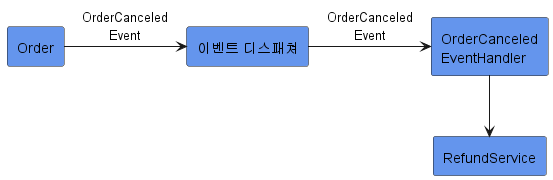
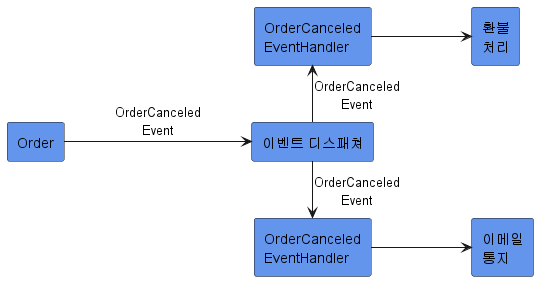
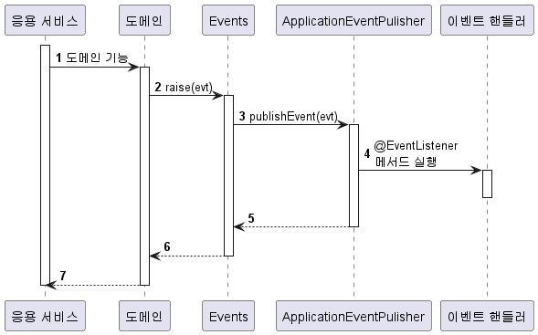
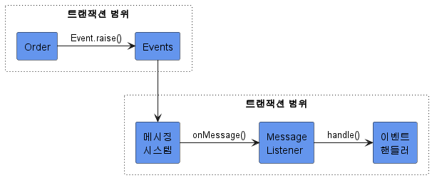
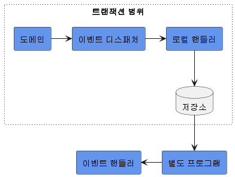

# 10. 이벤트

## 1. 시스템 간 강결합 문제

- 시스템 간 강결합은 다음과 같은 문제를 발생시킨다.
  1. 외부 서비스가 정상이 아닐 경우 트랜잭션 처리 정책에 관한 문제
  2. 외부 서비스의 성능이 내 서비스 성능에 미치는 문제
     - 외부 서비스 성능에 직접적인 영향을 받게 된다.
  3. 도메인 객체에 서비스를 전달하는 경우 발생하는 설계상 문제
- 문제가 발생하는 이유는 바운디드 컨텍스트간의 강결합 때문이다.
- 이벤트를 사용하면 시스템 간의 결합을 낮출 수 있다.
  - 특히 비동기 이벤트를 사용하면 시스템 간의 결합을 낮출 수 있다.

**EX - 쇼핑몰에서 구매를 취소하면 환불을 처리해야 한다.**

- 보통 결제 시스템은 외부에 존재하므로 환불 서비스는 외부 서비스를 사용한다.
- 도메인 레이어에서 환불 기능을 실행하려면 두 가지 방법이 있다.

  1. 애그리거트 메서드의 파라미터로 도메인 서비스를 전달받는다.

  ```java
  public class Order {
  	...
  	// 외부 서비스를 실행하기 위해 도메인 서비스를 파라미터로 전달받음
  	public void cancel(RefundService refundService) {
  		verifyNotYetShipped();
  		this.state = OrderState.CANCELED;

  		this.refundStatus = State.REFUND_STARTED;
  		try {
  			refundService.refund(getPaymentId());
  			this.refundStatus = State.REFUND_COMPLETED;
  		} catch(Exception e) {
  			// 처리
  		}
  	}
  	...
  }
  ```

  1. 응용 서비스에서 환불 기능을 실행한다.

  ```java
  public class CancelOrderService {
  	private RefundService refundService;

  	// 외부 서비스에서 환불 기능 실행
  	@Transactional
  	public void cancel(OrderNo orderNo) {
  		Order order = findOrder(orderNo);
  		order.cancel()

  		order.refundStarted();
  		try {
  			refundService.refund(getPaymentId());
  			order.refundCompleted();
  			} catch(Exception e) {
  			// 처리
  		}
  	}
  }
  ```

- 이때 여러가지 문제가 발생한다.

  1. 외부 서비스가 정상이 아닐 경우 트랜잭션 처리 정책에 관한 문제
     - 환불 기능을 실행하는 과정에서 익셉션이 발생하면 트랜잭션을 롤백 할 수 있다.
     - 주문을 취소 상태로 변경하고 환불만 나중에 다시 시도하는 방식으로 처리할 수도 있다.
  2. 외부 서비스의 성능이 내 서비스 성능에 미치는 문제
     - 환불을 처리하는 외부 시스템의 응답 시간이 길어지면 그 만큼 대기 시간도 길어진다.
  3. 도메인 객체에 서비스를 전달하는 경우 발생하는 설계상 문제

     - Order는 주문을 표현하는 도메인 객체인데 결제 도메인의 환불 관련 로직이 뒤섞이게 된다.
     - 기능을 추가할 때 다른 도메인 로직이 더 뒤섞이고 트랜잭션 처리 및 외부 영향 서비스가 증가한다.

     ```java
     public class Order {

     	public void cancel(RefundService refundService) {
     		// 주문 로직 시작
     		verifyNotYetShipped();
     		this.state = OrderState.CANCELED;

     		// 결제 로직
     		this.refundStatus = State.REFUND_STARTED;
     		try {
     			refundService.refund(getPaymentId());
     			this.refundStatus = State.REFUND_COMPLETED;
     		} catch(Exception e) {
     			// 처리
     		}
     	}
     }
     ```

## 2. 이벤트 개요

- 이벤트는 **과거에 벌어진 어떤 것**을 의미하며, **상태가 변경**됐다는 것을 의미한다.
  - 사용자가 암호를 변경한 것
  - 사용자가 주문을 취소한 것
- 이벤트는 발생하는 것에서 끝나지 않는다.
  - 이벤트가 발생하면 그 이벤트에 반응하여 원하는 동작을 수행하는 기능을 구현한다.

### 2.1. 이벤트 관련 구성요소

- 도메인 모델에 이벤트를 도입하려면 아래 그림과 같은 네 개의 구성요소인 이벤트, 이벤트 생성 주체, 이벤트 디스패처(퍼블리셔), 이벤트 핸들러(구독자)를 구현해야 한다.


- 이벤트 생성 주체
  - 엔티티, 밸류, 도메인 서비스와 같은 **도메인 객체**가 이벤트를 발생시킨다.
  - 도메인 객체는 도메인 로직을 실행해서 **상태가 바뀌면** 관련 이벤트를 발생시킨다.
- 이벤트 핸들러
  - 이벤트 생성 주체가 발생시킨 이벤트에 반응한다.
  - 생성 주체가 발생한 이벤트를 전달받아 이벤트에 담긴 데이터를 이용해서 원하는 기능을 실행한다.
- 이벤트 디스패처
  - 이벤트 생성 주체와 이벤트 핸들러를 연결해 준다.
  - 이벤트 생성 주체로부터 이벤트를 전달받은 디스패처 해당 이벤트를 처리할 수 있는 핸들러에 이벤트를 전파한다.
  - 이벤트 디스패처의 구현 방식에 따라 이벤트 생성과 처리를 동기나 비동기로 실행하게 된다.

### 2.2. 이벤트의 구성

- 이벤트의 구성은 다음과 같다.
  - 포함할 것: 이벤트 종류(클래스 이름 등), 이벤트 발생 시간, 추가 데이터(이벤트와 관련된 정보)
  - 제외할 것: 애그리거트 정보(이벤트 자체와 관련 없는 정보)
- 이벤트 클래스의 이름은 다음과 같은 규칙을 따른다.
  - Changed, Canceled 등 과거 시제를 사용한다.
    - 이벤트는 **과거에 벌어진 어떤 것**을 의미한다.
  - 선택적으로 Event Postfix를 붙인다.

**EX - 배송지를 변경할 때 발생하는 이벤트**

- 이 이벤트를 위한 클래스는 다음과 같이 작성할 수 있다.
  - 배송지 변경 이벤트와 관련 없는 상품 번호, 수량 등은 작성하지 않는다.

```java
// 과거 시제 사용
public class ShippingInfoChangedEvent {

	private String orderNumber;
	private long timestamp;
	private ShippingInfo newShippingInfo;

	// 생성자, getter 등
}
```

- Order 애그리거트(도메인 객체)는 배송지 정보를 변경한 뒤에 이벤트를 발생시킨다.

```java
public class Order {

	public void changeShippingInfo(ShippingInfo newShippingInfo) {
		verifyNotYetShipped();
		setShippingInfo(newShippingInfo);

		// 디스패처를 통해 이벤트를 전파하는 기능
		Events.raise(new ShippingInfoChangedEvent(number, newShippingInfo));
	}
	...
}
```

- Event를 처리하는 핸들러는 디스패처로부터 이벤트를 전달받아 필요한 작업을 수행한다.

```java
public class ShippingInfoChangeHandler {

	@EventListener(ShippingInfoChangedEvent.class)
	public void handle(ShippingInfoChangedEvent evt) {
		shippingInfoSynchronizer.sync(
						evt.getOrderNumber(),
						evt.getNewShippingInfo());
	}
}
```

- 필요한 데이터가 부족하면 핸들러는 관련 API를 호출하거나 DB에서 데이터를 직접 읽어와야 한다.

  ```java
  public class ShippingInfoChangeHandler {

  	@EventListener(ShippingInfoChangedEvent.class)
  	public void handle(ShippingInfoChangedEvent evt) {
  		// 이벤트가 필요한 데이터를 담고 있지 않으면,
  		// 이벤트 핸들러는 리포지터리, 조회 API, 직접 DB 접근 등의
  		// 방식을 통해 필요한 데이터를 조회해야 한다.
  		Order order = orderRepository.findById(evt.getOrderNo());
  		shippingInfoSynchronizer.sync(
  						order.getNumber().getValue(),
  						order.getShippingInfo());
  	}
  }
  ```

### 2.3. 이벤트 용도

- 이벤트는 크게 두 가지 용도로 쓰인다.

  1. 트리거 용도

     - 도메인의 상태가 바뀔 때 후처리를 실행하기 위한 트리거
     - 주문 취소 이벤트는 환불 처리를 위한 트리거가 된다.

     

     - 환불 결과에 대한 이벤트는 SMS 통지를 위한 트리거가 된다.

  2. 서로 다른 시스템 간 데이터 동기화
     - 배송지를 변경하면 외부 배송 서비스에 바뀐 배송지 정보를 전송해야 한다.
     - 주문 도메인은 배송지 변경 이벤트를 발생시키고 이벤트 핸들러는 외부 배송 서비스와 배송지 정보를 동기화 할 수 있다.

### 2.4. 이벤트 장점

1. 서로 다른 도메인 로직이 섞이는 것을 방지한다. (의존 제거)

   - 구매 취소에 더 이상 환불 로직이 없다.

   ```java
   public class Order {

   	public void Cancel() {
   		verifyNotYetShipped();
   		this.state = OrderState.CANCELED;
   		// 구매 취소 로직에 이벤트를 적용함으로써 환불 로직이 없어졌다.
   		// 환불 실행 로직은 주문 취소 이벤트를 받는 이벤트 핸들러로 이동하게 된다.
   		Events.raise(new OrderCanceledEvent(number.getNumber()));
   	}
   	...
   }
   ```

   - 이벤트를 사용하여 주문 도메인에서 결제(환불) 도메인으로의 의존을 제거했다.

2. 기능 확장이 용이하다.

   - 구매 취소 시 환불과 함께 이메일로 취소 내용을 보내고 싶다면 이메일 발송을 처리하는 핸들러로 구현하면 된다.

   

   - 기능을 확장해도 구매 취소 로직은 수정할 필요가 없다.

## 3. 이벤트, 핸들러, 디스패처 구현

- 실제 이벤트와 관련된 코드를 구현해 보자. 관련된 코드는 다음과 같다.
  - 이벤트 클래스: 이벤트를 표현한다.
  - 디스패처: 스프링이 제공하는 ApplicationEventPublisher를 사용한다.
  - Events: 이벤트를 발생한다. 이벤트 발생을 위해 ApplicationEventPublisher를 사용한다.
  - 이벤트 핸들러: 이벤트를 수신해서 처리한다. 스프링이 제공하는 기능을 사용한다.

### 3.1. 이벤트 클래스

- 원하는 클래스를 이벤트로 사용하면 된다.
  - 이벤트 자체를 위한 상위 타입은 존재하지 않는다.
  - 이벤트 클래스의 이름을 결정할 때에는 과거 시제를 사용한다는 점만 유의하면 된다.
- 이벤트를 처리하는 데 필요한 최소한의 데이터를 포함해야 한다.
- 모든 이벤트가 공통으로 갖는 프로퍼티가 존재한다면 관련 상위 클래스를 만들 수도 있다.

  - 모든 이벤트가 발생 시간을 갖도록 하려면 상위 클래스를 만들고 각 이벤트 클래스가 상속받도록 한다.

  ```java
  public abstract class Event {
  	private long timestamp;

  	public Event() {
  		this.timestamp = System.currentTimeMillis();
  	}

  	public long getTimestamp() {
  		return timestamp;
  	}
  }
  ```

  - 발생 시간이 필요한 이벤트 클래스는 이벤트 클래스를 상속받아 구현하면 된다.

  ```java
  public class OrderCanceledEvent extends Event {

  	public OrderCanceledEvent(String number) {
  		super();
  		this.orderNumber = number;
  	}
  	...
  }
  ```

### 3.2. Events 클래스와 ApplicationEventPublisher

- 이벤트 발생과 출판을 위해 스프링이 제공하는 ApplicationEventPublisher를 사용한다.
- Events 클래스는 ApplicationEventPublisher를 사용해서 이벤트를 발생시키도록 구현할 것이다.

```java
public class Events {
	private static ApplicationEventPublisher publisher;

	static void setPublisher(ApplicationEventPublisher publisher) {
		Events.publisher = publisher;
	}

	public static void raise(Object event) {
		if (publisher != null) {
			publisher.publishEvent(event);
		}
}
```

- Events 클래스의 raise() 메서드는 ApplicationEventPublisher가 제공하는 publishEvent() 메서드를 이용해서 이벤트를 발생시킨다.
- Events 클래스가 사용할 ApplicationEventPublisher 객체는 setPublisher() 메서드를 통해서 전달받는다.
- Events.setPublisher() 메서드에 이벤트 퍼블리셔를 전달하기 위해 스프링 설정 클래스를 다음과 같이 작성한다.

```java
@Configuration
public class EventsConfiguration {
	@Autowired
	private ApplicationContext applicationContext;

	@Bean
	public InitializingBean eventsInitializer() {
		return () -> Events.setPublisher(applicationContext);
	}
}
```

- eventsInitializer() 메서드는 InitializingBean 타입 객체를 빈으로 설정한다.
  - 이 타입은 스프링 빈 객체를 초기화할 때 사용하는 인터페이스로, 이 기능을 사용해서 Events 클래스를 초기화했다.
  - 참고로 ApplicationContextsms ApplicationEventPublisher를 상속하고 있으므로 Events 클래스를 초기화할 때 ApplicationContext를 전달했다.

### 3.3. 이벤트 발생과 이벤트 핸들러

- 이벤트를 발생시킬 코드는 Events.raise() 메서드를 사용한다.

  - Order.cancel() 메서드는 다음 같이 구매 취소 로직을 수행한 뒤 Events.raise()를 이용해서 관련 이벤트를 발생시킨다.

  ```java
  public class Order {

  	public void cancel() {
  		verifyNotYetShipped();
  		this.state = OrderState.CANCELED();
  		Events.raise(new OrderCanceldEvent(number.getNumber()));
  }
  ...
  ```

- 이벤트를 처리할 핸들러는 스프링이 제공하는 @EventListener 애너테이션을 사용해서 구현한다.

  - 다음은 OrderCancelEvent를 처리하기 위한 핸들러를 구현한 코드의 예다.

  ```java
  @Service
  public class OrderCanceledEventHandler {
  	private RefundService refundService;

  	public OrderCanceledEventHandler(RefundService refundService) {
  		refundService.refund(event.getOrderNumber());
  	}

  	@EventListener(OrderCanceledEvent.class)
  	public void handle(OrderCanceledEvent event) {
  		refundService.refund(event.getOrderNumber());
  	}
  }
  ```

- ApplicationEventPublisher.publishEvent() 메서드를 실행할 때 OrderCanceledEvent 타입 객체를 전달하면, OrderCanceledEvent.class 값을 갖는 @EventListener 애너테이션을 붙인 메서드를 찾아 실행한다.
- 위 코드는 OrderCanceledEventHandler의 handel() 메서드를 실행한다.

### 3.4. 흐름 정리

- 이벤트 처리 흐름을 아래 시퀀스 다이어그램으로 정리했다.



1. 도메인 기능을 실행한다.
2. 도메인 기능은 Events.raise()를 이용해서 이벤트를 발생시킨다.
3. Events.raise()는 스프링이 제공하는 ApplicationEventPublisher를 이용해서 이벤트를 출판한다.
4. ApplicationEventPublisher는 @EventListener(이벤트타입.class) 애너테이션이 붙은 메서드를 찾아 실행한다.

- 코드 흐름을 보면 응용 서비스와 동일한 트랜잭션 범위에서 이벤트 핸들러를 실행하고 있다.
- 즉, 도메인 상태 변경과 이벤트 핸들러는 같은 트랜잭션 범위에서 실행된다.

## 4. 동기 이벤트 처리 문제

- 이벤트를 사용해서 강결합 문제는 해소했지만 외부 서비스에 영향을 받는 문제가 있다.

```java
// 1. 응용 서비스 코드
@Transactional // 외부 연동 과정에서 익셉션이 발생하면 트랜잭션 처리는?
public void cancel(OrderNo orderNo) {
	Order order = findOrder(orderNo);
	order.cancel(); // order.cancel()에서 OrderCanceledEvent 발생
}

// 2. 이벤트를 처리하는 코드
@Service
public class OrderCanceledEventHandler {
	...생략

	@EventListener(OrderCanceledEvent.class)
	public void handle(OrderCanceledEvent event) {
		// refundService.refund()가 느려지거나 익셉션이 발생한다면?
		refundService.refund(event.getOrderNumber());
	}
}
```

- 이 코드에서 refundService.refund()가 외부 환불 서비스와 연동한다고 가정해 보자.
- 외부 서비스가 느려지면 다음과 같은 문제가 생긴다.
  - 외부 서비스의 성능 저하가 내 시스템의 성능 저하로 연결된다.
    - cancel() 메서드도 함께 느려진다.
  - 트랜잭션 정책에 문제가 생긴다.
    - 트랜잭션을 롤백하면 구매 취소 기능을 롤백하는 것이므로 구매 취소가 실패하는 것과 같다.
    - 일단 구매 취소 자체는 처리하고 환불만 재처리하거나 수동으로 처리할 수도 있다.
- 외부 시스템과의 연동을 동기로 처리할 때 발생하는 두 문제를 해소하는 방법은 두 가지가 있다.
  - 이벤트를 비동기로 처리한다.
  - 이벤트와 트랜잭션을 연계한다.
- 두 방법 중 먼저 비동기 이벤트 처리에 대해 알아보자.

## 5. 비동기 이벤트 처리

- ‘A하면 이어서 B하라'는 내용을 담고 있는 요구사항은 실제로 다음과 같은 경우가 많다.
  - A하면 최대 언제까지 B하라
  - B를 하는 데 실패하면 일정 간격으로 재시도를 하거나 수동 처리를 해도 상관 없다.
- 위와 같은 이벤트를 비동기로 처리하는 방식으로 구현할 수 있다.
- 이벤트를 비동기로 구현하는 방법은 다음과 같다. 각 방식마다 장단점이 있다.
  - 로컬 핸들러를 비동기로 실행하기
  - 메시지 큐를 사용하기
  - 이벤트 저장소와 이벤트 포워더 사용하기
  - 이벤트 저장소와 이벤트 제공 API 사용하기

### 5.1. 로컬 핸들러를 비동기로 실행하기

- 이벤트 핸들러를 비동기로 실행하는 방법은 이벤트 핸들러를 별로 스레드로 실행하는 것이다.
- 스프링에서는 다음 두 가지만 하면 된다.

  1. @EnableAsync 애너테이션을 사용해서 비동기 기능을 활성화 한다.

  ```java
  @SpringBootApplication
  @EnableAsync
  public class ShipApplication {

  	public static void main(String[] args) {
  		SpringApplication.run(ShipApplication.class, args);
  	}
  }
  ```

  1. 이벤트 핸들러 메서드에 @Async 애너테이션을 붙인다.

  ```java
  @Service
  public class OrderCanceledEventHandler {

  	@Async
  	@EventListener(OrderCanceledEvent.class)
  	public void handle(OrderCanceledEvent event) {
  		refundService.refund(event.getOrderNumber());
  	}
  }
  ```

### 5.2. 메시징 시스템을 이용한 비동기 구현

- 메시징 시스템에는 카프카와 레빗MQ 등이 있다.
- 흐름은 다음과 같다.
  1. 이벤트가 발생한다.
  2. 이벤트 디스패처가 이벤트를 메시지 큐에 보낸다.
  3. 메시지 큐는 이벤트를 메시지 리스너에 전달한다.
  4. 메시지 리스너는 이벤트 핸들러를 이용해서 이벤트를 처리한다.
     
- **이벤트를 메시지 큐에 저장하는 과정**과 **메시지 큐에서 이벤트를 읽어와 처리**하는 과정은 **별도 스레드나 프로세스로 처리**된다.

### 5.3. 이벤트 저장소를 이용한 비동기 처리

- 이벤트를 일단 DB에 저장한 뒤에 별도 프로그램을 이용해서 이벤트 핸들러에 전달하는 방법이다.
  1. 이벤트가 발생하면 로컬 핸들러는 DB에 이벤트를 저장한다.
  2. 별도 프로그램은 주기적으로 이벤트 DB에서 이벤트를 가져와 이벤트 핸들러를 실행한다.
     - 별도 프로그램은 별도 스레드 또는 프로세스기 때문에 이벤트 발행과 처리가 비동기로 처리된다.
       
- 이 방식은 도메인의 상태와 이벤트 저장소로 동일한 DB를 사용한다.
  - 이벤트를 물리적 저장소에 보관하기 때문에 핸들러가 이벤트 처리에 실패할 경우 별도 프로그램이 다시 이벤트 저장소에서 이벤트를 읽어와 핸들러를 실행하면 된다.
- 별도 프로그램은 두 가지 방법으로 구현할 수 있다.
  1. 이벤트 포워더 방식
  2. 이벤트 제공 API 방식
- 포워더 방식과 API 방식의 차이점은 이벤트를 전달하는 방식이다.
  - 포워더 방식
    - 포워더를 이용해서 이벤트를 외부에 전달
    - 포워더가 이벤트를 어디까지 처리했는지 추적한다.
  - API 방식
    - 외부 핸들러가 API 서버를 통해 이벤트 목록을 가져간다.
    - 외부 핸들러가 이벤트를 어디까지 처리했는지 추적한다.
- 메시징을 이용한 이벤트는 일반적으로 다음과 같은 스키마를 가진다.

  - id: 식별자
  - type: 이벤트 타입
  - contentType: 직렬화 데이터 형식, JSON으로 직렬화했다면 `application/json`을 갖는다.
  - payload: 이벤트 데이터 자체를 직렬화한 내용
  - timestamp: 이벤트 발생 시간

  ```java
  public class EventEntry {
  	private Long id;
  	private String type;
  	private String contentType;
  	private String payload;
  	private long timestamp;

  	... // 생성자, getter
  }
  ```

- 메시징은 별도 시스템이 주기적으로 이벤트를 이벤트 저장소에서 읽고, 메시지 큐에 저장한다.
- 때문에 도메인마다 다른 이벤트 객체를 저장소에 저장하는 것이 아니라, 위와 같이 직렬화된 payload를 가지고 type으로 이벤트 객체를 구별해서 이벤트를 저장하는 것이 편리하다.

## 6. 이벤트 적용 시 추가 고려 사항

- 이벤트를 구현할 때 추가로 고려할 점이 있다.
  1. 이벤트 소스를 EventEntry에 추가할지 여부
     - EventEntry는 이벤트 발생 주체에 대한 정보를 갖지 않기 때문에 특정 주체가 발생시킨 이벤트만 조회하는 기능을 구현할 수 없다.
     - 특정 주체가 발생시킨 이벤트만 조회하기 위해 이벤트 소스를 추가할지 고려해야 한다.
  2. 포워더에서 전송 실패를 얼마나 허용할 것인지
     - 이벤트 전송에 실패하면 실패한 이벤트부터 다시 읽어와 전송을 시도한다.
     - 특정 실패한 이벤트에서 계속 전송이 실패하면 다른 이벤트들을 전송할 수 없게 된다.
     - 때문에 이에 대한 정책이 필요하다.
  3. 이벤트 손실에 관해서
     - 로컬 핸들러를 이용해서 이벤트를 처리할 경우 이벤트 처리에 실패하면 이벤트를 유실하게 된다.
  4. 이벤트 순서에 관해서
     - 메시징 시스템은 사용 기술에 따라 이벤트 발생 순서와 메시지 전달 순서가 다를 수 있다.
  5. 이벤트 재처리에 관해서
     - 동일한 이벤트를 다시 처리해야 할 때 이벤트를 어떻게 할지 결정해야 한다.

### 6.1. 이벤트 처리와 DB 트랜잭션 고려

- 이벤트를 동기로 처리하든 비동기로 처리하든 DB 트랜잭션을 함께 고려해야 한다.
- 트랜잭션 실패와 이벤트 처리 실패 모두 고려하면 복잡해지므로 경우의 수를 줄이면 도움이 된다.
- 스프링은 @TransactionalEventListener 애너테이션을 지원한다.
  - 트랜잭션 상태에 따라 이벤트 핸들러를 실행할 수 있게 한다.
  - 트랜잭션이 성공할 때만 이벤트 핸들러를 실행하면 경우의 수가 줄어든다.

```java
@TransactionalEventListener(
		classes OrderCanceledEvent.class,
		// 트랜잭션 커밋이 성공한 뒤에 핸들러 메서드를 실행한다.
		phase = TransactionalPhase.AFTER_COMMIT
)
public void handle(OrderCanceledEvent event) {
	refundService.refund(event.getOrderNumber);
}
```

- 트랜잭션이 성공할 때만 이벤트 핸들러를 실행하게 되면 트랜잭션 실패에 대한 경우의 수가 줄어든다.
- 이제 이벤트 처리 실패만 고민하면 된다. 이벤트 특성에 따라 재처리 방식을 결정하면 된다.
