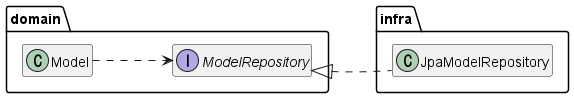
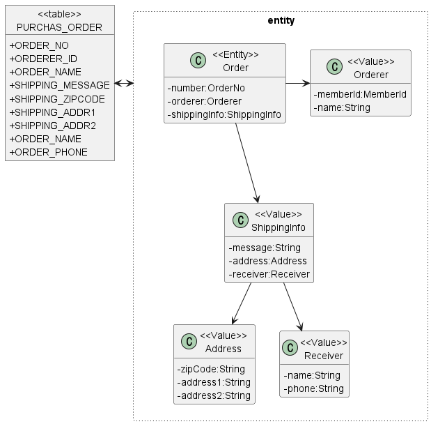
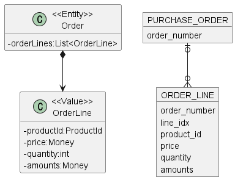
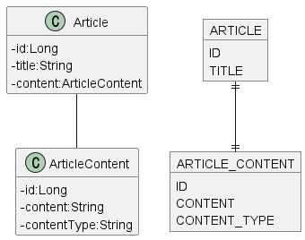
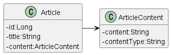
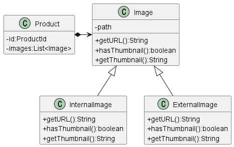
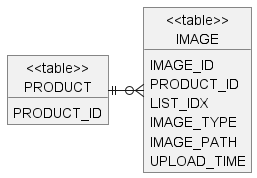

# 4. 리포지터리와 모델 구현

## 1. JPA를 이용한 리포지터리 구현

- 이 절에서는 자바의 ORM 표준인 JPA를 이용해서 리포지터리와 애그리거트를 구현하는 방법에 대해 살펴본다.

### 1.1. 모듈 위치

- 2장에서 언급한 것처럼 리포지터리 인터페이스는 애그리거트와 같이 모데인 영역에 속하고, 리포지터리를 구현한 클래스는 인프라스트럭처 영역에 속한다.



- 팀 표준에 따라 리포지터리 구현 클래스를 domain.impl과 같은 패키지에 위치시킬 수도 있다.
  - 하지만 이것은 리포지터리 인터페이스와 구현체를 분리하기 위한 타협안 같은 것이지 좋은 설계 원칙을 따르는 것은 아니다.
  - 가능하면 리포지터리 구현 클래스를 인프라스트럭처 영역에 위치시켜서 인프라스트럭처에 대한 의존을 낮춰야 한다.

### 1.2. 리포지터리 기본 기능 구현

- 리포지터리가 제공하는 기본 기능은 다음 두 가지다.
  - ID로 애그리거트 조회하기
  - 애그리거트 저장하기
- 두 메서드를 위한 리포지터리 인터페이스는 다음과 같은 형식을 갖는다.

```java
public interface OrderRepository {
	Order findById(OrderNo no); // Optional<Order>를 사용해도 된다.
	void save(Order order);
}
```

- 인터페이스는 애그리거트 루트를 기준으로 작성한다.
  - 주문 애그리거트는 Order 루트 엔티티를 비록해 OrderLine, Orderer, ShippingInfo 등 다양한 객체를 포함하는데, 이 구성요소 중에서 루트 엔티티인 Order를 기준으로 리포지터리를 작성한다.
- 이 인터페이스를 구현한 클래스는 JPA의 EntityManager를 이용해서 기능을 구현한다.
- 스프링 프레임워크에 기반한 리포지터리 구현 클래스는 다음과 같다.

```java
@Repository
public class JpaOrderRepository implements OrderRepository {
	@PersistenceContext
	private EntityManager entityManager;

	@Override
	public Order findById(OrderNo id) {
		return entityManager.find(Order.class, id);
	}

	@Overrid
	public void save(Order order) {
		entityManager.persist(order);
	}
}
```

### NOTE: 삭제 기능

- 삭제 요구사항이 있더라도 데이터를 실제로 삭제하는 경우는 많지 않다.
- 관리자 기능에서 삭제한 데이터까지 조회해야 하는 경우도 있고 데이터를 원복을 위해 일정 기간 동안 보관해야 할 때도 있기 때문이다.
- 이런 이유로 사용자가 삭제 기능을 실행할 때 데이터를 바로 삭제하기보다는 삭제 플래그를 사용해서 데이터를 화면에 보여줄지 여부를 결정하는 방식으로 구현한다.

## 2. 스프링 데이터 JPA를 이용한 리포지터리 구현

- 스프링과 JPA를 함께 적용할 때는 스프링 데이터 JPA를 사용한다.
- 스프링 데이터 JPA는 지정한 규칙에 맞게 리포지터리 인터페이스를 정의하면 리포지터리를 구현한 객체를 알아서 스프링 빈으로 등록해준다.
  - 리포지터리 인터페이스를 직접 구현하지 않아도 되기 때문에 개발자는 리포지터리를 쉽게 정의할 수 있다.
- 스프링 데이터 JPA는 다음 규칙에 따라 작성한 인터페이스를 찾아서 인터페이스를 구현한 스프링 빈 객체를 자동으로 등록한다.
  - org.springframework.data.repository.Repository<T, ID> 인터페이스 상속
  - T는 엔티티 타입을 지정하고 ID는 식별자 타입을 지정
- 예를 들어 Order 엔티티 타입의 식별자가 OrderNo 타입이라고 하자.
- Order를 위한 OrderRepository는 아래와 같이 작성할 수 있다.

```java
public interface OrderRepository extends Repository<Order, OrderNo> {
	Optional<Order> findById(OrderNo id);

	void save(Order order);
}
```

- 스프링 데이터 JPA는 OrderRepository를 리포지터리로 인식해서 알맞게 구현한 객체를 스프링 빈으로 등록한다.

```java
@Service
public class CancelOrderService {
	// 빈이 주입된다.
	private OrderRepository orderRepository;

	public CancelOrderService(OrderRepository orderRepository) {
		this.orderRepository = orderRepository;
	}
	...
}
```

- 스프링 데이터 JPA를 사용하려면 지정한 규칙에 맞게 메서드를 작성해야 한다.
  - 이 장에서는 기본 규칙을 살펴보고 5장에서 추가로 더 알아볼 것이다.
- OrderRepository를 기준으로 엔티티를 저장하는 메서드는 다음 중 하나를 사용한다.
  - Order save(Order order)
  - void save(Order order)
- 식별자를 이용해서 엔티티를 조회할 때는 findById() 메서드는 사용한다.
  - Order findById(OrderNo id)
    - 엔티티가 존재하지 않으면 null을 리턴한다.
  - Optional<Order> findById(OrderNo id)
    - 엔티티가 존재하지 않으면 Optional.empty()를 리턴한다.
- 특정 프로퍼티를 이용해서 엔티티를 조회할 때는 findBy프로퍼티이름 형식의 메서드를 사용하며, 특정 Orderer 값을 갖는 Order목록을 모두 조회하는 메서드는 다음과 같이 정의할 수 있다.
  - List<Order> findAllByOrderer(Orderer orderer)
    - 이 방법은 ‘도메인 주도 개발 시작하기’ 책에는 없는 내용이지만 관례적으로 사용되기 때문에 추가했다.
  - List<Order> findByOrderer(Orderer orderer)
- 다음처럼 중첩 프로퍼티도 가능하다. 이 메서드는 Orderer 객체의 memberId 프로퍼티가 파라미터와 같은 Order 목록을 조회한다.
  - List<Order> findByOrdererMemberId(MemberId memberId)
- 엔티티를 삭제하는 메서드는 다음 두 형태를 갖는다.
  - void delete(Order order)
  - void deleteById(OrderNo id)

## 3. 매핑 구현

### 3.1. 엔티티와 밸류 기본 매핑 구현

- 애그리거트와 JPA 매핑을 위한 기본 규칙은 다음과 같다.
  - 애그리거트 루트는 엔티티이므로 @Entity로 매핑 설정한다.
- 한 테이블에 엔티티와 밸류 데이터가 같이 있다면
  - 밸류는 @Embeddable로 매핑 설정한다.
  - 밸류 타입 프로퍼티는 @Embedded로 매핑 설정한다.
- 주문 애그리거트를 예로 들어보자.
  - 애그리거트의 루트 엔티티는 Order이다.
  - 이 애그리거트에 속한 Orderer와 ShippingInfo는 밸류이다.
  - 이 세 객체와 ShippingInfo에 포함된 Address 객체와 Receiver 객체는 아래 그림처럼 한 테이블에 매핑할 수 있다.
    
- 주문 애그리거트에서 루트 엔티티인 Order는 JPA의 @Entity로 매핑한다.
  ```java
  @Entity
  @Table(name = "purchase_order")
  public class Order {
  	...
  }
  ```
- Order에 속하는 Orderer는 밸류이므로 @Embeddable로 매핑한다.

  ```java
  @Embeddable
  public class Orderer {

  	// MemberId에 정의된 컬럼 이름을 변경하기 위해
  	// @AttributeOverride 애너테이션 사용
  	@Embedded
  	@AttributeOverrides(
  		@AttributeOverride(name = "id", column = @Column(name = "orderer_id"))
  	)
  	private MemberId memberId;

  	@Column(name = "orderer_name")
  	private String name;
  }
  ```

  - Orderer의 memberId는 Member 애그리거트를 ID로 참조한다.
  - Member의 ID 타입으로 사용되는 MemberId는 다음과 같이 id 프로퍼티와 매핑되는 테이블 컬럼 이름으로 “member_id”를 지정하고 있다.
    ```java
    @Embeddable
    public class MemberId implements Serializable {
    	@Column(name = "member_id")
    	private String id;
    }
    ```
    - 위 그림에서 Orderer의 memberId 프로퍼티와 매핑되는 컬럼 이름은 “orerer_id” 이므로 MemberId에 설정된 “member_id”와 이름이 다르다.
    - 따라서 Orderer 밸류에서 @AttributeOverrides 애너테이션을 이용해서 Orderer의 memberId 프로퍼티와 매핑할 컬럼 이름을 변경했다.

- Orderer와 마찬가지로 ShippingInfo 밸류도 또 다른 밸류인 Address와 Receiver를 포함한다.
- Address의 매핑 설정과 다른 컬럼 이름을 사용하기 위해 @AttributeOverride 애너테이션을 사용한다.

  ```java
  @Embeddable
  public class ShippingInfo {
  	@Embedded
  	@AttributeOverrides({
  		@AttributeOverride(name = "zipCode",
  											column = @Column(name = "shipping_zipcode"))
  		@AttributeOverride(name = "address1",
  											column = @Column(name = "shipping_address1"))
  		@AttributeOverride(name = "address2",
  											column = @Column(name = "shipping_address2"))
  	})
  	private Address address;

  	@Column(name = "shipping_message")
  	private String message;

  	@Embedded
  	private Receiver receiver;
  }
  ```

- 루트 엔티티인 Order 클래스는 @Embedded를 이용해서 밸류 타입 프로퍼티를 설정한다.

```java
@Entity
public class Order {
	...
	@Embedded
	private Orderer orderer;

	@Embedded
	private ShippingInfo shippingInfo;
}
```

### 3.2. 기본 생성자

- 엔티티와 밸류의 생성자는 객체를 생성할 때 필요한 것을 전달받는다.
  - Receiver 밸류 타입은 생성 시점에서 수취인의 이름과 연락처를 생성자 파라미터로 전달받는다.

```java
public class Receiver {
	private String name;
	private String phone;

	public Receiver(String name, String phone) {
		this.name = name;
		this.phone = phone;
	}
	...
}
```

- Receiver가 불변 타입이면 생성 시점에 필요한 값을 전부 전달받으므로 값을 변경하는 set 메서드를 제공하지 않는다.
- 이는 Receiver 클래스에 기본 생성자를 추가할 필요가 없다는 것을 의미한다.
- 하지만 JPA에서 @Entity와 @Embeddable로 클래스를 매핑하려면 기본 생성자를 제공해야 한다.
- DB에서 데이터를 읽어와 매핑된 객체를 생성할 때 기본 생성자를 사용해서 객체를 생성하기 때문이다.
- 이런 기술적인 제약으로 Receiver와 같은 불변 타입은 기본 생성자가 필요 없음에도 불구하고 다음과 같이 기본 생성자를 추가해야 한다.

```java
@Embeddable
public class Receiver {
	@Column(name = "receiver_name")
	private String name;
	@Column(name = "receiver_phone")
	private String phone;

	protected Receiver() {} // JPA를 적용하기 위해 기본 생성자 추가

	public Receiver(String name, String phone) {
		this.name = name;
		this.phone = phone;
	}
	...
}
```

- 기본 생성자는 JPA 프로바이더가 객체를 생성할 때만 사용한다.
- 기본 생성자를 다른 코드에서 사용하면 값이 없는 온전하지 못한 객체를 만들게 된다.
- 이런 이유로 다른 코드에서 기본 생성자를 사용하지 못하도록 protected로 선언한다.

### 3.3. 필드 접근 방식 사용

- JPA는 필드와 메서드의 두 가지 방식으로 매핑을 처리할 수 있다.
- 메서드 방식을 사용하려면 다음과 같이 프로퍼티를 위한 get/set 메서드를 구현해야 한다.

```java
@Entity
@Access(AccessType.PROPERTY)
public class Order {
	@Column(name = "state")
	@Enumerated(EnumType.STRING)
	public OrderState getState() {
		return state;
	}

	public void setState(OrderState state) {
		this.state = state;
	}
	...
}
```

- 엔티티에 프로퍼티를 위한 공개 get/set 메서드를 추가하면 도메인의 의도가 사라지고 객체가 아닌 데이터 기반으로 엔티티를 구현할 가능성이 높아진다.
- 특히 set 메서드는 내부 데이터를 위부에서 변경할 수 있는 수단이 되기 때문에 캡슐화를 깨는 원인이 될 수 있다.
  - 도메인의 의도가 잘 드러나도록 setState()보다는 cancel()을 권장한다.
- 밸류 타입을 불변으로 구현하려면 set 메서드 자체가 필요 없는데 JPA의 구현 방식 때문에 공개 set 메서드를 추가하는 것도 좋지 않다.
- 객체가 제공할 기능 중심으로 엔티티를 구현하게끔 유도하려면 JPA 매핑 처리를 프로퍼티 방식이 아닌 필드 방식으로 선택해서 불필요한 get/set 메서드를 구현하지 말아야 한다.

```java
@Entity
@Access(AccesType.FIELD)
public class Order {

	@EmbeddedId
	private OrderNo number;

	@Column(name = "state")
	@Enumberated(EnumType.STRING)
	private OrderState state;

	... // cancel(), changeShippingInfo() 등 도메인 기능 구현
	... // 필요한 get 메서드 제공
}
```

### 3.4. AttributeConverter를 이용한 밸류 매핑 처리

- int, long, String, LocalDate와 같은 타입은 DB 테이블의 한 개 컬럼에 매핑된다.
- 이와 비슷하게 밸류 타입의 프로퍼티를 한 개 컬럼에 매핑해야 할 때도 있다.
  - Length가 길이 값과 단위의 두 프로퍼티를 갖고 있는데 DB 테이블에는 한 개 컬럼에 ‘1000mm’와 같은 형식으로 저장하는 경우
- 두 개 이상의 프로퍼티를 가진 밸류 타입을 한 개 컬럼에 매핑하려면 @Embeddable 애너테이션으로는 처리할 수 없다.
- 이럴 때 사용할 수 있는 것이 AttributeConverter이다.
- AttributeConverter는 다음과 같이 밸류 타입과 컬럼 데이터 간의 변환을 처리하기 위한 기능을 정의하고 있다.

```java
public interface AttributeConverter<X, Y> {
	public Y convertToDatabaseColumn(X attribute);
	public X convertToEntityAttribute(Y dbData);
}
```

- 타입 파라미터 X는 밸류 타입이고 Y는 DB 타입이다.
- convertToDatabaseColumn() 메서드는 밸류 타입을 DB 컬럼 값으로 변환하는 기능을 구현하고 convertToEntityAttribute() 메서드는 DB 컬럼 값을 밸류로 변환하는 기능을 구현한다.
- Money 밸류 타입을 위한 AttributeConverter는 아래와 같이 구현할 수 있다.

```java
@Converter(autoApply = true)
public class MoneyConverter implements AttributeConverter<Money, Integer> {

	@Override
	public Integer convertToDatabaseColumn(Money money) {
		return money == null ? null : money.getValue()
	}

	@Override
	public Money convertToEntityAttribute(Integer value) {
		return value == null ? null : new Money(value);
	}
}
```

- AttributeConverter 인터페이스를 구현한 클래스는 @Converter 애너테이션을 적용한다.
- @Converter의 `autoApply = true`는 모델에 출현하는 모든 Money 타입의 프로퍼티에 대해 MoneyConverter를 자동으로 적용한다는 것이다.
  - 예를 들어 Order의 totalAmounts 프로퍼티는 Money 타입인데 이 프로퍼티를 DB total_amounts 컬럼에 매핑할 때 MoneyConverter를 사용한다.
  ```java
  @Entity
  @Table(name = "purchase_order")
  public class Order {
  	...
  	@Column(name = "total_amounts")
  	private Money totalAmounts; // MoneyConverter를 적용해서 값 변환
  	...
  }
  ```
- @Converter의 속성을 `autoApply = false`로 하면 프로퍼티 값을 변환할 때 사용할 컨버터를 직접 지정해야 한다. (defualt는 false이다.)
  ```java
  @Entity
  @Table(name = "purchase_order")
  public class Order {
  	...
  	@Column(name = "total_amounts")
  	@Convert(converter = MoneyConverter.class)
  	private Money totalAmounts;
  	...
  }
  ```

### 3.5. 밸류 컬렉션: 별도 테이블 매핑

- Order 엔티티는 한 개 이상의 OrderLine을 가질 수 있다.
- OrderLine에 순서가 있다면 다음과 같이 List 타입을 이용해서 컬렉션을 프로퍼티로 지정할 수 있다.

```java
public class Order {
	private List<OrderLine> orderLines;
	...
}
```

- Order와 OrderLine을 저장하기 위한 테이블은 아래와 같이 매핑 가능하다.



- 밸류 컬렉션을 저장하는 ORDER_LINE 테이블은 외부키를 이용해서 엔티티에 해당하는 PURCHASE_ORDER 테이블을 참조한다.
  - 이 외부키는 컬렉션이 속할 엔티티를 의미한다.
- List 타입의 컬렉션은 인덱스 값이 필요하므로 ORDER_LINE 테이블에는 인덱스 값을 저장하기 위한 컬럼(line_idx)도 존재한다.
- 밸류 컬랙션을 별도 테이블로 매핑할 때는 @ElementCollection과 @CollectionTable을 함께 사용한다. 관련 매핑 코드는 다음과 같다.

```java
@Entity
@Table(name = "purchase_order")
public class Order {
	@EmbeddedId
	private OrderNo number;
	...
	@ElementsCollection(fetch = FetchType.EAGER)
	@CollectionTable(name = "order_line",
								joinColumn = @JoinColumn(name = "order_number"))
	@OrderColumn(name = "line_idx")
	private List<OrderLine> orderLines;
}
```

```java
@Embeddable
public class OrderLine {
	@Embedded
	private ProductId productId;

	@Column(name = "price")
	private Money price;

	@Column(name = "quantity")
	private int quantity;

	@Column(name = "amounts")
	private Money amounts;
	...
}
```

- OrderLine의 매핑을 함께 표시했는데 OrderLine에는 List의 인덱스 값을 저장하기 위한 프로퍼티가 존재하지 않는다.
  - List 타입 자체가 인덱스를 갖고 있기 때문이다.
- JPA는 @OrderColumn 애너테이션을 이용해서 지정한 컬럼에 리스트의 인덱스 값을 저장한다.
- @CollectionTable은 밸류를 저장할 테이블을 지정하는데, name 속성은 테이블 이름을 지정하고 joinColumns 속성은 외부키로 사용할 컬럼을 지정한다.

### 3.6. 밸류 컬렉션: 한 개 컬럼 매핑

- 밸류 컬렉션을 별도 테이블이 아닌 한 개 컬럼에 저장해야 할 때가 있다.
  - 도메인 모델에는 이메일 주소 목록을 Set으로 보관하고 DB에는 한 개 컬럼에 콤마로 구분해서 저장해야 할 때가 있다.
- 이 때 AttributeConverter를 사용하면 밸류 컬렉션을 한 개 컬럼에 쉽게 매핑할 수 있다.
- 단 AttributeConverter를 사용하려면 밸류 컬렉션을 표현하는 새로운 밸류 타입을 추가해야 한다.

  - 이메일의 경우 아래 코드처럼 이메일 집합을 위한 밸류 타입을 추가로 작성해야 한다.

  ```java
  public class EmailSet {
  	private Set<Email> emails = new HashSet<>();

  	public EmailSet(Set<Email> emails) {
  		this.emails.addAll(emails);
  	}

  	public Set<Email> getEmails() {
  		return Collections.unmodifiableSet(emails);
  	}
  }
  ```

  - 밸류 컬렉션을 위한 타입을 추가했다면 AttributeConverter를 구현한다.

  ```java
  public class EmailSetConverter implements AttributeConverter<EmailSet, String> {
  	@Override
  	public String convertToDatabaseColumn(EmailSet attribute) {
  		if (attribute == null) {
  			return null;
  		}
  		return attribute.getEmails().stream()
  						.map(email -> email.getAddress())
  						.collect(Collectors.joining(","));
  	}

  	@Override
  	public EmailSet convertToEntityAttribute(String dbData) {
  		if (dbData == null) {
  			return null;
  		}
  		String[] emails = dbData.split(",");
  		Set<Email> emailSet = Arrays.stream(emails)
  								.map(value -> new Email(value))
  								.collect(toSet());
  		return new EmailSet(emailSet);
  	}
  }
  ```

  - 이제 프로퍼티가 Converter로 EmailSetConvert를 사용하도록 지정하면 된다.

  ```java
  @Column(name = "emails")
  @Convert(converter = EmailSetConverter.class)
  private EmailSet emailSet;
  ```

### 3.7. 밸류를 이용한 ID매핑

- 식별자라는 의미를 부각시키기 위해 식별자 자체를 밸류 타입으로 만들 수도 있다.
- 밸류 타입을 식별자로 매핑하면 @Id 대신 @EmbeddedId 애너테이션을 사용한다.

```java
@Entity
@Table(name = "purchase_order")
public class Order {
	@EmbeddedId
	private OrderNo number;
	...
}
```

```java
@Embeddable
public class OrderNo implements Serializable {
	@Column(name = "order_number")
	private String number;
	...
}
```

- JPA에서 식별자 타입은 Serializable 타입이여야 하므로 식별자로 사용할 밸류 타입은 Serializable 인터페이스를 상속받아야 한다.
- 밸류 타입으로 식별자를 구현할 때 얻을 수 있는 장점은 식별자에 기능을 추가할 수 있다는 점이다.

  - 1세대 시스템의 주문번호와 2세대 시스템의 주문번호를 구분할 때 주문번호의 첫 글자를 이용할 경우, 다음과 같이 OrderNo 클래스에 시스템 세대를 구분할 수 있는 기능을 구현할 수 있다.

  ```java
  @Embeddable
  public class OrderNo implements Serializable {
  	@Column(name = "order_number")
  	private String number;

  	public boolean is2ndGeneration() {
  		return number.startsWith("N");
  	}
  	...
  }
  ```

  - 세대 구분이 필요한 코드는 OrderNo가 제공하는 기능을 이용해서 구분하면 된다.

- JPA는 내부적으로 엔티티를 비교할 목적으로 equals() 메서드와 hashcode() 값을 사용하므로 식별자로 사용할 밸류 타입은 이 두 메서드를 알맞게 구현해야 한다.

### 3.8. 별도 테이블에 저장하는 밸류 매핑

- 애그리거트에서 루트 엔티티를 뺀 나머지 구성요소는 대부분 밸류이다.
- 루트 엔티티 외에 또 다른 엔티티가 있다면 진짜 엔티티인지 의심해 봐야 한다.
- 단지 별도 테이블에 데이터를 저장한다고 해서 엔티티인 것은 아니다.
- 주문 애그리거트도 OrderLine을 별도 테이블에 저장하지만 OrderLine 자체는 엔티티가 아니라 밸류이다.
- 밸류가 아니라 엔티티가 확실하다면 해당 엔티티가 다른 애그리거트는 아닌지 확인해야 한다.
- 특히 자신만의 독자적인 라이프 사이클을 갖는다면 구분되는 애그리거트일 가능성이 높다.
  - 상품 상세 화면을 보면 상품 자체에 대한 정보와 고객의 리뷰를 함께 보여주는데 이를 보고 상품 애그리거트에 고객 리뷰가 포함된다고 생각할 수 있다.
  - 하지만 Product와 Review는 함께 생성되지 않고 함께 변경되지도 않는다. 게다가 변경 주체도 다르다.
  - Review 변경이 Product에 영향을 주지 않고 반대로 Product 변경이 Review에 영향을 주지 않기 때문에 Review는 엔티티가 맞지만 리뷰 애그리거트에 속한 엔티티이지 상품 애그리거트에 속한 엔티티는 아니다.
- 애그리거트에 속한 객체가 밸류인지 엔티티인지 구분하는 방법은 고유 식별자를 갖는지를 확인하는 것이다.
- 하지만 식별자를 찾을 때 매핑되는 테이블의 식별자를 애그리거트 구성요소의 식별자와 동일한 것으로 착각하면 안 된다.
- 별도 테이블로 저장하고 테이블에 PK가 있다고 해서 테이블과 매핑되는 애그리거트 구성요소가 항항 고유 식별자를 갖는 것은 아니기 때문이다.

  - 게시글 데이터를 ARTICLE 테이블과 ARTICLE_CONTENT 테이블로 나눠서 저장한다고 하자.
  - 이 경우 아래와 같이 Article과 ArticleContent 클래스를 두 테이블에 매핑할 수 있다.
    
  - 위 그림만 보면 ARTICLE_CONTENT 테이블의 ID 컬럼이 식별자이므로 ARTICLE_CONTENT와 매핑되는 ArticleContent를 엔티티로 생각해서 Article과 ArticleContent를 두 엔티티 간의 1-1 연관으로 매핑할 수 있다.
  - ArticleContent를 엔티티로 생각할 수 있겠지만 ArticleContent는 Article의 내용을 담고 있는 밸류로 생각하는 것이 맞다.
  - ARTICLE_CONTENT의 ID는 식별자이긴 하지만 이 식별자를 사용하는 이유는 ARTICLE 테이블의 데이터와 연결하기 위함이지 ARTICLE_CONTENT를 위한 별도 식별자가 필요하기 때문은 아니다.
  - 즉 이것은 게시글의 특정 프로퍼티를 별도 테이블에 보관한 것으로 접근해야 한다.
  - ArticleContent를 밸류로 보고 접근하면 모델은 아래와 같이 바뀐다.
    
  - ArticleContent는 밸류이므로 @Embeddable로 매핑한다.
  - ArticleContent와 매핑되는 테이블은 Article과 매핑되는 테이블과 다르다.
  - 이때 밸류를 매핑한 테이블을 지정하기 위해 @SecondaryTable과 @AttributeOverride를 사용한다.

  ```java
  @Entity
  @Table(name = "article")
  @SecondaryTable(
  	name = "article_content",
  	pkJoinColumns = @PrimaryKeyJoinColumn(name = "id")
  )
  public class Article {
  	@Id
  	@GeneratedValue(strategy = GenerationType.IDENTITY)
  	private Long id;

  	private String title;

  	@AttributeOverrides({
  		@AttributeOverride(
  			name = "content",
  			column = @Column(table = "article_content", name = "content")),
  		@AttributeOverride(
  			name = "contentType",
  			column = @Column(table = "article_content", name = "content_type"))
  	})
  	@Embedded
  	private ArticleContent content;
  }
  ```

  - @SecondaryTable의 name 속성은 밸류를 저장할 테이블을 지정한다.
  - pkJoinColumns 속성은 밸류 테이블에서 엔티티 테이블로 조인할 때 사용할 컬럼을 지정한다.
  - content 필드에 @AttributeOverride를 적용했는데 이 애너테이션을 사용해서 해당 밸류 데이터가 저장된 테이블 이름을 지정한다.
  - @SecondaryTable을 이용하면 아래 코드를 실행할 때 두 테이블을 조인해서 데이터를 조회한다.

  ```java
  // @SecondaryTable로 매핑된 article_content 테이블을 조인
  Article article = entityManager.find(Article.class, 1L);
  ```

  - 게시글 목록을 보여주는 화면은 article 테이블의 데이터만 필요하지 article_content 테이블의 데이터는 필요하지 않다.
  - 그런데 @SecondaryTable을 사용하면 목록 화면에 보여줄 Article을 조회할 때 artile_content 테이블까지 조인해서 데이터를 읽어오는데 이것은 원하는 결과가 아니다.
  - 이 문제를 해소하고자 ArticleContent를 엔티티로 매핑하고 Article에서 ArticleContent의 로딩을 지연 로딩 방식으로 설정할 수도 있다.
  - 하지만 이 방식은 밸류인 모델을 엔티티로 만드는 것이므로 좋은 방법은 아니다.
  - 대신 조회 전용 기능을 구현하는 방법을 사용하는 것이 좋다.
  - JPA에서 조회 전용 쿼리를 실행하는 방법은 5장에서 살펴본다.
  - 또한 11장에서 추가로 명령 모델과 조회 전용 모델을 구분하는 것에 대해 알아볼 것이다.

### 3.9. 밸류 컬렉션을 @Entity로 매핑하기

- 개념적으로 밸류인데 구현 기술의 한계나 팀 표준 때문에 @Entity를 사용해야 할 때도 있다.
  - 제품의 이미지 업로드 방식에 따라 이미지 경로와 섬네일 이미지 제공 여부가 달라진다고 해보자.
  - 이를 위해 Image를 아래 그림과 같이 계층 구조로 설계할 수 있다.
    
- JPA는 @Embeddable 타입의 클래스 상속 매핑을 지원하지 않는다.
- 상속 구조를 갖는 밸류 타입을 사용하려면 @Embeddable 대신 @Entity를 이용해서 상속 매핑으로 처리해야 한다.
- 밸류 타입을 @Entity로 매핑하므로 식별자 매핑을 위한 필드도 추가해야 한다.
- 또한 구현 클래스를 구분하기 위한 타입 식별 컬럼을 추가해야 한다.



- 한 테이블에 Image와 그 하위 클래스를 매핑하므로 Image 클래스에 다음 설정을 사용한다.
  - @Inheritance 애너테이션 적용
  - strategy 값으로 SINGLE_TABLE 사용
  - @DiscriminatorColumn 애너테이션을 이용하여 타입 구분용으로 사용할 컬럼 지정
- Image를 @Entity로 매핑했지만 모델에서 Image는 밸류이므로 아래 코드와 같이 상태를 변경하는 기능은 추가하지 않는다.

```java
@Entity
@Inheritance(strategy = InheritanceType.SINGLE_TABLE)
@DiscriminatorColumn(name = "image_type")
@Table(name = "image")
public abstract class Image {
	@Id
	@GeneratedValue(strategy = GenerationType.IDENTITY)
	@Column(name = "image_id")
	private Long id;
	@Column(name = "image_path")
	private String path;

	@Temporal(TemporalType.TIMESTAMP)
	@Column(name = "upload_time")
	private Date uploadTime;

	protected Image() {}
	public Image(String path) {
		this.path = path;
		this.uploadTime = new Date();
	}

	protected String getPaht() {
		return path;
	}

	public Date getUploadTime() {
		return uploadTime;
	}

	public abstract String getURL();
	public abstract boolean hasThumbnail();
	public abstract String getThumbnail();
}
```

- Image를 상속받은 클래스는 @Entity와 @DiscriminatorValue를 사용해서 매핑을 설정한다.

```java
@Entity
@DiscriminatorValue("II")
public class InternalImage extends Image {
	...
}
```

```java
@Entity
@DiscriminatorValue("EI")
public class ExternalImage extends Image {
	...
}
```

- Image가 @Entity이므로 목록을 담고 있는 Product는 아래 코드와 같이 @OneToMany를 이용해서 매핑을 처리한다.
- Image는 밸류이므로 독자적인 라이프 사이클을 갖지 않고 Product에 완전히 의존한다.
  - 따라서 Product를 저장할 때 함께 저장되고 Product를 삭제할 때 함께 삭제되도록 cascade 속성을 지정한다.
  - 리스트에서 Image 객체를 제거하면 DB에서 함께 삭제되도록 orphanRemoval도 true로 설정한다.

```java
@Entity
@Table(name = "product")
public class Product {
	@EmbeddedId
	private ProductId id;
	private String name;

	@Convert(converter = MoneyConverter.class)
	private Money price;
	private String detail;

	@OneToMany(
		cascade = {CascadeType.PERSIST, CascadeType.REMOVE},
		orphanRemoval = true
	)
	@JoinColumn(name = "product_id")
	@OrderColumn(name = "list_idx")
	private List<Image> images = new ArrayList<>();

	...

	public void changeImages(List<Image> newImages) {
		images.clear();
		images.addAll(newImages);
	}
}
```

- changeImage() 메서드를 보면 이미지 교체를 위해 clear() 메서드를 사용하고 있다.
- @Entity에 대한 @OneToMany 매핑에서 컬렉션의 clear() 메서드를 호출하면 삭제 과정이 효율직이지는 않다.
- 하이버네이트의 경우 @Entity를 위한 컬렉션 객체의 clear() 메서드를 호출하면 select() 쿼리로 대상 엔티티를 조회하고, 각 개별 엔티티에 대해 delete 쿼리를 실행한다.
- 즉, images에 보관되어 있던 Image 개수가 4개면 Image 몱록을 가져오기 위한 한 번의 `select * from image where product_id = ?` 쿼리와 각 Image를 삭제하기 위한 네 번의 `delete from image where image_id = ?` 쿼리를 실행한다.
- 변경 빈도가 낮으면 괜찮지만 빈도가 높으면 전체 서비스 성능에 문제가 될 수 있다.
- 하이버네이트는 @Embeddable 타입에 대한 컬렉션의 clear() 메서드를 호출하면 컬렉션에 속한 객체를 로딩하지 않고 한 번의 delete 쿼리로 삭제 처리를 수행한다.
- 따라서 애그리거트의 특성을 유지하면서 이 문제를 해소하려면 결국 상속을 포기하고 @Embeddable로 매핑된 단일 클래스로 구현해야 한다.
- 물론 타입에 따라 다른 기능을 구현하려면 다음과 같이 if-else를 써야 한다.

```java
@Embeddable
public class Image {
	@Column(name = "image_type")
	private String imageType;
	@Column(name = "image_path")
	private String path;

	@Temporal(TemporalType.TIMESTAMP)
	@Column(name = "upload_time")
	private Date uploadTime;
	...

	public boolean hasThumbnail() {
		// 성능을 위해 다형을 포기하고 if-else로 구현
		if (imageType.equals("TI") {
			return true;
		} else {
			return false;
		}
}
```

- 코드 유지 보수와 성능의 두 가지 측면을 고려해서 구현 방식을 선택해야 한다.

### 3.10 ID 참조와 조인 테이블을 이용한 단방향 M-N 매핑

- 3장에서 애그리거트 간 집합 연관은 성능 상의 이유로 피해야 한다고 했다.
- 그럼에도 불구하고 요구사항을 구현하는 데 집합 연관을 사용하는 것이 유리하다면 ID 참조를 이용한 단방향 집합 연관을 적용해 볼 수 있다.
- 이미 3장에서 이와 관련된 매핑 예를 보여준 바 있다. 코드를 다시 보자.

```java
@Entity
@Table(name = "product")
public class Product {
	@EmbeddedId
	private ProductId id;

	@ElementCollection
	@CollectionTable(name = "product_category",
			joinColumns = @JoinColumn(name = "product_id")
	)
	private Set<CategoryId> categoryIds;
	...
}
```

- 이 코드는 Product에서 Category로의 단방향 M-N 연관을 ID 참조 방식으로 구현한 것이다.
- ID 참조를 이용한 애그리거트 간 단방향 M-N 연관은 밸류 컬렉션 매핑과 동일한 방식으로 설정한 것을 알 수 있다.
- 차이점이 있다면 집합의 값에 밸류 대신 연관을 맺는 식별자가 온다는 점이다.
- @ElementCollection을 이용하기 때문에 Product를 삭제할 때 매핑에 사용한 조인 테이블의 데이터도 함께 삭제된다.
- 애그리거트를 직접 참조하는 방식을 사용했다면 영속성 전파나 로딩 전략을 고민해야 하는데 ID 참조 방식을 사용함으로써 이런 고민을 없앨 수 있다.

## 4. 애그리거트 로딩 전략

## 5. 애그리거트의 영속성 전파

## 6. 식별자 생성 기능

## 7. 도메인 구현과 DIP
