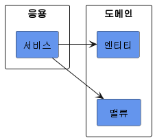
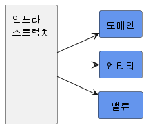

# 2. 아키텍처 개요

## 1. 네 개의 영역

- 표현, 응용, 도메인, 인프라스트럭처는 아키텍처를 설계할 때 출현하는 전형적인 네가지 영역이다.
- 표현 영역
  
  - 웹 어플리케이션에서 표현영역은 HTTP 요청을 응용 영역이 필요로 하는 형식으로 변환해서 응용 영역에 전달하고 응용 영역의 응답을 HTTP 응답으로 변환하여 전송한다.
    - 웹 브라우저가 HTTP 요청 파라미터로 데이터를 전송한다.
    - 표현 영역은 데이터를 응용 서비스가 요구하는 형식의 객체 타입으로 변환해서 전달한다.
    - 응용 서비스가 결과를 리턴한다.
    - 표현 영역은 결과를 JSON 형식으로 변환해서 HTTP 응답으로 웹 브라우저에 전송한다.
- 응용 영역
  

  - 시스템이 사용자에게 제공해야 할 기능을 구현한다.
    - 주문 등록, 주문 취소, 상품 상세 조회 등
  - 기능을 구현하기 위해 도메인 영역의 도메인 모델을 사용한다.

    - 주문 취소 기능을 제공하는 응용 서비스를 보면 다음과 같이 주문 도메인 모델을 사용해서 기능을 구현한다.

    ```java
    public class CancelOrderService {

    	@Transactional
    	public void cancelOrder(String orderId) {
    		Order order = findOrderById(orderId);
    		if (order == null) {
    			throw new OrderNotFoundException(orderId);
    		}
    		order.cancel();
    	}
    }
    ```

    - 응용 서비스는 로직을 직접 수행하기보다는 도메인 모델에 로직 수행을 위임한다. 위 코드에서도 주문 취소 로직을 직접 구현하지 않고 Order 객체에 취소 처리를 위임하고 있다.

- 도메인 영역
  - 도메인 영역은 도메인 모델을 구현한다. 그리고 도메인 모델은 도메인의 핵심 로직을 구현한다.
    - 배송지 변경, 결제 완료, 주문 총액 계산과 같은 핵심 모델을 도메인 모델에서 구현한다.
- 인프라스트럭처 영역
  
  - 논리적인 개념을 표현하기보다는 구현 기술에 대한 것을 다룬다.
    - RDBMS 연동 처리
    - 메시징 큐에 메시지를 송수신 기능 구현
    - 몽고DB나 레디스와의 데이터 연동을 처리
    - SMTP를 이용한 메일 발송 기능을 구현
    - HTTP 클라이언트를 이용해서 REST API를 호출
  - 표현, 응용, 도메인 영역은 구현 기술을 사용한 코드를 직접 만들지 않는다. 대신 인프라스트럭처 영역에서 제공하는 기능을 사용해서 필요한 기능을 개발한다.
    - 응용 영역에서 DB에 보관된 데이터가 필요하면 인프라스트럭처 영역의 DB 모듈을 사용하여 데이터를 읽어온다.
    - 외부에 메일을 발송해야 한다면 인프라스트럭처가 제공하는 SMTP 연동 모듈을 이용해서 메일을 발송한다.
