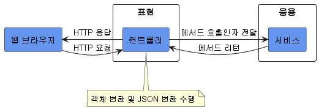
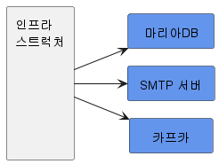

# 2. 아키텍처 개요

## 1. 네 개의 영역

- 표현, 응용, 도메인, 인프라스트럭처는 아키텍처를 설계할 때 출현하는 전형적인 네가지 영역이다.
- 표현 영역
  
  - 웹 어플리케이션에서 표현영역은 HTTP 요청을 응용 영역이 필요로 하는 형식으로 변환해서 응용 영역에 전달하고 응용 영역의 응답을 HTTP 응답으로 변환하여 전송한다.
    - 웹 브라우저가 HTTP 요청 파라미터로 데이터를 전송한다.
    - 표현 영역은 데이터를 응용 서비스가 요구하는 형식의 객체 타입으로 변환해서 전달한다.
    - 응용 서비스가 결과를 리턴한다.
    - 표현 영역은 결과를 JSON 형식으로 변환해서 HTTP 응답으로 웹 브라우저에 전송한다.
- 응용 영역
  

  - 시스템이 사용자에게 제공해야 할 기능을 구현한다.
    - 주문 등록, 주문 취소, 상품 상세 조회 등
  - 기능을 구현하기 위해 도메인 영역의 도메인 모델을 사용한다.

    - 주문 취소 기능을 제공하는 응용 서비스를 보면 다음과 같이 주문 도메인 모델을 사용해서 기능을 구현한다.

    ```java
    public class CancelOrderService {

    	@Transactional
    	public void cancelOrder(String orderId) {
    		Order order = findOrderById(orderId);
    		if (order == null) {
    			throw new OrderNotFoundException(orderId);
    		}
    		order.cancel();
    	}
    }
    ```

    - 응용 서비스는 로직을 직접 수행하기보다는 도메인 모델에 로직 수행을 위임한다. 위 코드에서도 주문 취소 로직을 직접 구현하지 않고 Order 객체에 취소 처리를 위임하고 있다.

- 도메인 영역
  - 도메인 영역은 도메인 모델을 구현한다. 그리고 도메인 모델은 도메인의 핵심 로직을 구현한다.
    - 배송지 변경, 결제 완료, 주문 총액 계산과 같은 핵심 모델을 도메인 모델에서 구현한다.
- 인프라스트럭처 영역
  
  - 논리적인 개념을 표현하기보다는 구현 기술에 대한 것을 다룬다.
    - RDBMS 연동 처리
    - 메시징 큐에 메시지를 송수신 기능 구현
    - 몽고DB나 레디스와의 데이터 연동을 처리
    - SMTP를 이용한 메일 발송 기능을 구현
    - HTTP 클라이언트를 이용해서 REST API를 호출
  - 표현, 응용, 도메인 영역은 구현 기술을 사용한 코드를 직접 만들지 않는다. 대신 인프라스트럭처 영역에서 제공하는 기능을 사용해서 필요한 기능을 개발한다.
    - 응용 영역에서 DB에 보관된 데이터가 필요하면 인프라스트럭처 영역의 DB 모듈을 사용하여 데이터를 읽어온다.
    - 외부에 메일을 발송해야 한다면 인프라스트럭처가 제공하는 SMTP 연동 모듈을 이용해서 메일을 발송한다.

## 2. 계층 구조 아키텍처

- 네 영역을 구성할 때 많은 사용하는 아키텍처가 아래 그림과 같은 계층 구조이다.
  
- 계층 구조는 특성상 상위 계층에서 하위 계층으로의 의존만 존재하고 하위 계층은 상위 계층에 의존하지 않는다.
- 계층 구조를 엄격하게 적용한다면 상위 계층은 바로 아래 계층에만 의존을 가져야 하지만 구현의 편리함을 위해 계층 구조를 유연하게 적용하기도 한다.
  
  - 응용 계층은 바로 아래 계층인 도메인 계층에 의존하지만 외부 시스템과의 연동을 위해 더 아래 계층인 인프라스트럭처 계층에 의존하기도 한다.
- 하지만 위와 계층 구조는 표현, 응용, 도메인 계층이 상세한 구현 기술을 다루는 인프라스트럭처 계층에 종속된다.

  - 도메인의 가격 계산 규칙을 예로 들어보자. Drools라는 룰 엔진을 사용해서 계산 로직을 수행하는 인프라스트럭처 영역의 코드를 만들어 본 것이다.

  ```java
  public class DroolsRuleEngine {
  	private KieContainer kContainer;

  	public DroolsRuleEngine () {
  		KieServices ks = KieServices.Factory.get();
  		kContatiner = ks.getKieClasspathContainer();
  	}

  	// 이 메서드를 이용한다.
  	public void evalute(String sessionName, List<?> facts) {
  		KieSession kSession = kContainer.newKieSession(sessionName);
  		try {
  			facts.forEach(x -> kSession.insert(x));
  			kSession.fireAllRules();
  		} finally {
  			kSession.dispose();
  		}
  	}
  }
  ```

  - 응용 영역은 가격 계산을 위해 인프라스트럭처 영역의 DroolsRuleEngine을 사용한다.

  ```java
  public class CalculateDiscountService {
  	private DroolsRuleEngine ruleEngine;

  	public CalculateDiscountService() {
  		ruleEngine = new DroolsRuleEngine;
  	}

  	public Money calculateDiscount(List<OrderLine> orderLines, String customerId) {
  		Customer customer = findCustomer(customerId);

  		MutableMoney money = new MutableMoney(0);
  		List<?> facts = Arrays.asList(customer, money);
  		facts.addAll(orderLines);
  		ruleEngine.evalute("discountCalculation", facts);
  		return money.toImmutableMoney();
  	}
  	...
  }
  ```

  - 이 코드는 두 가지 문제를 안고 있다.
  - CalculateDiscountService만 테스트하기 어렵다.
    - 이 코드를 테스트하려면 RuleEngine 완벽하게 동작해야 한다.
  - 구현 방식을 변경하기 어렵다.
    - `MutableMoney money = new MutableMoney(0);`
      - Drools의 연산 결과를 받기 위해 추가한 타입이다.
    - `List<?> facts = Arrays.asList(customer, money); `
    - `facts.addAll(orderLines);`
      - Drools 룰에 필요한 데이터이다.
    - `ruleEngine.evalute("discountCalculation", facts);`
      - Drools의 세션 이름을 넣기 위해 “discountCalculation”을 파라미터로 넘겼다.

- 이렇게 CalculateDiscountService는 Drools라는 인프라스트럭처 영역의 기술에 완전하게 의존하고 있다.
- 인프라스트럭처에 의존하면 ‘테스트 어려움’과 ‘기능 확장의 어려움’이라는 두 가지 문제가 발생하는 것을 알게 되었다. 어떻게 해야 두 문제를 해소할 수 있을까?

## 3. DIP

- 가격 할인 계산을 하려면 고객 정보를 구해야 하고, 구한 고객 정보와 주문 정보를 이용해서 룰을 실행해야 한다.
- 여기서 고수준 모듈과 저수준 모듈이 존재한다.
  - 고수준 모듈: 의미 있는 단일 기능을 제공하는 모듈, 여러 하위 기능이 필요하다.
    - CalculateDiscountService
  - 저수준 모듈: 하위 기능을 실제로 구현한 모듈
    - JPA를 이용해서 고객 정보를 읽어오는 모듈
    - Drools로 룰을 실행하는 모듈
- 고수준 모듈이 제대로 동작하려면 저수준 모듈을 사용해야 한다. 그런데 고수준 모듈이 저수준 모듈을 사용하면 앞서 언급했던 두 가지 문제가 발생한다.
- 이를 해결하기 위해 DIP를 이용한다. DIP는 추상화한 인터페이스를 사용해서 저수준 모듈이 고수준 모듈에 의존하도록 바꾼다.

  - CalculateDiscountService 입장에서 봤을 때 룰 적용을 Drools로 구현했는지 자바로 직접 구현했는지는 중요하지 않다.
  - ‘고객 정보와 구매 정보에 룰을 적용해서 할인 금액을 구한다.’라는 것만 중요할 뿐이다. 추상화한 인터페이스는 다음과 같다.

  ```java
  public interface RuleDiscounter {
  	Money applyRules(Customer customer, List<OrderLine> orderLines);
  }
  ```

  - 이제 인터페이스를 service에 반영한다.

  ```java
  public class CalculateDiscountService {
  	private RuleDiscounter ruleDiscounter;

  	public CalculateDiscountService(RuleDiscounter ruleDiscounter) {
  		this.ruleDiscounter = ruleDiscounter;
  	}

  	public Money calculateDiscount(List<OrderLine> orderLines, String customerId) {
  		Customer customer = findCustomer(customerId);
  		return ruleDiscounter.applyRules(customer, orderLines);
  	}
  	...
  }
  ```

  - 이렇게 하면 Drools에 의존하는 코드가 없다. 단지 RuleDiscounter가 룰을 적용한다는 사실만 알 뿐이다. 실제 RuleDiscounter의 구현 객체는 생성자를 통해서 전달받는다.
    - 룰 적용을 구현한 클래스는 RuleDiscounter 인터페이스를 상속받아 구현한다.
      

  ```java
  public class DroolsRuleEngine implements RuleDiscounter {
  	private KieContainer kContainer;

  	public DroolsRuleEngine () {
  		KieServices ks = KieServices.Factory.get();
  		kContatiner = ks.getKieClasspathContainer();
  	}

  	@Override
  	public Money applyRules(Customer customer, List<OrderLine> orderLines) {
  		KieSession kSession = kContainer.newKieSession("discountSession");
  		MutableMoney money = new MutableMoney(0);
  		try {
  			// 코드 생략
  			kSession.fireAllRules();
  		} finally {
  			kSession.dispose();
  		}
  		return money.toImmutableMoney();
  	}
  }
  ```

- DIP를 적용하면 아래 그림과 같이 저수준 모듈이 고수준 모듈에 의존하게 된다. DIP를 적용하면 앞서 언급한 두 가지 문제인 구현 교체가 어렵다는 것과 테스트가 어려운 문제를 해소할 수 있다.
  

  - 구현 교체

  ```java
  // 사용할 저수준 구현 객체 변경
  RuleDiscounter ruleDiscounter = new SimpleRuleDiscounter();

  // 사용할 저수준 모듈을 변경해도 고수준 모듈을 수정하지 않는다.
  CalculateDiscountService disService = new CalculateDiscountService(ruleDiscounter);
  ```

  - 테스트

    - CalculateDiscountService가 저수준 모듈에 직접 의존했다면 저수준 모듈이 만들어지기 전까지 테스트를 할 수 없었겠지만 RuleDiscounter는 인터페이스이므로 Mock 객체를 사용해서 테스트를 진행할 수 있다.
    - 아래 코드는 Customer를 찾는 저수준 모듈도 DIP를 적용한 후 테스트이다.

    ```java
    public class CalculateDiscountServiceTest {

    	@Test
    	public void Customer가_없으면_Exception이_발생한다() {
    		// 테스트 목적의 Mock 객체
    		CustomerRepository stubRepo = mock(CustomerRepository.class);
    		when(stubRepo.findById("noCusId").thenReturn(null);

    		RuleDiscounter stubRule = (cust, lines) -> null;

    		// Mock 객체를 주입 받아 테스트 진행
    		CalculateDiscountService calDisSvc =
    				new CalculateDiscountService(stubRepo, stubRule);
    		assertThrows(NoCustomerException.class,
    										() -> calDisSvc.calculateDiscount(someLines, "noCusId"));
    	}
    }
    ```

### 3.1. DIP 주의 사항

- DIP를 잘 못 생각하면 단순히 인터페이스와 구현 클래스를 분리하는 정도로 생각할 수 있다.
  
- DIP의 핵심은 구수준 모듈이 저수준 모듈에 의존하지 않도록 하기 위함인데 DIP를 적용한 결과 구조만 보고 아래 그림과 같이 저수준 모듈에서 인터페이스를 추출하는 경우가 있다.
  - 이 구조에서 도메인 영역은 구현 기술을 다루는 인프라스트럭처 영역에 의존하고 있다. RuleEngine 인터페이스는 고수준 모듈인 도메인 관점이 아니라 룰 엔진이라는 저수준 모듈 관점에서 도출한 것이다.
- DIP를 적용할 때 하위 기능을 추상화한 인터페이스는 고수준 모듈 관점에서 도출한다.
  - 즉, CalculateDiscountService 입장에서 할인 금액을 계산한다는 것이 중요할 뿐이지, 룰 엔진을 사용하는지 직접 연산하는지는 중요하지 않다.

### 3.2. DIP와 아키텍처

- 인프라스트럭처 계층이 가장 하단에 위치하는 계층형 구조와 달리 아키텍처에 DIP를 적용하면 아래 그림과 같이 인프라스트럭처 영역이 응용 영역과 도메인 영역에 의존하는 구조가 된다.
  
- 인프라스트럭처가 응용 계층과 도메인 계층에서 정의한 인터페이스를 상속받아 구현하는 구조가 되므로, 도메인과 응용 영역에 대한 영향을 최소화하면서 구현 기술을 변경하는 것이 가능하다.
  
  - 인프라스트럭처 영역의 EmailNotifier 클래스는 응용 영역의 Notifier 인터페이스를 상속받고 있다.
  - 주문 시 통지 방식에 SMS를 추가해야 한다는 요구사항이 들어왔을 때 응용 영역의 OrderService는 변경할 필요가 없다.
  - 비슷하게 마이바티스 대신 JPA를 구현기술로 사용하고 싶다면 JPA를 이용한 OrderRepository 구현 클래스를 인프라스트럭처 영역에 추가하면 된다.
    

> DIP를 항상 적용할 필요는 없다. 사용하는 구현 기술에 따라 DIP를 적용하기보다 구현 기술에 의존적인 코드를 도메인에 일부 포함하는 게 효과적일 때도 있다.
> 또는 추상화 대상이 잘 떠오르지 않을 때도 있다. 이럴 때는 DIP의 이점을 얻는 수준에서 적용 범위를 검토해보자.

## 4. 도메인 영역의 주요 구성요소

- 앞서 네 영역을 설명에서 도메인 영역은 도메인의 핵심 모델을 구현한다고 했다. 도메인 영역의 모델은 도메인의 주요 개념을 표현하며 핵심 로직을 구현한다. 또한 엔티티와 밸류 타입은 도메인 영역의 주요 구성 요소이다.

| 요소 | 설명 |
| ---- | ---- |

| 엔티티
ENTITY | 고유의 식별자를 갖는 객체로 자신의 라이프 사이클을 갖는다. 주문(Order), 회원(Member), 상품(Product)과 같이 도메인의 고유한 개념을 표현한다. 도메인 모델의 데이터를 포함하며 해당 데이터와 관련된 기능을 함께 제공한다. |
| 밸류
VALUE | 고유의 식별자를 갖지 않는 객체로 주로 개념적으로 하나인 값을 표현할 때 사용된다. 배송지 주소를 표현하기 위한 주소(Address)나 구매 금액을 위함 금액(Money)과 같은 타입이 밸류 타입이다. 엔티티의 속성으로 사용할 뿐만 아니라 다른 밸류 타입의 속성으로도 사용할 수 있다. |
| 애그리거트
AGGREGATE | 애그리거트는 연관된 엔티티와 밸류 객체를 개념적으로 하나로 묶은 것이다. 예를 들어 주문과 관련된 Order 엔티티, OrderLine 밸류, Orderer 밸류 객체를 ‘주문’ 에그리거크로 묶을 수 있다. |
| 리포지터리
REPOSITORY | 도메인 모델의 영속성을 처리한다. 예를 들어 DBMS 테이블에서 엔티티 객체를 로딩하거나 저장하는 기능을 제공한다. |
| 도메인 서비스
DOMAIN SERVICE | 특정 엔티티에 속하지 않은 도메인 로직을 제공한다. ‘할인 금액 계산’은 상품, 쿠폰, 회원 등급, 구매 금액 등 다양한 조건을 이용해서 구현하게 되는데, 이렇게 도메인 로직이 여러 엔티티와 밸류를 필요로 하면 도메인 서비스에서 로직을 구현한다. |

### 4.1. 엔티티와 밸류

- DB 테이블의 엔티티와 도메인 모델의 엔티티의 차이점은 다음과 같다.

  - 도메인 모델의 엔티티는 기능을 함께 제공한다.

    - 도메인 관점에서 기능을 구현하고 기능 구현을 캡슐화해서 데이터가 임의로 변경되는 것을 막는다.

    ```java
    public class Order {
    	// 주문 도메인 모델의 데이터
    	private OrderNo number;
    	private Orderer orderer;
    	private ShippingInfo shippingInfo;
    	...

    	// 도메인 모델의 엔티티는 도메인 기능도 함께 제공
    	public void changeShippingInfo(ShippingInfo newShippingInfo) {
    		...
    	}
    }
    ```

  - 도메인 모델의 엔티티는 두 개 이상의 데이터가 개념적으로 하나인 경우 밸류 타입을 이용해서 표현할 수 있다.

    ```java
    public class Orderer {
    	private String name;
    	private String email;

    	...
    }
    ```

    - RDBMS와 같은 관계형 데이터베이스는 밸류 타입을 제대로 표현하기 힘들다. Order 객체의 데이터를 저장하기 위한 테이블이 Orderer의 개별 데이터를 저장하거나 별도 테이블로 분리해서 저장해야 한다.

- 밸류는 immutable로 구현할 것을 권장하며, 이는 엔티티의 밸류 타입 데이터를 변경할 때는 객체 자체를 완전히 교체한다는 것을 의미한다.

```java
public class Order {
    private ShippingInfo shippingInfo;
    ...
    // 도메인 모델 엔티티는 도메인 기능도 함께 제공
    public void changeShippingInfo(ShippingInfo shippingInfo) {
        checkShippingInfoChangeable();
        setShippingInfo(newShippingInfo);
    }

    private void setShippingInfo(ShippingInfo newShippingInfo) {
        if(newShippingInfo == null) {
					throw new IllegalArgumentException();
				}
        // 밸류타입의 데이터를 변경할 때는 새로운 객체로 교체한다.
        this.ShippingInfo = newShippingInfo;
    }
}
```

### 4.2. 애그리거트

- 도메인이 커질수록 개발할 도메인 모델도 커지고 많은 엔티티와 밸류가 출현한다. 엔티티와 밸류 개수가 많아질 수록 모델은 점점 더 복잡해진다.
- 도메인 모델이 복잡해지면 개발자가 전체 구조에 초점을 맞추지 못하게 되고, 큰 수준에서 모델을 이해하지 못해 큰 틀에서 모델을 관리할 수 없는 상황에 빠질 수 있다.
- 상위 수준에서 도메인 모델을 볼 수 있어야 전체 모델의 관계와 개별 모델을 이해하는 데 도움이 된다.
- 도메인 모델에서 전체 구조를 이해하는 데 도움이 되는 것이 바로 에그리거트이다.
- 애그리거트는 관련 객체를 하나로 묶은 군집이다.
  - 주문이라는 도메인 개념은 ‘주문’, ‘배송지 정보’, ‘주문자’, ‘주문 목록’, ‘총 결제 금액’의 하위 모델로 구성된다.
  - 이 하위 개념을 표현한 모델을 하나로 묶어서 ‘주문’이라는 상위 개념으로 표현할 수 있다.
- 애그리거트를 사용하면 관련 객체를 묶어서 객체 군집 단위로 모델을 바라볼 수 있게 된다.
  - 애그리거트 간의 관계로 도메인 모델을 이해하고 구현하게 된다.
  - 이를 통해 큰 틀에서 도메인 모델을 관리할 수 있다.
- 애그리거트는 군집에 속한 객체를 관리하는 루트 엔티티를 갖는다. 루트 엔티티는 애그리거트에 속해 있는 엔티티와 밸류 객체를 이용해서 애그리거트가 구현해야 할 기능을 제공한다.
  - 애그리거트를 사용하는 코드는 애그리거트 루트가 제공하는 기능을 실행하고 애그리거트 루트를 통해서 간접적으로 애그리거트 내의 다른 엔티티나 밸류 객체에 접근한다.
  - 이것은 애그리거트의 내부 구현을 숨겨서 애그리거트 단위로 구현을 캡슐화할 수 있도록 돕는다.
    
  - 애그리거트 루트인 Order는 주문 도메인 로직에 맞게 애그리거트의 상태를 관리한다.
    - Order의 배송지 정보 변경 기능은 배송지를 변경할 수 있는지 확인한 뒤에 배송지 정보를 변경한다.
    - 주문 애그리거트는 Order를 통하지 않고 ShippingInfo를 변경할 수 있는 방법을 제공하지 않는다.
    - 즉, 배송지를 변경하려면 루트 엔티티인 Order를 사용해야 하므로 배송지 정보를 변경할 때에는 Order가 구현한 도메인 로직을 항상 따르게 된다.
- 애그리거트를 구현할 때는 고려할 것이 많다.
- 애그리거트의 구성에 따라 구현이 복잡해지기도 하고, 트랜잭션 범위가 달라지기도 한다. 또한 구현 기술에 따라 애그리거트 구현에 제약이 생기기도 한다.

### 4.3. 리포지터리

- 엔티티나 밸류가 요구사항에서 도출되는 도메인 모델이라면 리포지터리는 구현을 위한 도메인 모델이다.
- 리포지터리는 애그리거트 단위로 도메인 객체를 저장하고 조회하는 기능을 정의한다.

```java
public interface OrderRepository {
	Order findByOrderNumber(OrderNumber number);
	void save(Order order);
	void delete(Order order);
}
```

- OrderRepository의 메서드를 보면 대상을 찾고 저장하는 단위가 애그리거트 루트인 Order인 것을 알 수 있다.
- Order는 애그리거트에 속한 모든 객체를 포함하고 있으므로 결과적으로 애그리거트 단위로 저장하고 조회한다.
- 도메인 모델을 사용해야 하는 코드는 리포지터리를 통해서 도메인 객체를 구한 뒤에 도메인 객체의 기능을 실행한다.

  - 주문 취소 기능을 제공하는 응용 서비스는 다음 코드처럼 OrderRepository를 이용해서 Order 객체를 구하고 해당 기능을 실행한다.

  ```java
  public class CancelOrderService {
  	private OrderRepository orderRepository;

  	public void cancel(OrderNumber number) {
  		Order order = orderRepository.findByOrderNumber(number);
  		if (order == null) {
  			throw new NoOrderException(number);
  		}
  		order.cancel();
  	}
  }
  ```

- 도메인 모델 관점에서 OrderRepository는 도메인 객체를 영속화하는 데 필요한 기능을 추상화한 것으로 고수준 모듈에 속한다. 또한 OrderRepository를 구현한 클래스는 저수준 모듈로 인프라스트럭처 영역에 속한다.
  
- 응용 서비스는 의존 주입과 같은 방식을 사용해서 실제 리포지터리 구현 객체에 접근한다.
- 응용 서비스와 리포지터리는 밀접한 연관이 있다.
  - 응용 서비스는 필요한 도메인 객체를 구하거나 저장할 때 리포지터리를 사용한다.
  - 응용 서비스는 트랜잭션을 관리하는데, 트랜잭션 처리는 리포지터리 구현 기술의 영향을 받는다.
- 리포지터리를 사용하는 주체가 응용 서비스이기 때문에 리포지터리는 응용 서비스가 필요로 하는 메서드를 제공한다.
  - 애그리거트를 저장하는 메서드
  - 애그리거트 루트 식별자로 애그리거트를 조회하는 메서드
  - 이 외에 필요에 따라 필요한 메서드

## 5. 요청 처리 흐름


- 사용자 입장에서 웹 애플리케이션이나 데스크톱 애플리케이션과 같은 소프트웨어는 기능을 제공한다.
- 사용자가 기능 실행을 요청하면 그 요청을 처음 받는 영역은 표현 영역이다.
  - 스프링 MVC를 사용해서 웹 애플리케이션을 구현했따면 컨트롤러가 사용자의 요청을 받아 처리하게 된다.
- 표현영역은 사용자가 전송한 데이터 형식이 올바른지 검사하고 문제가 없다면 데이터를 이용해서 응용 서비스에 기능 실행을 위임한다.
  - 이때 표현 영역은 사용자가 전송한 데이터를 응용 서비스가 요구하는 형식으로 변환해서 전달한다.
- 응용 서비스는 도메인 모델을 이용해서 기능을 구현한다. 기능 구현에 필요한 도메인 객체를 리포지터리에서 가져와 실행하거나 신규 도메인 객체를 생성해서 리포지터리에 저장한다.
  - 두 개 이상의 도메인 객체를 사용해서 구현하기도 한다.
- ‘예매하기’나 ‘예매 취소’와 같은 기능을 제공하는 응용 서비스는 도메이느이 상태를 변경하므로 변경 상태가 물리 저장소에 올바르게 반영되도록 트랜잭션을 관리해야 한다.

  - 스프링 프레임워크를 사용하면 스프링에서 제공하는 @Transactional 애너테이션을 이용해서 트랜잭션을 처리할 수 있을 것이다.

  ```java
  public class CancelOrderService {
  	private OrderRepository orderRepository;

  	@Transactional // 응용 서비스는 트랜잭션을 관리한다.
  	public void cancel(OrderNumber number) {
  		Order order = orderRepository.findByOrderNubmer(number);
  		if (order == null) {
  			throw new NoOrderException(number);
  		}
  		order.cancel();
  	}
  }
  ```
