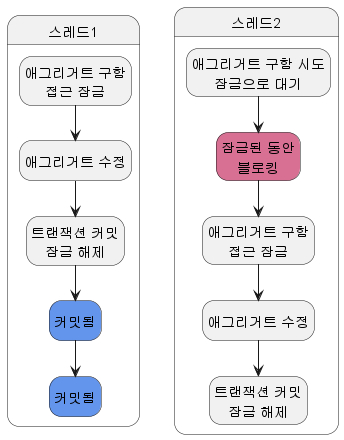

# 8. 애그리거트 트랜잭션 관리

## 1. 애그리거트와 트랜잭션

- 아래 그림은 운영자와 고객이 동시에 한 주문 애그리거트를 수정하는 과정을 보여준다.


- 트랜잭션마다 리포지터리는 새로운 애그리거트 객체를 생성하므로 운영자 스레드와 고객 스레드는 같은 주문 애그리거트를 나타내는 다른 객체를 구하게 된다.
- 운영자 스레드와 고객 스레드는 개념적으로 동일한 애그리거트지만 물리적으로 서로 다른 애그리거트 객체를 사용한다.
- 때문에 운영자 스레드가 주문 애그리거트 객체를 배송 상태로 변경하더라고 고객 스레드가 사용하는 주문 애그리거트 객체에 영향을 주지 않는다.
  - 고객 입장에서 주문 애그리거트 객체는 아직 배송 상태 전이므로 배송지 정보를 변경할 수 있다.
- 이 상황에서 두 스레드는 각각 트랜잭션을 커밋할 때 수정한 내용을 DB에 반영한다. 이 시점에 배송 상태로 바뀌고 배송지도 바뀌게 된다.
- 이 순서의 문제는 운영자는 기존 배송지 정보를 이용해서 배송 상태를 변경했는데, 그 사이 고객은 배송지 정보를 변경했다는 점이다. 즉, 애그리거트의 일관성이 깨지는 것이다.
- 일관성이 깨지는 문제가 발생하지 않도록 하려면 다음 두 가지 중 하나를 해야 한다.
  - 운영자가 배송지 정보를 조회하고 상태를 변경하는 동안, 고객이 애그리거트를 수정하지 못하게 한다.
  - 운영자가 배송지 정보를 조회한 이후에 고객이 정보를 변경하면, 운영자가 애그리거트를 다시 조회한 뒤 수정하도록 한다.
- 이 두 가지는 애그리거트 자체의 트랜잭션과 관련이 있다. DBMS가 지원하는 트랜잭션과 함께 애그리거트를 위한 추가적인 트랜잭션 처리 기법이 필요하다.
- 애그리거트에 대해 사용할 수 있는 대표적인 트랜잭션 처리 방식에는 선점 잠금과 비선점 잠금 두 가지 방식 있는데 이어서 살펴보도록 하자.

## 2. 선점 잠금

- 선점 잠금은 먼저 애그리거트를 구한 스레드가 애그리거트 사용이 끝날 때까지 다른 스레드가 해당 애그리거트를 수정하지 못하게 막는 방법이다.
  - 이 방식은 동시에 애그리거트를 수정할 때 발생하는 데이터 충돌 문제를 해소할 수 있다.
- 선점 잠금은 보통 DBMS가 제공하는 행단위 잠금을 사용해서 구현한다.
  - 오라클을 비롯한 다수의 DBMS가 for update와 같은 쿼리를 사용해서 특정 레코드에 한 커넥션만 접근할 수 있는 잠금잠치를 제공한다.
- JPA EntityManager는 LockModeType을 인자로 받는 find() 메서드를 제공한다.
  - LockModeType.PRESSIMISTIC_WRITE를 값으로 전달하면 해당 엔티티와 매핑된 테이블을 이용해서 선점 잠금 방식을 적용할 수 있다.
  ```java
  Order order =
  			entityManger.find(Order.class, orderNo, LockModeType.PESSIMISTIC_WRITE);
  ```
  - 하이버네이트의 경우 위 쿼리를 실행하면 for update 쿼리를 이용해서 선점 잠금을 구현한다.
- 스프링 데이터 JPA는 @Lock 애너테이션을 사용해서 잠금 모드를 지정한다.
  ```java
  import org.springframework.data.jpa.repository.Lock;
  import javax.persistence.LockModeType;

  public interface MemberRepository extends Repository<Member, MemberId> {

  	@Lock(LockModeType.PESSIMISTIC_WRITE)
  	@Query("select m from Member m where m.id = :id")
  	Optional<Member> findByIdForUpdate(@Param("id") MemberId memberId);
  }
  ```



- 위 그림에서 스레드1이 선점 잠금 방식으로 애그리거트를 구한 뒤 이어서 스레드2가 같은 애그리거트를 구하고 있다.
  - 이때 스레드2는 스레드1이 애그리거트에 대한 잠금을 해제할 때까지 블로킹된다.
- 스레드1이 애그리거트를 수정하고 트랜잭션을 커밋하면 잠금을 해제한다.
  - 이때 스레드2가 애그리거트에 접근하게 된다.
- 스레드1이 커밋한 뒤에 스레드2가 애그리거트를 구하므로 스레드2는 스레드1이 수정한 애그리거트의 내용을 보게 된다.

### 2.1. 선점 잠금과 교착 상태

- 선점 잠금 기능을 사용할 때는 잠금 순서에 따른 교착 상태가 발생하지 않도록 주의해야 한다.
  1. 스레드1: A 애그리거트에 대한 선점 잠금 구함
  2. 스레드2: B 애그리거트에 대한 선점 잠금 구함
  3. 스레드1: B 애그리거트에 대한 선점 잠금 시도
  4. 스레드2: A 애그리거트에 대한 선점 잠금 시도
  - 이 순서에 따르면 스레드1은 영원히 B 애그리거트에 대한 선점 잠금을 구할 수 없다.
    - 스레드2가 B 애그리거트에 대한 잠금을 이미 선점하고 있기 때문이다.
  - 마찬가지로 스레드2도 A 애그리거트에 대한 선점 잠금을 구할 수 없다.
- 선점 잠금에 따른 교착 상태는 상대적으로 사용자 수가 많을 때 발생할 가능성이 높고, 사용자 수가 많아지면 교착 상태에 빠지는 스레드는 더 빠르게 증가한다.
  - 더 많은 스레드가 교착 상태에 빠질수록 시스템은 아무것도 할 수 없는 상태가 된다.
- 이런 문제가 발생하지 않도록 잠금을 구할 때 최대 대기 시간을 지정해야 한다.
- JPA에서 선점 잠금을 시도할 때 최대 대기 시간을 지정하려면 힌트를 사용해야 한다.
  - JPA의 `javax.persistence.lock.timeout`힌트는 잠금을 구하는 대기 시간을 밀리초 단위로 지정한다. 지정한 시간 이내에 잠금을 구하지 못하면 Exception을 발생시킨다.
    - 이 힌트를 사용할 때 주의할 점은 DBMS에 따라 힌트가 적용되지 않을 수 있다는 것이다.
  ```java
  Map<String, Object> hints = new HashMap<>();
  hints.put("javax.persistence.lock.timeout", 2000);
  Order order = entityManager.find(
  					Order.class, orderNo, LockModeType.PESSIMISTIC_WRITE, hints);
  ```
- 스프링 데이터 JPA는 @QueryHints 애너테이션을 사용해서 쿼리 힌트를 지정할 수 있다.
  ```java
  import org.springframework.data.jpa.repository.QueryHints;
  import javax.persistence.QueryHint;

  public interface MemberRepository {
  	@Lock(LockModetype.PESSISISTIC_WRITE)
  	@QueryHints({
  				@QueryHint(name = "javax.persistence.lock.timeout, value = "2000")
  	})
  	@Query("select m from Member m where m.id = :id")
  	Optional<Member> findByIdForUpdate(@Param("id") MemberId, memberId);
  }
  ```

## 3. 비선점 잠금

## 4. 오프라인 선점 잠금
