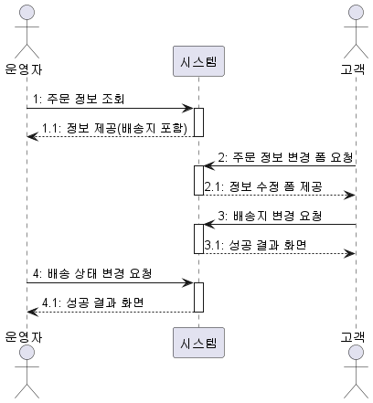
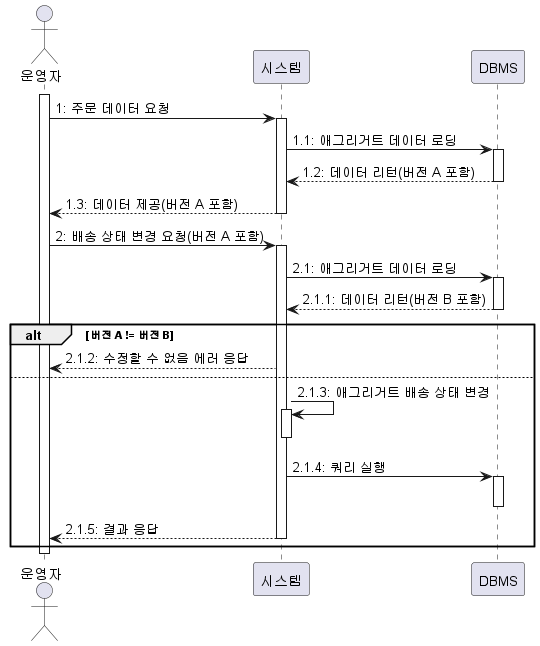

# 8. 애그리거트 트랜잭션 관리

## 1. 애그리거트와 트랜잭션

- 아래 그림은 운영자와 고객이 동시에 한 주문 애그리거트를 수정하는 과정을 보여준다.


- 트랜잭션마다 리포지터리는 새로운 애그리거트 객체를 생성하므로 운영자 스레드와 고객 스레드는 같은 주문 애그리거트를 나타내는 다른 객체를 구하게 된다.
- 운영자 스레드와 고객 스레드는 개념적으로 동일한 애그리거트지만 물리적으로 서로 다른 애그리거트 객체를 사용한다.
- 때문에 운영자 스레드가 주문 애그리거트 객체를 배송 상태로 변경하더라고 고객 스레드가 사용하는 주문 애그리거트 객체에 영향을 주지 않는다.
  - 고객 입장에서 주문 애그리거트 객체는 아직 배송 상태 전이므로 배송지 정보를 변경할 수 있다.
- 이 상황에서 두 스레드는 각각 트랜잭션을 커밋할 때 수정한 내용을 DB에 반영한다. 이 시점에 배송 상태로 바뀌고 배송지도 바뀌게 된다.
- 이 순서의 문제는 운영자는 기존 배송지 정보를 이용해서 배송 상태를 변경했는데, 그 사이 고객은 배송지 정보를 변경했다는 점이다. 즉, 애그리거트의 일관성이 깨지는 것이다.
- 일관성이 깨지는 문제가 발생하지 않도록 하려면 다음 두 가지 중 하나를 해야 한다.
  - 운영자가 배송지 정보를 조회하고 상태를 변경하는 동안, 고객이 애그리거트를 수정하지 못하게 한다.
  - 운영자가 배송지 정보를 조회한 이후에 고객이 정보를 변경하면, 운영자가 애그리거트를 다시 조회한 뒤 수정하도록 한다.
- 이 두 가지는 애그리거트 자체의 트랜잭션과 관련이 있다. DBMS가 지원하는 트랜잭션과 함께 애그리거트를 위한 추가적인 트랜잭션 처리 기법이 필요하다.
- 애그리거트에 대해 사용할 수 있는 대표적인 트랜잭션 처리 방식에는 선점 잠금과 비선점 잠금 두 가지 방식 있는데 이어서 살펴보도록 하자.

## 2. 선점 잠금

- 선점 잠금은 먼저 애그리거트를 구한 스레드가 애그리거트 사용이 끝날 때까지 다른 스레드가 해당 애그리거트를 수정하지 못하게 막는 방법이다.
  - 이 방식은 동시에 애그리거트를 수정할 때 발생하는 데이터 충돌 문제를 해소할 수 있다.
- 선점 잠금은 보통 DBMS가 제공하는 행단위 잠금을 사용해서 구현한다.
  - 오라클을 비롯한 다수의 DBMS가 for update와 같은 쿼리를 사용해서 특정 레코드에 한 커넥션만 접근할 수 있는 잠금잠치를 제공한다.
- JPA EntityManager는 LockModeType을 인자로 받는 find() 메서드를 제공한다.
  - LockModeType.PRESSIMISTIC_WRITE를 값으로 전달하면 해당 엔티티와 매핑된 테이블을 이용해서 선점 잠금 방식을 적용할 수 있다.
  ```java
  Order order =
  			entityManger.find(Order.class, orderNo, LockModeType.PESSIMISTIC_WRITE);
  ```
  - 하이버네이트의 경우 위 쿼리를 실행하면 for update 쿼리를 이용해서 선점 잠금을 구현한다.
- 스프링 데이터 JPA는 @Lock 애너테이션을 사용해서 잠금 모드를 지정한다.

  ```java
  import org.springframework.data.jpa.repository.Lock;
  import javax.persistence.LockModeType;

  public interface MemberRepository extends Repository<Member, MemberId> {

  	@Lock(LockModeType.PESSIMISTIC_WRITE)
  	@Query("select m from Member m where m.id = :id")
  	Optional<Member> findByIdForUpdate(@Param("id") MemberId memberId);
  }
  ```


- 위 그림에서 스레드1이 선점 잠금 방식으로 애그리거트를 구한 뒤 이어서 스레드2가 같은 애그리거트를 구하고 있다.
  - 이때 스레드2는 스레드1이 애그리거트에 대한 잠금을 해제할 때까지 블로킹된다.
- 스레드1이 애그리거트를 수정하고 트랜잭션을 커밋하면 잠금을 해제한다.
  - 이때 스레드2가 애그리거트에 접근하게 된다.
- 스레드1이 커밋한 뒤에 스레드2가 애그리거트를 구하므로 스레드2는 스레드1이 수정한 애그리거트의 내용을 보게 된다.

### 2.1. 선점 잠금과 교착 상태

- 선점 잠금 기능을 사용할 때는 잠금 순서에 따른 교착 상태가 발생하지 않도록 주의해야 한다.
  1. 스레드1: A 애그리거트에 대한 선점 잠금 구함
  2. 스레드2: B 애그리거트에 대한 선점 잠금 구함
  3. 스레드1: B 애그리거트에 대한 선점 잠금 시도
  4. 스레드2: A 애그리거트에 대한 선점 잠금 시도
  - 이 순서에 따르면 스레드1은 영원히 B 애그리거트에 대한 선점 잠금을 구할 수 없다.
    - 스레드2가 B 애그리거트에 대한 잠금을 이미 선점하고 있기 때문이다.
  - 마찬가지로 스레드2도 A 애그리거트에 대한 선점 잠금을 구할 수 없다.
- 선점 잠금에 따른 교착 상태는 상대적으로 사용자 수가 많을 때 발생할 가능성이 높고, 사용자 수가 많아지면 교착 상태에 빠지는 스레드는 더 빠르게 증가한다.
  - 더 많은 스레드가 교착 상태에 빠질수록 시스템은 아무것도 할 수 없는 상태가 된다.
- 이런 문제가 발생하지 않도록 잠금을 구할 때 최대 대기 시간을 지정해야 한다.
- JPA에서 선점 잠금을 시도할 때 최대 대기 시간을 지정하려면 힌트를 사용해야 한다.
  - JPA의 `javax.persistence.lock.timeout`힌트는 잠금을 구하는 대기 시간을 밀리초 단위로 지정한다. 지정한 시간 이내에 잠금을 구하지 못하면 Exception을 발생시킨다.
    - 이 힌트를 사용할 때 주의할 점은 DBMS에 따라 힌트가 적용되지 않을 수 있다는 것이다.
  ```java
  Map<String, Object> hints = new HashMap<>();
  hints.put("javax.persistence.lock.timeout", 2000);
  Order order = entityManager.find(
  					Order.class, orderNo, LockModeType.PESSIMISTIC_WRITE, hints);
  ```
- 스프링 데이터 JPA는 @QueryHints 애너테이션을 사용해서 쿼리 힌트를 지정할 수 있다.

  ```java
  import org.springframework.data.jpa.repository.QueryHints;
  import javax.persistence.QueryHint;

  public interface MemberRepository {
  	@Lock(LockModetype.PESSISISTIC_WRITE)
  	@QueryHints({
  				@QueryHint(name = "javax.persistence.lock.timeout, value = "2000")
  	})
  	@Query("select m from Member m where m.id = :id")
  	Optional<Member> findByIdForUpdate(@Param("id") MemberId, memberId);
  }
  ```

## 3. 비선점 잠금

- 선점 잠금으로 모든 트랜잭션 충돌 문제가 해결되는 것은 아니다.



- 위 그림의 과정은 다음과 같다.
  1. 운영자는 배송을 위해 주문 정보를 조회한다. 시스템은 정보를 제공한다.
  2. 고객이 배송지 변경을 위해 변경 폼을 요청한다. 시스템은 변경 폼을 제공한다.
  3. 고객이 새로운 배송지를 입력하고 폼을 전송하여 배송지를 변경한다.
  4. 운영자가 1번에서 조회한 주문 정보를 기준으로 배송지를 정하고 배송 상태 변경을 요청한다.
- 여기서 문제는 운영자가 배송지 정보를 조회하고 배송 상태로 변경하는 사이에 고객이 배송지를 변경한다는 것이다.
- 배송 상태 변경 전에 배송지를 한 번 더 확인하지 않으면 운영자는 다른 배송지로 물건을 발송하게 되고, 고객은 배송지를 변경했음에도 불구하고 엉뚱한 곳으로 주문한 물건을 받는 상황이 발생한다.
- 이 문제는 선점 잠금 방식으로는 해결할 수 없다.
  - 이때 필요한 것이 비선점 잠금이다.
- 비선점 잠금은 동시에 접근하는 것을 막는 대신 변경한 데이터를 실제 DBMS에 반영하는 시점에 변경 가능 여부를 확인하는 방식이다.
  - 비선점 잠금을 구현하려면 애그리거트에 버전으로 사용할 숫자 타입 프로퍼티를 추가해야 한다.
  - 애그리거트를 수정할 때마다 버전으로 사용할 프로퍼티값이 1씩 증가하는데, 이때 다음과 같은 쿼리를 사용한다.
  ```sql
  UPDATE aggtable SET version = version + 1, colx = ?, coly = ?
  WHERE aggid = ? and version = 현재버전
  ```
  - 이 쿼리는 수정할 애그리거트와 매핑되는 테이블의 버전 값이 현재 애그리거트의 버전과 동일한 경우에만 데이터를 수정한다. 그리고 수정에 성공하면 값을 1 증가시킨다.
  - 다른 트랜잭션이 먼저 데이터를 수정해서 버전 값이 바뀌면 데이터 수정에 실패하게 된다.
- JPA는 버전을 이용한 비선점 잠금 기능을 지원한다.

  - 다음과 같이 버전으로 사용할 필드에 @Version 애너테이션을 붙이고 매핑되는 테이블에 버전을 저장할 컬럼을 추가하면 된다.

  ```java
  @Entity
  @Table(name = "purchase_order")
  @Access(AccessType.FIELD)
  public class Order {
  	@Embeddedid
  	private OrderNo number;

  	@Version
  	private long version;

  	...
  }
  ```

  - JPA는 엔티티가 변경되어 UPDATE 쿼리를 실행할 때 @Version에 명시한 필드를 이용해서 비선점 잠금 쿼리를 실행한다.
  - 즉, 애그리거트 객체의 버전이 10이면 UPDATE 쿼리를 실행할 때 다음과 같은 쿼리를 사용해서 버전이 일치하는 경우에만 데이터를 수정한다.

  ```sql
  UPDATE purchase_order SET ..., version = version + 1
  WHERE number = ? and version = 10
  ```

  - 응용 서비스는 버전에 대해 알 필요가 없다. 리포지터리에서 애그리거트를 구하고 기능만 실행하면 된다.

  ```java
  public class ChangeShippingService {

  	@Transactional
  	public void changeShipping(ChangeShippingRequest changeReq) {
  		Order order = orderRepository.findById(new OrderNo(changeReq.getNumber());
  		checkNoOrder(order);
  		order.changeShippingInfo(changeReq.getShippingInfo());
  	}
  	...
  }
  ```

  - 비선점 잠금을 위한 쿼리를 실행할 때 쿼리 실행 결과로 수정된 행의 개수가 0이면 이미 데이터를 수정한 것이다.
    - 이는 트랜잭션이 충돌한 것이므로 트랜잭션 종료 시점에 OptimisticLockingFailureException이 발생한다.
  - 표현 영역 코드는 이 Exception이 발생했는지에 따라 트랜잭션 충돌이 일어났는지 확인할 수 있다.

  ```java
  @Controller
  public class OrderController {
  	private ChangeShippingService changeShippingService;

  	@PostMapping("/changeShipping")
  	public String changeShipping(ChangeShippingRequest changeReq) {
  		try {
  			changeShippingService.changeShipping(changeReq);
  			return "changeShippingCuccess";
  		} catch(OptimisticLockingFailureException ex) {
  			// 누군가 먼저 같은 주문 애그리거트를 수정했으므로
  			// 트랜잭션이 충돌했다는 메시지를 보여준다.
  			return "changeShippingTxConflict";
  		}
  	}
  	...
  }
  ```

- 비선점 잠금을 아래 그림 상황으로 확장해서 적용할 수 있다.
  - 시스템은 사용자에게 수정 폼을 제공할 때 애그리거트 버전을 함께 제공하고, 폼을 서버에 전송할 때 이 버전을 함께 전송한다.
  - 사용자가 전송한 버전과 애그리거트 버전이 동일한 경우에만 애그리거트 수정 기능을 수행하도록 함으로써 트랜잭션 충돌 문제를 해결할 수 있다.
    
  - 2에서 운영자는 배송 상태 변경을 요청할 때 앞서 요성한 애그리거트의 버전을 함께 전송한다. 시스템은 애그리거트를 조회할 때 버전 값도 함께 읽어온다.
  - 만약 버전이 다르다면 다른 사용자가 애그리거트의 값을 수정한 것이다. 이 경우 시스템은 2.1.2와 같이 수정할 수 없다.
  - 버전이 같다면 애그리거트의 배송 상태를 변경하고 커밋하여 성공적으로 응답을 마친다.
    - 하지만 만약 2.1.1과 2.1.4 사이에 누군가 애그리거트의 값을 변경하여 커밋했다면 배송 상태 변경 트랜잭션은 커밋에 실패하고 결과로 에러를 응답한다.
- 위 그림과 같이 비선점 잠금 방식을 여러 트랜잭션으로 확장하려면 애그리거트 정보를 뷰로 보여줄 때 버전도 함께 사용자 화면으로 전달해야 한다.

  - HTML 폼을 생성하는 경우 버전 값을 갖는 hidden 타입 <input> 태그를 생성해서 폼 전송 시 버전 값이 서버에 함께 전달되도록 한다.

  ```html
  <!-- 애그리거트 정보를 보여줄 때 뷰 코드는 버전 값을 함께 전송한다. -->
  <form th:action="@{/startShipping}" method="post">
    <input type="hidden" name="version" th:value="${orderDto.version}" />
    <input
      type="hidden"
      name="orderNumber"
      th:value="${orderDto.orderNumber}"
      readonly
    />
    ...
    <input type="submit" value="배송 상태로 변경하기" />
  </form>
  ```

  - 응용 서비스에 전달할 요청 데이터는 사용자가 전송한 버전 값을 포함한다.
  - 배송 상태 변경을 처리하는 응용 서비스가 전달받는 데이터는 다음과 같이 주문번호와 함께 해당 주문을 조회한 시점의 버전 값을 포함해야 한다.

  ```java
  public class StartShippingRequest {

    private String orderNumber;
    private long version;

    ...생성자, getter
  }
  ```

  - 응용 서비스는 전달받은 버전 값을 이용해서 애그리거트 버전과 일치하는지 확인하고, 일치하는 경우에만 기능을 수행한다.

  ```java
  public class StartShippingservice {

  	@PreAuthorize("hasRole('ADMIN')")
  	@Transactional
  	public void startShipping(StartShippingRequest req) {
  		Order order = orderRepository.findById(new OrderNo(req.getOrderNumber()));
  		checkOrder(order);
  		if (!order.matchVersion(req.getVersion()) {
  			throw new VersionConflictException();
  		}
  		order.startShipping();
  	}
  	...
  }
  ```

  - 표현 계층은 버전 충돌 Exception이 발생하면 버전 충돌을 사용자에게 알려 사용자가 알맞은 후속 처리를 할 수 있도록 한다.

  ```java
  @Controller
  public class OrderAdminController {
  	private StartShippingService startShippingService;

  	@PostMapping("/startShipping")
  	public String startShipping(StartShippingRequest startReq) {
  		try {
  			startShippingService.startShipping(startReq);
  			return "shippingStarted";
  		} catch(OptimisticLockingFailureException | VersionConflictException ex) {
  			// 트랜잭션 충돌
  			return "startShippingTxConflict";
  		}
  	}
  }
  ```

  - 이 코드는 비선점 잠금과 관련한 두 개의 Exception을 처리하고 있다. 스프링의 OptimisticLockingFailureException과 응용 서비스 코드에서 발생시키는 VersionConflictException이다.
  - 이 Exception은 개발자 입장에서 트랜잭션 충돌이 발생한 시점을 명확하게 구분해준다.
    - VersionConflictException: 누군가 애그리거트를 수정했다.
    - OptimisticLockingFailureException: 누군가 거의 동시에 애그리거트를 수정했다.
  - 버전 충돌 상황에 대한 구분이 명시적으로 필요 없다면 응용 서비스에서 OptimisticLockingFailureException을 발생시키는 것도 고려할 수 있다.

### 3.1. 강제 버전 증가

- 애그리거트에 애그리거트 루트 외에 다른 엔티티의 값만 변경된다고 하자.
- 이 경우 JPA는 루트 엔티티의 버전 값을 증가시키지 않는다.
- 그런데 이런 JPA 특징은 애그리거트 관점에서보면 문제가 된다.
  - 루트 엔티티의 값이 바뀌지 않았더라고 애그리거트의 구성요소 중 일부 값이 바뀌면 논리적으로 그 애그리거트는 바뀐 것이다.
  - 따라서 애그리거트 내에 어떤 구성요소의 상태가 바뀌면 루트 애그리거트의 버전 값이 증가해야 비선점 잠금이 올바르게 동작한다.
- JPA는 이런 문제를 처리할 수 있도록 `EntityManager.find()` 메서드로 엔티티를 구할 때 강제로 버전 값을 증가시키는 잠금 모드를 지원한다.

```java
@Repository
public class JpaOrderRepository implements OrderRepository {
	@PersistenceContext
	private EntityManager entityManager;

	@Override
	public Order findByIdOptimisticLockMode(OrderNo id) {
		return entiryManger.find(
					Order.class, id, LockModeType.OPTIMISTIC_FORCE_INCREAMENT);
	}
}
```

- `LockModeType.OPTIMISTIC_FORCE_INCREAMENT`를 사용하면 해당 엔티티의 상태가 변경되었는지에 상관없이 트랜잭션 종료 시점에 버전 값 증가 처리를 한다.
- 이 잠금 모드를 사용하면 애그리거트 루트 엔티티가 아닌 다른 엔티티나 밸류가 변경되더라고 버전 값을 증가시킬 수 있으므로 비선점 잠금 기능을 안전하게 적용할 수 있다.
- 스프링 데이터 JPA를 사용하면 @Lock 애너테이션을 이용해서 지정하면 된다.

## 4. 오프라인 선점 잠금
