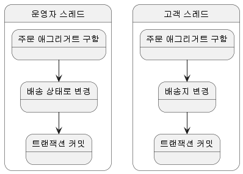

# 8. 애그리거트 트랜잭션 관리

## 1. 애그리거트와 트랜잭션

- 아래 그림은 운영자와 고객이 동시에 한 주문 애그리거트를 수정하는 과정을 보여준다.

- 트랜잭션마다 리포지터리는 새로운 애그리거트 객체를 생성하므로 운영자 스레드와 고객 스레드는 같은 주문 애그리거트를 나타내는 다른 객체를 구하게 된다.
- 운영자 스레드와 고객 스레드는 개념적으로 동일한 애그리거트지만 물리적으로 서로 다른 애그리거트 객체를 사용한다.
- 때문에 운영자 스레드가 주문 애그리거트 객체를 배송 상태로 변경하더라고 고객 스레드가 사용하는 주문 애그리거트 객체에 영향을 주지 않는다.
  - 고객 입장에서 주문 애그리거트 객체는 아직 배송 상태 전이므로 배송지 정보를 변경할 수 있다.
- 이 상황에서 두 스레드는 각각 트랜잭션을 커밋할 때 수정한 내용을 DB에 반영한다. 이 시점에 배송 상태로 바뀌고 배송지도 바뀌게 된다.
- 이 순서의 문제는 운영자는 기존 배송지 정보를 이용해서 배송 상태를 변경했는데, 그 사이 고객은 배송지 정보를 변경했다는 점이다. 즉, 애그리거트의 일관성이 깨지는 것이다.
- 일관성이 깨지는 문제가 발생하지 않도록 하려면 다음 두 가지 중 하나를 해야 한다.
  - 운영자가 배송지 정보를 조회하고 상태를 변경하는 동안, 고객이 애그리거트를 수정하지 못하게 한다.
  - 운영자가 배송지 정보를 조회한 이후에 고객이 정보를 변경하면, 운영자가 애그리거트를 다시 조회한 뒤 수정하도록 한다.
- 이 두 가지는 애그리거트 자체의 트랜잭션과 관련이 있다. DBMS가 지원하는 트랜잭션과 함께 애그리거트를 위한 추가적인 트랜잭션 처리 기법이 필요하다.
- 애그리거트에 대해 사용할 수 있는 대표적인 트랜잭션 처리 방식에는 선점 잠금과 비선점 잠금 두 가지 방식 있는데 이어서 살펴보도록 하자.

## 2. 선점 잠금

## 3. 비선점 잠금

## 4. 오프라인 선점 잠금
