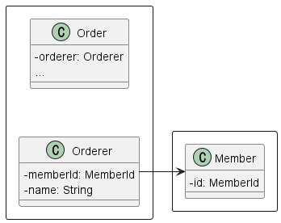

# 3. 애그리거트

## 1. 애그리거트


- 온라인 쇼핑몰 시스템을 개발할 때 위 그림과 같이 상위 수준 개념을 이용해서 전체 모델을 정리하면 전반적인 관계를 이해하는 데 도움이 된다.
- 그림의 상위 수준 모델을 개별 객체 단위로 다시 그려보면 아래 그림과 같다.
  
  - 상위 수준 모델에 대한 이해 없이 위 그림을 그리려면 더 오랜 시간이 걸린다.
- 도메인 객체 모델이 복잡해지면 개별 구성요소 위주로 모델을 이해하게 되고 전반적인 구조나 큰 수준에서 도메인 간의 관계를 파악하기 어려워진다.
- 주요 도메인 요소 간의 관계를 파악하기 어렵다는 것은 코드를 변경하고 확장하는 것이 어려워진다는 것을 의미한다.
- 애그리거트는 아래와 같은 장점이 있다.
  - 수많은 객체를 애그리거트로 묶어서 바라보면 상위 수준에서 도메인 모델 간의 관계를 파악할 수 있다.
    - 아래 그림은 위 그림을 애그리거트 단위로 묶어서 다시 표현한 것이다.
      
    - 동일한 모델이지만 애그리거트를 사용함으로써 모델 간의 관계를 개별 모델 수준과 상위 수준에서 모두 이해할 수 있다.
  - 애그리거트는 일관성을 관리하는 기준이 된다.
    - 애그리거트 단위로 일관성을 관리하기 때문에 복잡한 모델을 단순하게 만들어준다. 복잡도가 낮아지는 만큼 도메인 기능을 확장하고 변경하는 데 필요한 노력과 시간도 줄어든다.
    - 애그리거트는 관련된 모델을 하나로 모았기 때문에 한 애그리거트에 속한 객체는 유사하거나 동일한 라이프 사이클을 갖는다.
    - 주문 애그리거트를 만들려면 Order, OrderLine, Orderer와 같은 관련 객체를 함께 생성해야 한다.
      - Order는 생성했는데 ShippingInfo는 만들지 않거나 ShippingInfo를 생성하면서 Orderer를 생성하지 않는 경우는 없다.
- 애그리거트는 독립된 객체 군이며 각 애그리거트는 자기 자신을 관리할 뿐 다른 애그리거트를 관리하지 않는다.
  - 주문 애그리거트는 회원의 비밀번호나 상품의 가격을 변경하지 않는다.
- 경계를 생성할 때 기본이 되는 것은 도메인 규칙과 요구사항이다. 도메인 규칙에 따라 함께 생성되는 구성요소는 한 애그리거트에 속할 가능성이 높다.
  - 주문할 상품 개수, 배송지 정보 주문자 정보는 주문 시점에 함께 생성되므로 이들은 한 애그리거트에 속한다.
  - OrderLine의 주문 상품 개수를 변경하면 도메인 규칙에 따라 Order의 총 주문 금액을 새로 계산해야 한다.
- 흔히 ‘A가 B를 갖는다.’로 설계할 수 있는 요구사항이 있다고 해서 반드시 A와 B가 한 애그리거트에 속한다는 것을 의미하는 것은 아니다.
  - 상품 상세 정보와 함께 리뷰 내용을 보여줘야 한다는 요구사항이 있을 때Product 엔티티와 Review 엔티티가 한 애그리거트에 속한다고 생각할 수 있다.
  - 하지만 Product와 Review는 함께 생성되지 않고, 함께 변경되지도 않는다. 개다가 엔티티를 변경하는 주체가 상품 담당자와 고객으로 서로 다르다.
    
- 처음 도메인 모델을 만들기 시작하면 큰 애그리거트로 보이는 것들이 많지만, 도메인에 대한 경험이 생기고 도메인 규칙을 이해할수록 애그리거트의 실제 크기는 줄어든다.

## 2. 애그리거트 루트

- 주문 애그리거트는 다음을 포함한다.
  - 총 금액인 totalAmounts를 갖고 있는 Order 엔티티
  - 개별 구매 상품의 개수인 quantity와 금액인 price를 갖고 있는 OrderLine 밸류
- 구매할 상품의 개수를 변경하면 한 OrderLine의 quantity를 변경하고 Order의 totalAmounts도 변경해야 한다.
  - 주문 총 금액은 개별 상품의 주문 개수 X 가격의 합이다.
- 애그리거트는 여러 객체로 구성되기 때문에 한 객체만 상태가 정상이면 안된다.
- 도메인 규칙을 지키려면 애그리거트에 속한 모든 객체가 정상 상태를 가져야 한다.
  - 주문 애그리거트에서는 OrderLine을 변경하면 Order의 totalAmounts도 다시 계산해야 총 금액이 맞는다.
- 애그리거트에 속한 모든 객체가 일관된 상태를 유지하려면 애그리거트 전체를 관리할 주체가 필요한데, 이 책임을 지는 것이 바로 애그리거트의 루트 엔티티이다.
- 애그리거트에 속한 객체는 애그리거트 루트 엔티티에 직접 또는 간접적으로 속하게 된다.
  
  - 주문 애그리거트에서 루트 역할을 하는 엔티티는 Order이다. OrderLine, ShippingInfo, Orderer등 주문 애그리거트에 속한 모델은 Order에 직접 또는 간접적으로 속한다.

### 2.1. 도메인 규칙과 일관성

- 애그리거트 루트의 핵심 역할은 애그리거트의 일관성이 깨지지 않도록 하는 것이다. 이를 위해 애그리거트 루트는 애그리거트가 제공해야 할 도메인 기능을 구현한다.
  - 주문 애그리거트는 배송지 변경, 상품 변경과 같은 기능을 제공하고, 애그리거트 루트인 Order가 이 기능을 구현한 메서드를 제공한다.
- 애그리거트 루트가 제공하는 메서드는 도메인 규칙에 따라 애그리거트에 속한 객체의 일관성이 깨지지 않도록 구현해야 한다.

  - 애그리거트 루트인 Order의 changeShippingInfo() 메서드는 규칙에 따라 배송 시작 여부를 확인하고 규칙을 충족할 때만 배송지 정보를 변경해야 한다.

  ```java
  public class Order {

  	// 애그리거트 루트는 도메인 규칙을 구현한 기능을 제공한다.
  	public void changeShippingInfo(ShippingInfo newShippingInfo) {
  		verifyNotYetShipped();
  		setShippingInfo(newShippingInfo);
  	}

  	private void verifyNotYetShipped() {
  		if (state != OrderState.PAYMENT_WAITING && state != OrderState.PREPARING) {
  			throw new IllegalStateException("alreay shipped");
  		}
  	}

  	...
  }
  ```

- 애그리거트 외부에서 애그리거트에 속한 객체를 직접 변경하면 안 된다.
  - 애그리거트 루트가 강제하는 규칙을 적용할 수 없어 모델의 일관성을 깨는 원인이 된다.
  ```java
  ShippingInfo si = order.getShippingInfo();
  si.setAddress(newAddress);
  ```
  - 이 코드는 주문 상태에 상관없이 배송지 주소를 변경하는데, 이는 업무 규칙을 무시하고 직접 DB 테이블의 데이터를 수정하는 것과 같은 결과를 만든다.
  - 즉 논리적인 데이터 일관성이 깨지게 되는 것이다.
    - 이를 위해 검증 로직을 set하기 전에 넣어도, 중복 코드가 발생하는 문제가 발생하고 유지보수를 어렵게 만든다.
- 불필요한 중복을 피하고 애그리거트 루트를 통해서만 도메인 로직을 구현하게 만들려면 도메인 모델에 대해 다음 두 가지를 습관적으로 적용해야 한다.
  - 단순히 필드를 변경하는 set 메서드를 public으로 만들지 않는다.
    - 보통 필드에 값을 할당하는 것으로 끝나는 경우가 많고, 잘해야 null을 검사하는 정도다.
    - 도메인의 의미나 의도를 표현하지 못하고 도메인 로직을 도메인 객체가 아닌 응용 영역이나 표현 영역으로 분산시킨다. 도메인 로직이 응집되지 않으므로 코드를 유지 보수할 때에도 분석하고 수정하는 데 더 많은 시간이 필요하다.
  - set 메서드를 public으로 만들지 않는 것의 연장으로 밸류는 불변타입으로 한다.
    - 애그리거트 외부에서 내부 상태를 바꾸지 못하므로 애그리거트의 일관성이 깨질 가능성이 줄어든다.
    - 밸류 객체의 값을 변경하는 방법은 새로운 밸류 객체를 할당하는 방법뿐이다.
- 밸류 타입의 내부 상태를 변경하려면 애그리거트 루트를 통해서만 가능하다.
- 애그리거트 루트가 도메인 규칙을 올바르게 구현하면 애그리거트 전체의 일관성을 올바르게 유지 할 수 있다.

### 2.2. 애그리거트 루트의 기능 구현

- 애그리거트 루트는 애그리거트 내부의 다른 객체를 조합해서 기능을 완성한다.

  - Order는 총 주문 금액을 구하기 위해 OrderLine 목록을 사용한다.

  ```java
  public class Order {
  	private Money totalAmounts;
  	private List<OrderLine> orderLines;

  	private void calculateTotalAmounts() {
  		int sum = orderLines.stream()
  						.mapToInt(ol -> ol.getPrice() * ol.getQuantity())
  						.sum();
  		this.totalAmounts = new Money(sum);
  	}
  }
  ```

  - 회원을 표현하는 Member 애그리거트 루트는 암호를 변경하기 위해 Password 객체에 암호가 일치하는지를 확인할 것이다.

  ```java
  public class Member {
  	private Password password;

  	public void changePassword(String currentPassword, String newPassword) {
  		if (!password.match(currentPassword)) {
  				throw new PasswordNotMatchException();
  		}
  		this.password = new Password(newPassword);
  	}
  }
  ```

- 애그리거트 루트가 구성요소의 상태만 참조하는 것은 아니다. 기능 실행을 위임하기도 한다.

  - 구현 기술의 제약이나 내부 모델링 규칙 때문에 OrderLine 목록을 별도 클래스로 분리했다고 해보자.

  ```java
  public class OrderLines {
  	private List<OrderLine> lines;

  	public Money getTotalAmounts() {
  		... // 구현
  	}

  	public void changeOrderLines(List<OrderLine> newLines) {
  		this.lines = newLines;
  	}
  }
  ```

  - 이 경우 Order의 changeOrderLines() 메서드는 다음과 같이 내부의 orderLines 필드에 상태 변경을 위임하는 방식으로 기능을 구현한다.

  ```java
  public class Order {
  	private Money totalAmounts;
  	private OrderLines orderLines;

  	public void changeOrderLines(List<OrderLine> newLines) {
  		orderLines.changeOrderLines(newLines);
  		this.totalAmounts = orderLines.getTotalAmounts();
  	}
  }
  ```

  - OrderLines는 changeOrderLines()와 getTotalAmounts() 같은 기능을 제공하고 있다.
  - 만약 Order가 getOrderLines()와 같이 OrderLines를 구할 수 있는 메서드를 제공하면 애그리거트 외부에서 OrderLines의 기능을 실행할 수 있게 된다.

  ```java
  OrderLines lines = order.getOrderLines();

  // 외부에서 애그리거트 내부 상태 변경!
  // order의 totalAmounts가 값이 OrderLines과 일치하지 않게 됨
  lines.changeOrderLines(newOrderLines);
  ```

  - 하지만 이 코드는 주문의 OrderLine 목록이 바뀌는데 총합은 계산하지 않는 버그를 만든다.
  - 이런 버그가 생기지 않도록 하려면 애초에 애그리거트 외부에서 OrderLine 목록을 변경할 수 없도록 OrderLines를 불변으로 구현하면 된다.
  - OrderLines를 불변 밸류로 구현한 코드는 다음과 같다.

  ```java
  public class Order {
  	private Money totalAmounts;
  	private OrderLines orderLines;

  	public void changeOrderLines(OrderLines newOrderLines) {
  		this.orderLines = newOrderLines;
  		this.totalAmounts = orderLines.getTotalAmounts();
  	}
  }
  ```

  ```java
  public class OrderLines {
  	private List<OrderLine> lines;

  	public Money getTotalAmounts() {
  		... // 구현
  	}

  	// 변경 로직 없이, 생성자로 객체를 생성한다.
  	public OrderLines(List<OrderLine> lines) {
  		this.lines = lines;
  	}
  }
  ```

  ```java
  OrderLines lines = order.getOrderLines();

  // 외부에서 애그리거트 내부 상태 변경이 불가능하다!
  lines.changeOrderLines(newOrderLines); // changeOrderLines 메서드가 없다.
  ```

  - 이제 아래와 같이 OrderLines를 변경해야 하며, 데이터의 불일치는 일어나지 않는다.

  ```java
  OrderLines lines = new OrderLines(newOrderLines);
  order.changeOrderLines(lines);
  ```

### 2.3. 트랜잭션 범위

- 트랜잭션 범위는 작을수록 좋다.
  - 한 트랜잭션이 한 개 테이블을 수정하는 것과 세 개의 테이블을 수정하는 것을 비교하면 성능에서 차이가 발생한다.
  - 한 개 테이블을 수정하면 트랜잭션 충돌을 막기 위해 잠그는 대상이 한 개 테이블의 한 행으로 한정되지만, 세 개의 테이블을 수정하면 잠금 대상이 더 많아진다.
  - 잠금 대상이 많다는 것은 그만큼 동시에 처리할 수 있는 트랜잭션 개수가 줄어든다는 것을 의미하고, 전체적인 처리량을 떨어뜨린다.
- 동일하게 한 트랜잭션에서는 한 개의 애그리거트만 수정해야 한다.
  - 한 트랜잭션에서 두 개 이상의 애그리거트를 수정하면 트랜잭션 충돌이 발생할 가능성이 더 높아지기 때문에 한 번에 수정하는 애그리거트 개수가 많아질수록 전체 처리량이 떨어진다.
- 한 개의 애그리거트만 수정한다는 것은 애그리거트에서 다른 애그리거트를 변경하지 않는다는 것을 의미한다.

  - 배송지 정보를 변경하면서 동시에 배송지 정보를 회원의 주소로 설정하는 기능이 있다고 해보자.
  - 이 때 주문 애그리거트는 다음과 같이 회원 애그리거트의 정보를 변경하면 안된다.

  ```java
  public class Order {
  	private Orderer orderer;

  	public void shipTo(ShippingInfo newShippingInfo,
  					boolean useNewShippingAddrAsMemberAddr) {
  		verifyNotYetShipped();
  		setShippingInfo(newShippingInfo);
  		if (useNewShippingAddrAsMemberAddr) {
  			// 다른 애그리거트의 상태를 변경하면 안 됨!
  			orderer.getMember().changeAddress(newShippingInfo.getAddress());
  		}
  	}
  }
  ```

  - 애그리거트는 최대한 독립적이어야 하는데 한 애그리거트가 다른 애그리거트의 기능에 의존하기 시작하면 애그리거트간 결합도가 높아진다.
  - 결합도가 높아질수록 향후 수정 비용이 증가하므로 애그리거트에서 다른 애그리거트의 상태를 변경하지 말아야 한다.
  - 만약 한 트랜잭션으로 두 개 이상의 애그리거트를 수정해야 한다면 응용 서비스에서 두 애그리거트를 수정하도록 구현한다.
    ```java
    public class ChangeOrderService {
    	// 두 개 이상의 애그리거트를 변경해야 한다면 응용 서비스에서 애그리거트의 상태를 변경한다.
    	@Transactional
    	public void changeShippingInfo(OrderId id, ShippingInfo newShippingInfo,
    					boolean useNewShippingAddrAsMemberAddr) {
    		Order order = orderRepository.findById(id);
    		if (order == null) {
    			throw new OrderNotFoundException();
    		}
    		order.shipTo(newShippingInfo
    		if (useNewShippingAddrAsMemberAddr) {
    			Member member = findMember(order.getOrderer());
    			member.changeAddress(newShippingInfo.getAddress());
    		}
    	}
    	...
    }
    ```
    - 애그리거트에서 다른 애그리거트를 직접 수정하지 않는다.

- 도메인 이벤트를 사용하면 한 트랜잭션에서 한 개의 애그리거트를 수정하면서도 동기나 비동기로 다른 애그리거트의 상태를 변경하는 코드를 작성할 수 있다. 이 내용은 10장에서 다룬다.
- 한 트랜잭션에서 한 개의 애그리거트를 변경하는 것을 권장하지만, 다음 경우에는 한 트랜잭션에서 두 개 이상의 애그리거트를 변경하는 것을 고려할 수 있다.
  - 팀 표준: 팀이나 조직의 표준에 따라 사용자 유스케이스와 관련된 응용 서비스의 기능을 한 트랜잭션으로 실행해야 하는 경우가 많다.
  - 기술 제약: 기술적으로 이벤트 방식을 도입할 수 없는 경우 한 트랜잭션에서 다수의 애그리거트를 수정해서 일관성을 처리해야 한다.
  - UI 구현의 편의: 운영자의 편리함을 위해 주문 목록 화면에서 여러 주문 상태를 한 번에 변경하고 싶을 것이다. 이 경우 한 트랜잭션에서 여려 주문 애그리거트의 상태를 변경해야 한다.

## 3. 리포지터리와 애그리거트

- 애그리거트는 개념상 완전한 한 개의 도메인 모델을 표현하므로 객체의 영속성을 처리하는 리포지터리는 애그리거트 단위로 존재한다.
  - Order와 OrderLine을 물리적으로 각각 별도의 DB 테이블에 저장한다고 해서 Order와 OrderLine을 위한 리포지터리를 각각 만들지 않는다.
  - Order가 루트이므로 Order를 위한 리포지터리만 존재한다.
- 새로운 애그리거트를 만들면 저장소에 애그리거트를 영속화하고 애그리거트를 사용하려면 저장소에서 애그리거트를 읽어야 하므로, 리포지터리는 보통 다음의 두 메서드를 기본으로 제공한다.
- 애그리거트는 개념적으로 하나이므로 리포지터리는 애그리거트 전체를 저장소에 영속화해야 한다.
  - Order 애그리거트와 관련된 테이블이 세 개라면 Order 애그리거트를 저장할 때 애그리거트 루트와 매핑되는 테이블뿐만 아니라 애그리거트에 속한 모든 구성요소에 매핑된 테이블에 데이터를 저장해야 한다.
  ```java
  // 리포지터리에 애그리거트를 저장하면 애그리거트 전체를 영속화해야 한다.
  orderRepository.save(order);
  ```
- 동일하게 애그리거트를 구하는 리포지터리 메서드는 완전한 애그리거트를 제공해야 한다.

  - 다음 코드를 실행하면 order 애그리거트는 OrderLine, Orderer 등 모든 구성요소를 포함하고 있어야 한다.

  ```java
  // 리포지터리는 완전한 order를 제공해야 한다.
  Order order = orderRepository.findById(orderId);

  // order가 온전한 애그리거트가 아니면
  // 기능 실행 도중 NullPointerException과 같은 문제가 생긴다.
  order.cancel();
  ```

## 4. ID를 이용한 애그리거트 참조

- 한 객체가 다른 객체를 참조하는 것처럼 애그리거트도 다른 애그리거트를 참조한다.
  - 다른 애그리거트를 참조한다는 것은 다른 애그리거트의 루트를 참조한다는 것과 같다.
- 애그리거트 간의 참조는 필드를 통해 쉽게 구현할 수 있다.
  - 주문 애그리거트에 속해 있는 Orderer는 아래 그림처럼 주문한 회원을 참조하기 위해 회원 애그리거트 루트인 Member 필드로 참조할 수 있다.
    
- 필드를 이용해서 다른 애그리거트를 직접 참조하는 것은 개발자에게 구현의 편리함을 제공한다.
  - 주문 정보 조회 화면에서 회원 ID를 이용해 링크를 제공해야 할 경우 다음과 같이 Order로부터 시작해서 회원 ID를 구할 수 있다.
  ```java
  order.getOrderer().getMember().getId();
  ```
- JPA는 @ManyToOne, @OneToOne과 같은 애너테이션을 이용해서 연관된 객체를 로딩하는 기능을 제공하고 있으므로 필드를 이용해 다른 애그리거트를 쉽게 참조할 수 있다.
- ORM 기술덕에 애그리거트 루트에 대한 참조를 쉽게 구현할 수 있고 다른 애그리거트의 데이터를 쉽게 조회할 수 있다. 하지만 필드를 이용햔 애그리거트 참조는 다음 문제를 야기할 수 있다.

  - 편한 탐색 오용

    - 한 애그리거트 내부에서 다른 애그리거트 객체에 접근할 수 있으면 다른 애그리거트의 상태를 쉽게 변경할 수 있게 된다.
    - 한 애그리거트가 관리하는 범위는 자기 자신으로 한정해야 한다. 그런데 다른 애그리거트 객체에 접근할 수 있으면 다음 코드처럼 다른 애그리거를 수정하고자 하는 유혹에 빠지기 쉽다.

    ```java
    public class Order {
    	private Orderer orderer;

    	public void changeShippingInfo(ShippingInfo newShippingInfo,
    					boolean useNewShippingAddrAsMemberaddr) {
    		...
    		if (useNewShippingInfoAddrAsMemberAddr) {
    			// 한 애그리거트 내부에서 다른 애그리거트에 접근할 수 있으면,
    			// 구현이 쉬워진다는 것 때문에 다른 애그리거트의 상태를 변경하는 유혹에 빠지기 쉽다.
    			orderer.getMember().changeAddress(newShippingInfo.getAddress());
    		}
    	}
    	...
    }
    ```

    - 한 애그리거트에서 다른 애그리거트의 상태를 변경하는 것은 애그리거트 간의 의존 결합도를 높여서 결과적으로 애그리거트의 변경을 어렵게 만든다.

  - 성능에 대한 고민
    - JPA를 사용하면 참조한 객체를 지연로딩과 즉시로딩 두 가지 방식으로 로딩할 수 있다.
    - 두 방식 중 무엇을 사용할지는 애그리거트의 어떤 기능을 사용하느냐에 따라 달라진다.
    - 경우의 수를 고려해서 연관 매핑과 JPQL/Criteria 쿼리의 로딩 전략을 결정해야 한다.
  - 확장 어려움
    - 초기에는 단일 서버에 단일 DBMS로 서비스를 제공하는 것이 가능하다. 하지만 트래픽이 증가하면 부하를 분산하기 위해 하위 도메인별로 시스템을 분리하기 시작한다.
    - 이 과정에서 하위 도메인마다 서로 다른 DBMS를 사용할 때도 있다. 심지어 다른 종류의 저장소를 사용하기도 한다.
    - 이것은 더 이상 다른 애그리거트 루트를 참조하기 위해 JPA와 같은 단일 기술을 사용할 수 없음을 의미한다.

- 위에서 설명한 세 가지 문제를 완화할 때 사용할 수 있는 것이 ID를 이용해서 다른 애그리거트를 참조하는 것이다.

  - DB 테이블에서 외래키로 참조하는 것과 비슷하게 ID를 이용한 참조는 다른 애그리거트를 참조할 때 ID를 사용한다.
    
  - ID 참조를 사용하면 모든 객체가 참조로 연결되지 않고 한 애그리거트에 속한 객체들만 참조로 연결된다.
  - 이는 애그리거트의 경계를 명확히하고 애그리거트 간 물리적인 연결을 제거하기 때문에 모델의 복잡도를 낮춰준다. 또한 애그리거트간의 의존을 제거하므로 응집도를 높여주는 효과도 있다.
  - 구현 복잡도도 낮아진다. 다른 애그리거트를 직접 참조하지 않으므로 애그리거트 간 참조를 지연 로딩으로 할지 즉시 로딩으로 할지 고민하지 않아도 된다.
  - 참조하는 애그리거트가 필요하면 응용 서비스에서 ID를 이용해서 로딩하면 된다.

  ```java
  public class ChangeOrderService {

  	@Transactional
  	public void changeShippingInfo(OrderId id, ShippingInfo newShippingInfo,
  					boolean useNewShippingAddrAsMemberAddr) {
  		Order order = orderRepository.findById(id);
  		if (order == null) {
  			throw new OrderNotFoundException();
  		}
  		order.changeShippingInfo(newShippingInfo);
  		if (useNewShippingAddrAsMemberAddr) {
  			// ID를 이용해서 참조하는 애그리거트를 구한다.
  			Member member = memberRepository.findByid(
  							order.getOrderer().getMemberId());
  		}
  		member.changeAddress(newShippingInfo.getAddress());
  	}
  	...
  }
  ```

- 응용 서비스에서 필요한 애그리거트를 로딩하므로 애그리거트 수준에서 지연 로딩을 하는 것과 동일한 결과를 만든다.
- ID를 이용한 참조 방식을 사용하면 복잡도를 낮추고 한 애그리거트에서 다른 애그리거트를 수정하는 문제를 근원적으로 방지할 수 있다.
- 애그리거트별로 다른 구현 기술을 사용하는 것도 가능해진다.
  - 중요한 데이터인 주문 애그리거트는 RDBMS에 저장하고 조회 성능이 중요한 상품 애그리거트는 NoSQL에 저장할 수 있다.
    

### 4.1. ID를 이용한 참조와 조회 성능

- 다른 애그리거트를 ID로 참조하면 참조하는 애그리거트를 읽을 때 조회 속도가 문제 될 수 있다.

  - 주문 목록을 보여주려면 상품 애그리거트와 회원 애그리거트를 함께 읽어야 하는데, 이를 처리할 때 다음과 같이 각 주문마다 상품과 회원 애그리거트를 읽어온다고 해보자.
  - 한 DBMS에 데이터가 있다면 조인을 이용해서 한 번에 모든 데이터를 가져올 수 있음에도 불구하고 주문마다 상품 정보를 읽어오는 쿼리를 실행하게 된다.

  ```java
  Member member = memberRepository.findById(orderId)
  List<Order> orders = orderRepository.findByOrderer(ordererId);
  List<OrderView> dtos = orders.stream()
  						map(order -> {
  							ProductId prodId = order.getOrderLines().get(0).getProductId();
  							// 각 주문마다 첫 번째 주문 상품 정보 로딩을 위한 쿼리
  							Product product = productRepository.findById(prodId);
  							return new OrderView(order, member, product);
  						}).collect(toList());
  ```

  - 위 코드는 주문 개수가 10개면 주문을 읽어오기 위한 1번의 쿼리와 주문별로 각 상품을 읽어오기 위한 10번의 쿼리를 실행한다. 즉, 총 10 + 1 번 조회하는 것이다.
  - ID를 이용한 애그리거트 참조는 지연 로딩과 같은 효과를 만드는 데 지연 로딩과 관련된 대표적인 문제가 N + 1 문제이다.
  - ID 참조 방식을 사용하면서 N + 1 문제가 발생하지 않도록하려면 조회 전용 쿼리를 사용하면 된다.

    - 데이터 조회를 위한 별도 DAO를 만들고 DAO의 조회 메서드에서 조인을 이용해 한 번의 쿼리로 필요한 데이터를 로딩하면 된다.

    ```java
    @Repository
    public class JpaOrderViewDao implements OrderViewDao {
    	@PersistenceContext
    	private EntityManager em;

    	@Override
    	public  List<OrderView> selectByOrderer(String ordererId) {
    		String selectQuery =
    				"select new com.myshop.order.application.dto.OrderView(o, m, p) " +
    				"from Order o " +
    				"join o.orderLines ol, Member m, Product p " +
    				"where o.orderer.memberId.id = :ordererId " +
    				"and o.orderer.memberId = m.id " +
    				"and index(ol) = 0 " +
    				"and ol.productId = p.id " +
    				"order by o.number.number desc";
    		TypedQuery<OrderView> query =
    						em.createQuery(selectQuery, OrderView.class);
    		query.setParameter("ordererId", ordererId);
    		return query.getResultList();
    	}
    ```

    - 위 코드는 JPA를 이용해서 특정 사용자의 주문 내역을 보여주기 위한 코드이다.

  - 애그리거트마다 다른 저장소를 사용하면 한 번의 쿼리로 관련 애그리거트를 조회할 수 없다.
    - 이때는 캐시를 적용하거나 조회 전용 저장소를 따로 구성한다.
    - 이 방법은 코드는 복잡해지지만 시스템의 처리량을 높일 수 있다는 장점이 있다.

## 5. 애그리거트 간 집합 연관

- 애그리거트 간 1-N과 M-N 연관은 컬렉션을 이용한 연관이다.
  - 카테고리와 상품간의 연관이 대표적이다.
  - 하나의 키테고리에 여러 개의 상품이 속할 수 있으니 1-N 관계이다.
- 애그리거트 간 1-N 관계는 Set과 같은 컬렉션을 이용해서 표현할 수 있다.
  - 카테고리-상품 예시
  ```java
  public class Category {

  	private Set<Product> products; // 다른 애그리거트에 대한 1-N 연관
  	...
  ```
- 그러나 개념적으로는 존재하는 애그리거트 간의 1-N 연관을 실제 구현에 반영하는 것이 요구사항을 충족하는 것과 상관없을 때가 있다.
  - 특정 카테고리에 속한 상품 목록을 보여주는 요구사항을 생각해보자.
  - 보통 목록 관련 요구사항은 한 번에 전체 상품을 보여주기보다는 페이징을 이용해 제품을 나눠서 보여준다.
  - 이 기능을 카테고리 입장에서 1-N 연관을 이용해 구현하면 다음과 같은 방식으로 코드를 작성해야 한다.
  ```java
  public class Category {
  	private Set<Product> products;

  	public List<Product> getProducts(int page, int size) {
  		List<Product> sortedProducts = sortById(products);
  		return sordtedProducts.subList((page - 1) * size, page * size);
  }
  ...
  ```
  - 이 코드를 실제 DBMS와 연동해서 구현하면 Category에 속한 모든 Product를 조회하게 된다.
  - Product 개수가 수만 개 정도로 많다면 이 코드를 실행할 때마다 실행 속도가 급격하게 느려지고 심각한 문제를 일으킬 것이다.
  - 따라서 개념적으로 1-N 연관이 있더라도 실제 구현에 반영하지 않는다. 카테고리에 속한 상품을 구할 필요가 있다면 자신이 속한 카테고리를 N-1로 연관 지어 구하면 된다.
  ```java
  public class Product {
  	...
  	private CategoryId categoryId;
  	...
  }
  ```
  - 카테고리에 속한 상품 목록을 제공하는 응용 서비스는 다음과 같이 PoductRepository를 이용해서 categoryId가 지정한 카테고리 식별자인 product 목록을 구한다.
  ```java
  public class ProductListService {

  	public Page<Product> getProductOfCategory(Long categoryId,
  																						int page,
  																						int size) {
  		Category category = categoryRepository.findById(categoryId);
  		checkCategory(category);
  		List<Product> products =
  				productRepository.findByCategoryId(category.getId(), page, size);
  		int totalCount = poductRepository.countsByCategoryId(category.getId());
  		return new Page(page, size, totalCount, products);
  	}
  }
  ```
- M-N 연관은 개념적으로 양쪽 애그리거트에 컬렉션으로 연관을 만든다.
  - 앞서 1-N 연관처럼 M-N 연관도 실제 요구사항을 고려하여 M-N 연관을 구현에 포함시킬지를 결정해야 한다.
  - 상품이 여러 카테고리에 속할 수 있다고 가정하면 카테고리와 상품은 M-N 연관을 맺는다.
  - 보통 특정 카테고리에 속한 상품 목록을 보여줄 때 목록 화면에서 각 상품이 속한 모든 카테고리를 상품 정보에 표시하지 않는다. 제품이 속한 모든 카테고리가 필요한 화면은 상품 상세 화면이다.
  - 이러한 요구사항을 고려할 때 카테고리에서 상품으로의 집합 연관은 필요하지 않다.
  - 즉 실제 구현에서는 상품에서 카테고리로의 단방향 M-N 연관만 적용하면 되는 것이다.
  ```java
  public class Product {
  	...
  	private Set<CategoryId> categoryIds;
  	...
  }
  ```
  - RDBMS를 이용해서 M-N 연관을 구현하려면 조인 테이블을 사용한다.
  
  - JPA를 이용하면 다음과 같은 매핑 설정을 사용해서 ID 참조를 이용한 M-N 단방향 연관을 구현할 수 있다.
  ```java
  @Entity
  @Table(name = "product")
  public class Product {
  	@EmbeddedId
  	private ProductId id;
  	@ElementCollection
  	@CollectionTable(name = "product_category",
  				joinColumns = @JoinColumn(name = "product_id"))
  	private Set<CategoryId> categoryIds;
  	...
  ```
  - 이 매핑은 카테고리 ID 목록을 보관하기 위해 밸류 타입에 대한 컬렉션 매핑을 이용했다.
  - 이 매핑을 사용하면 다음과 같이 JPQL의 member of 연산자를 이용해서 특정 Category에 속한 Product 목록을 구하는 기능을 구현할 수 있다.
  ```java
  @Repository
  public class JpaProductRepository implements ProductRepository {
  	@PersistenceContext
  	private EntityManager entiryManager;

  	@Override
  	public List<Product> findByCategoryId(CategoryId catId, int page, int size) {
  		TypedQuery<Product> query = entityManager.createQuery(
  							"select p from Product p " +
  							"where :catId member of p.categoryIds order by p.id.id desc",
  							Product.class);
  		query.setParameter("catId", catId);
  		query.setFirstResult((page - 1) * size);
  		query.setMaxResults(size);
  		return query.getResultList();
  	}
  }
  ```
  - 이 코드에서 `:catId member of p.categoryIds`는 categoryIds 컬렉션에 catId로 지정한 값이 존재하는지를 검사하기 위한 검색 조건이다.
    - 응용 서비스는 이 기능을 사용해서 지정한 카테고리테 속한 Product 목록을 구할 수 있다.
  - JPA를 이용한 모델 매핑에 대한 내용과 컬렉션을 사용할 때의 성능 관련 문제에 대한 내용은 4장에서 살펴본다.

## 6. 애그리거트를 팩토리로 사용하기
